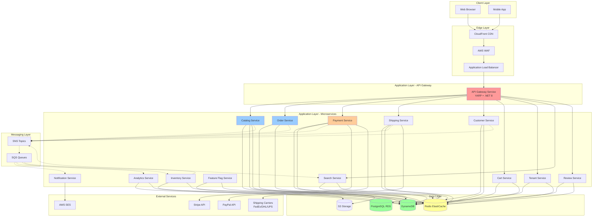
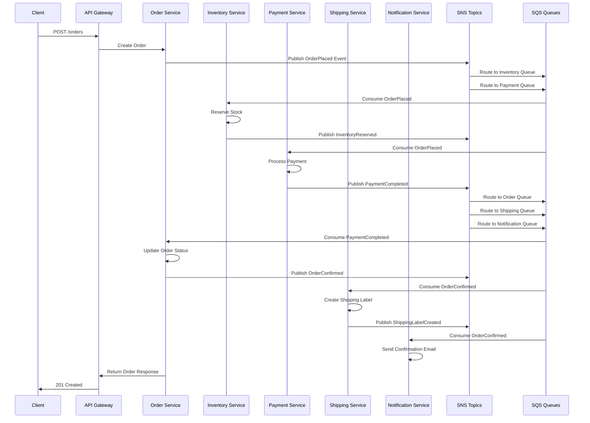
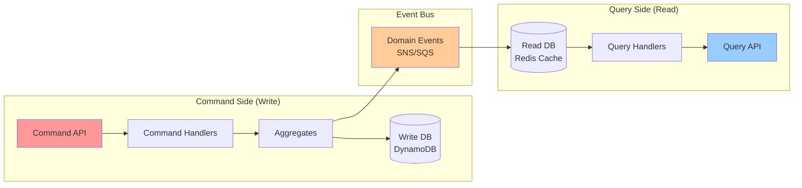
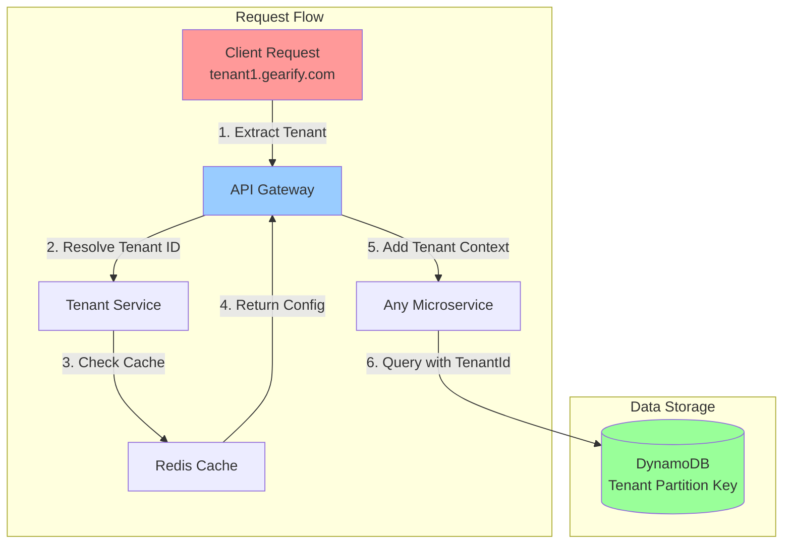
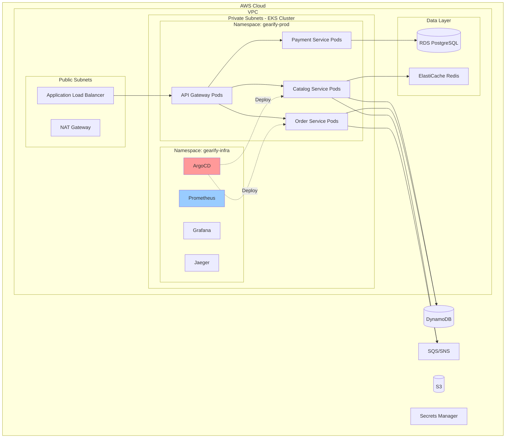
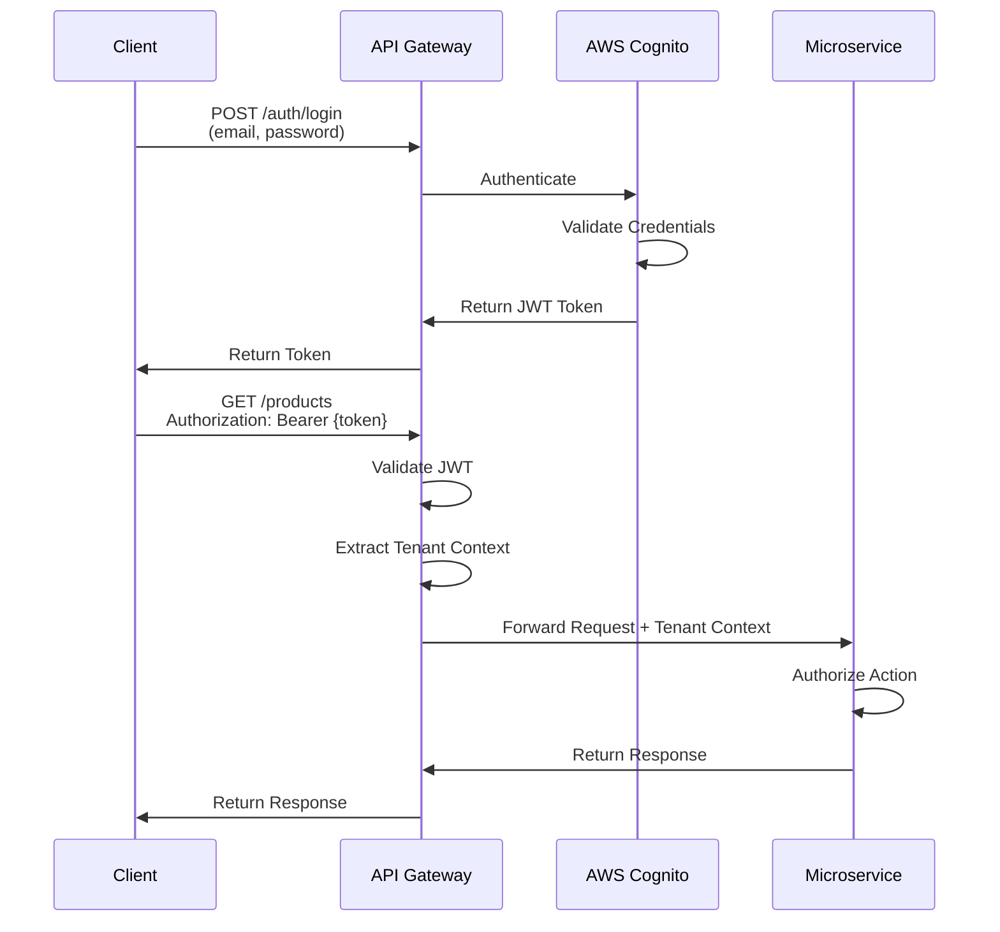
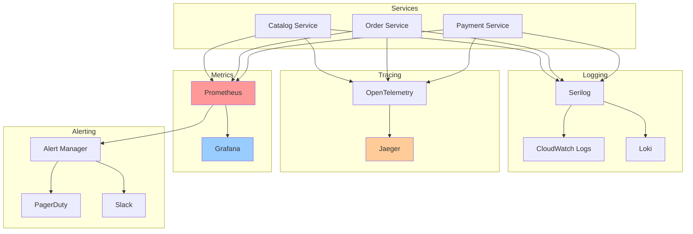
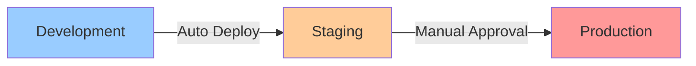
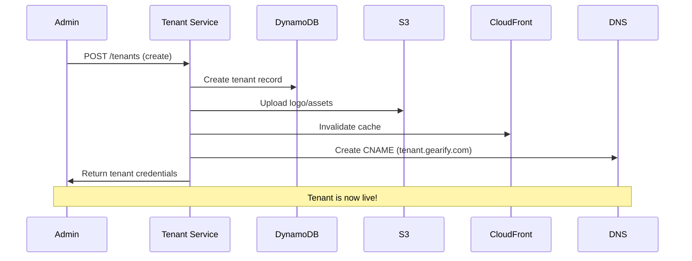

# Gearify - Global Cricket E-Commerce Platform Architecture

## Table of Contents
1. [Executive Summary](#executive-summary)
2. [System Architecture Overview](#system-architecture-overview)
3. [Microservices Catalog](#microservices-catalog)
4. [Architecture Diagrams](#architecture-diagrams)
5. [Polyrepo Structure](#polyrepo-structure)
6. [Frontend Architecture](#frontend-architecture)
7. [Data Architecture](#data-architecture)
8. [Security Architecture](#security-architecture)
9. [Observability & Monitoring](#observability--monitoring)
10. [CI/CD & GitOps](#cicd--gitops)
11. [Multi-Tenancy & Feature Flags](#multi-tenancy--feature-flags)
12. [Scalability & Resilience](#scalability--resilience)

---

## Executive Summary

**Gearify** is a global multi-tenant e-commerce platform specialized in cricket equipment. The platform is built using a microservices architecture with polyrepo approach, deployed on AWS infrastructure using Kubernetes and managed via GitOps principles.

### Key Characteristics:
- **Technology Stack**: .NET 8, Angular 18 SSR, AWS Services
- **Architecture Pattern**: Microservices with CQRS, Event-Driven
- **Database Strategy**: Polyglot persistence (DynamoDB, PostgreSQL, Redis)
- **Messaging**: AWS SQS/SNS for async communication
- **Payment Gateways**: Stripe and PayPal only
- **Global Scale**: Multi-region support with worldwide shipping
- **Deployment**: Kubernetes + Argo CD (GitOps)

---

## System Architecture Overview

### High-Level Architecture

The system follows a microservices architecture pattern with the following layers:

1. **Edge Layer**: CloudFront CDN, WAF, API Gateway
2. **Application Layer**: Backend microservices (.NET 8)
3. **Data Layer**: DynamoDB, PostgreSQL, Redis
4. **Messaging Layer**: SQS/SNS for event-driven communication
5. **Infrastructure Layer**: EKS, RDS, ElastiCache, S3
6. **Observability Layer**: CloudWatch, X-Ray, OpenTelemetry

### Core Principles

- **Domain-Driven Design**: Each microservice owns its domain
- **Event-Driven Architecture**: Async communication via events
- **CQRS**: Separate read and write models where appropriate
- **Clean Architecture**: Clear separation of concerns
- **API-First**: Well-defined contracts between services
- **Immutable Infrastructure**: Infrastructure as Code via Terraform
- **GitOps**: Declarative deployment via Argo CD

---

## Microservices Catalog

### 1. **API Gateway Service** (`gearify-api-gateway`)

**Purpose**: Central entry point for all client requests, routing, authentication, rate limiting

**Responsibilities**:
- Request routing to backend services
- JWT validation
- Rate limiting and throttling
- Request/response transformation
- API versioning
- CORS handling

**Technology**:
- .NET 8 with YARP (Yet Another Reverse Proxy)
- Redis for rate limiting state

**Data Store**: Redis (cache, rate limit counters)

**Key Dependencies**: All backend services

**Events Published**: None (gateway doesn't publish domain events)

**Events Consumed**: None

---

### 2. **Catalog Service** (`gearify-catalog-svc`)

**Purpose**: Manage product catalog, categories, inventory, and search

**Responsibilities**:
- CRUD operations for products (bats, pads, gloves, balls, kits)
- Product attributes management (weight, grade, weightType)
- Add-ons management (Knocking, Oiling, Toe Binding)
- Category hierarchy
- Simple search (text-based, can migrate to Elasticsearch later)
- Inventory tracking
- Product images/media management

**Technology**:
- .NET 8 with Clean Architecture
- MediatR for CQRS
- FluentValidation

**Data Store**:
- **Primary**: DynamoDB (products table)
  - Partition Key: `TenantId`
  - Sort Key: `ProductId`
  - GSI: `Category-ProductName-Index`
- **Cache**: Redis (product details, search results)
- **Media**: S3 (product images)

**Events Published**:
- `ProductCreated`
- `ProductUpdated`
- `ProductDeleted`
- `InventoryUpdated`
- `ProductOutOfStock`

**Events Consumed**:
- `OrderPlaced` (to decrement inventory)
- `OrderCancelled` (to restore inventory)

---

### 3. **Order Service** (`gearify-order-svc`)

**Purpose**: Order lifecycle management, order processing, and fulfillment coordination

**Responsibilities**:
- Order creation and validation
- Order status tracking
- Order history
- Order cancellation/refunds
- Order fulfillment coordination
- Order confirmation emails

**Technology**:
- .NET 8 with Clean Architecture
- MediatR for CQRS
- Saga pattern for order orchestration

**Data Store**:
- **Primary**: DynamoDB (orders table)
  - Partition Key: `TenantId`
  - Sort Key: `OrderId`
  - GSI: `CustomerId-OrderDate-Index`
- **Cache**: Redis (order status)

**Events Published**:
- `OrderPlaced`
- `OrderConfirmed`
- `OrderCancelled`
- `OrderShipped`
- `OrderDelivered`
- `OrderRefunded`

**Events Consumed**:
- `PaymentCompleted`
- `PaymentFailed`
- `ShippingLabelCreated`
- `InventoryReserved`
- `InventoryReservationFailed`

---

### 4. **Payment Service** (`gearify-payment-svc`)

**Purpose**: Payment processing integration with Stripe and PayPal

**Responsibilities**:
- Payment gateway integration (Stripe, PayPal)
- Payment processing
- Payment status tracking
- Refund processing
- Payment reconciliation
- Multi-currency support
- Payment method management
- PCI compliance

**Technology**:
- .NET 8 with Clean Architecture
- Stripe SDK
- PayPal SDK
- Idempotency handling

**Data Store**:
- **Primary**: PostgreSQL (payments, transactions, refunds)
  - ACID compliance for financial data
  - Audit trail
- **Cache**: Redis (payment status)

**Schema** (PostgreSQL):
```sql
Tables:
- payments
- transactions
- refunds
- payment_methods
- reconciliation_records
```

**Events Published**:
- `PaymentInitiated`
- `PaymentCompleted`
- `PaymentFailed`
- `RefundProcessed`
- `PaymentReconciled`

**Events Consumed**:
- `OrderPlaced`
- `OrderCancelled`

---

### 5. **Shipping Service** (`gearify-shipping-svc`)

**Purpose**: Shipping calculation, label generation, and carrier integration

**Responsibilities**:
- Shipping rate calculation (worldwide)
- Carrier integration (FedEx, DHL, UPS, etc.)
- Shipping label generation
- Tracking number management
- Delivery status updates
- Address validation
- Customs documentation (international shipping)

**Technology**:
- .NET 8 with Clean Architecture
- Carrier API SDKs (ShipStation, EasyPost)
- Rate caching

**Data Store**:
- **Primary**: DynamoDB (shipping_records)
  - Partition Key: `OrderId`
  - Sort Key: `ShipmentId`
- **Cache**: Redis (shipping rates by zone)

**Events Published**:
- `ShippingRateCalculated`
- `ShippingLabelCreated`
- `ShipmentDispatched`
- `DeliveryStatusUpdated`

**Events Consumed**:
- `OrderConfirmed`
- `PaymentCompleted`

---

### 6. **Customer Service** (`gearify-customer-svc`)

**Purpose**: Customer profile management, addresses, preferences

**Responsibilities**:
- Customer registration
- Profile management
- Address book (multiple shipping addresses)
- Customer preferences
- Customer segmentation
- Loyalty tracking
- Customer support ticket integration

**Technology**:
- .NET 8 with Clean Architecture
- MediatR for CQRS

**Data Store**:
- **Primary**: DynamoDB (customers table)
  - Partition Key: `TenantId`
  - Sort Key: `CustomerId`
  - GSI: `Email-Index`
- **Cache**: Redis (customer sessions)

**Events Published**:
- `CustomerRegistered`
- `CustomerUpdated`
- `CustomerDeleted`
- `AddressAdded`
- `AddressUpdated`

**Events Consumed**:
- `OrderPlaced` (customer order history)

---

### 7. **Tenant Service** (`gearify-tenant-svc`)

**Purpose**: Multi-tenant configuration and management

**Responsibilities**:
- Tenant registration and onboarding
- Tenant configuration (logos, colors, themes)
- Domain/subdomain mapping
- Tenant-specific settings
- Tenant billing
- Tenant feature entitlements

**Technology**:
- .NET 8 with Clean Architecture
- Tenant isolation middleware

**Data Store**:
- **Primary**: DynamoDB (tenants table)
  - Partition Key: `TenantId`
  - GSI: `Domain-Index`
- **Cache**: Redis (tenant config, very heavily cached)

**Events Published**:
- `TenantCreated`
- `TenantUpdated`
- `TenantConfigUpdated`
- `TenantSuspended`

**Events Consumed**: None

---

### 8. **Notification Service** (`gearify-notification-svc`)

**Purpose**: Email, SMS, and push notification delivery

**Responsibilities**:
- Email sending (order confirmations, shipping updates)
- SMS notifications
- Push notifications (mobile apps)
- Notification templates
- Multi-language support
- Delivery tracking
- Unsubscribe management

**Technology**:
- .NET 8
- AWS SES (email)
- AWS SNS (SMS)
- Firebase Cloud Messaging (push)
- Template engine (Scriban)

**Data Store**:
- **Primary**: DynamoDB (notification_log)
- **Templates**: S3

**Events Published**:
- `NotificationSent`
- `NotificationFailed`

**Events Consumed**:
- `OrderPlaced`
- `OrderShipped`
- `PaymentCompleted`
- `CustomerRegistered`
- All major domain events

---

### 9. **Feature Flag Service** (`gearify-feature-flag-svc`)

**Purpose**: Feature flag management and runtime configuration

**Responsibilities**:
- Feature flag definitions
- Flag evaluation (tenant-level, user-level, percentage rollout)
- A/B testing support
- Runtime configuration
- Flag change auditing

**Technology**:
- .NET 8
- LaunchDarkly-like feature set
- Real-time flag updates

**Data Store**:
- **Primary**: DynamoDB (feature_flags)
  - Partition Key: `FlagKey`
- **Cache**: Redis (heavily cached, TTL: 30s)

**Events Published**:
- `FeatureFlagUpdated`
- `FeatureFlagCreated`

**Events Consumed**: None

---

### 10. **Analytics Service** (`gearify-analytics-svc`)

**Purpose**: Business analytics, reporting, and metrics

**Responsibilities**:
- Sales analytics
- Customer behavior tracking
- Product performance metrics
- Revenue reporting
- Custom reports
- Data aggregation

**Technology**:
- .NET 8
- Time-series data processing
- Background workers for aggregation

**Data Store**:
- **Primary**: DynamoDB (events, aggregations)
- **Warehouse**: S3 + Athena (for complex queries)

**Events Published**: None (read-only service)

**Events Consumed**: All domain events (for analytics)

---

### 11. **Search Service** (`gearify-search-svc`)

**Purpose**: Product search and filtering (simple implementation, can migrate to Elasticsearch)

**Responsibilities**:
- Text-based product search
- Faceted search (category, price range, brand)
- Search suggestions
- Search analytics
- Index synchronization

**Technology**:
- .NET 8
- DynamoDB queries + GSI
- (Future: Elasticsearch/OpenSearch migration path)

**Data Store**:
- **Primary**: DynamoDB (denormalized search index)
  - GSI optimized for search queries
- **Cache**: Redis (search results, autocomplete)

**Events Published**: None

**Events Consumed**:
- `ProductCreated`
- `ProductUpdated`
- `ProductDeleted`

---

### 12. **Cart Service** (`gearify-cart-svc`)

**Purpose**: Shopping cart management

**Responsibilities**:
- Add/remove items from cart
- Cart persistence (logged in users)
- Cart expiration
- Cart merge (anonymous → authenticated)
- Cart calculation (subtotal, tax estimation)
- Abandoned cart tracking

**Technology**:
- .NET 8

**Data Store**:
- **Primary**: Redis (ephemeral carts, TTL: 7 days)
- **Backup**: DynamoDB (for abandoned cart recovery)

**Events Published**:
- `ItemAddedToCart`
- `CartAbandoned`
- `CartCheckedOut`

**Events Consumed**: None

---

### 13. **Review Service** (`gearify-review-svc`)

**Purpose**: Product reviews and ratings

**Responsibilities**:
- Product review submission
- Review moderation
- Rating aggregation
- Review helpfulness voting
- Review reporting

**Technology**:
- .NET 8

**Data Store**:
- **Primary**: DynamoDB (reviews table)
  - Partition Key: `ProductId`
  - Sort Key: `ReviewId`
- **Cache**: Redis (aggregated ratings)

**Events Published**:
- `ReviewSubmitted`
- `ReviewApproved`
- `ReviewRejected`

**Events Consumed**:
- `OrderDelivered` (enable review submission)

---

### 14. **Inventory Service** (`gearify-inventory-svc`)

**Purpose**: Real-time inventory tracking and reservation

**Responsibilities**:
- Stock level tracking
- Inventory reservation (during checkout)
- Inventory release (on timeout/cancellation)
- Low stock alerts
- Warehouse management integration
- Stock transfer between warehouses

**Technology**:
- .NET 8
- Distributed locking (Redis)
- Saga pattern for reservations

**Data Store**:
- **Primary**: DynamoDB (inventory table)
  - Partition Key: `ProductId`
  - Optimistic locking with version numbers
- **Cache**: Redis (inventory counts)

**Events Published**:
- `InventoryReserved`
- `InventoryReservationFailed`
- `InventoryReleased`
- `LowStockAlert`
- `OutOfStock`

**Events Consumed**:
- `OrderPlaced`
- `OrderCancelled`
- `OrderExpired`

---

## Architecture Diagrams

### 1. High-Level System Architecture



### 2. Event-Driven Communication Flow



### 3. CQRS Pattern Implementation



### 4. Multi-Tenant Data Isolation



### 5. Deployment Architecture (Kubernetes)



### 6. CI/CD & GitOps Flow

```mermaid
graph LR
    subgraph "Developer"
        CODE[Code Changes]
        PR[Pull Request]
    end

    subgraph "GitHub"
        REPO[Service Repo]
        ACTIONS[GitHub Actions]
    end

    subgraph "Build & Test"
        BUILD[Build .NET 8]
        TEST[Run Tests]
        SCAN[Security Scan]
        DOCKER[Build Docker Image]
    end

    subgraph "Container Registry"
        ECR[AWS ECR]
    end

    subgraph "GitOps Repo"
        HELM[Helm Charts Repo]
        MANIFEST[K8s Manifests]
    end

    subgraph "Kubernetes"
        ARGOCD[ArgoCD]
        EKS[EKS Cluster]
    end

    CODE --> PR
    PR --> REPO
    REPO -->|Trigger| ACTIONS
    ACTIONS --> BUILD
    BUILD --> TEST
    TEST --> SCAN
    SCAN --> DOCKER
    DOCKER --> ECR
    ECR -->|Update Image Tag| MANIFEST
    MANIFEST --> HELM
    HELM -->|Sync| ARGOCD
    ARGOCD -->|Deploy| EKS

    style ACTIONS fill:#ff9999
    style ARGOCD fill:#99ccff
    style ECR fill:#ffcc99
```



---

## Polyrepo Structure

### Repository Organization

Each microservice is a **separate Git repository** with its own CI/CD pipeline:

```
gearify-api-gateway/
├── src/
│   ├── Gearify.ApiGateway/
│   ├── Gearify.ApiGateway.Tests/
├── .github/
│   └── workflows/
│       └── ci-cd.yml
├── Dockerfile
├── terraform/
│   └── modules/
├── helm/
│   └── charts/
└── README.md

gearify-catalog-svc/
├── src/
│   ├── Gearify.Catalog.Api/
│   ├── Gearify.Catalog.Application/
│   ├── Gearify.Catalog.Domain/
│   ├── Gearify.Catalog.Infrastructure/
│   ├── Gearify.Catalog.Tests/
├── .github/
│   └── workflows/
│       └── ci-cd.yml
├── Dockerfile
├── terraform/
│   └── modules/
├── helm/
│   └── charts/
└── README.md

gearify-order-svc/
├── src/
│   ├── Gearify.Order.Api/
│   ├── Gearify.Order.Application/
│   ├── Gearify.Order.Domain/
│   ├── Gearify.Order.Infrastructure/
│   ├── Gearify.Order.Tests/
├── .github/
│   └── workflows/
│       └── ci-cd.yml
├── Dockerfile
├── terraform/
│   └── modules/
├── helm/
│   └── charts/
└── README.md

gearify-payment-svc/
gearify-shipping-svc/
gearify-customer-svc/
gearify-tenant-svc/
gearify-notification-svc/
gearify-feature-flag-svc/
gearify-analytics-svc/
gearify-search-svc/
gearify-cart-svc/
gearify-review-svc/
gearify-inventory-svc/

gearify-web/
├── src/
│   ├── app/
│   │   ├── features/
│   │   ├── shells/
│   │   │   ├── desktop-shell/
│   │   │   └── mobile-shell/
│   │   ├── guards/
│   │   └── services/
├── angular.json
├── package.json
├── Dockerfile
└── .github/
    └── workflows/
        └── ci-cd.yml

gearify-shared-contracts/
├── src/
│   ├── Events/
│   ├── DTOs/
│   └── Interfaces/
└── nuget.config

gearify-infrastructure/
├── terraform/
│   ├── modules/
│   │   ├── eks/
│   │   ├── dynamodb/
│   │   ├── rds/
│   │   ├── elasticache/
│   │   ├── sqs-sns/
│   │   └── networking/
│   ├── environments/
│   │   ├── dev/
│   │   ├── staging/
│   │   └── production/
└── README.md

gearify-gitops/
├── clusters/
│   ├── dev/
│   ├── staging/
│   └── production/
├── applications/
│   ├── api-gateway/
│   ├── catalog-svc/
│   ├── order-svc/
│   └── ...
└── helm-charts/
    ├── base-service/
    └── frontend/
```

### Clean Architecture Structure (Per Microservice)

Each .NET microservice follows Clean Architecture:

```
Gearify.Catalog.Api/          # API Layer (Controllers, Middleware)
├── Controllers/
├── Middleware/
├── Filters/
└── Program.cs

Gearify.Catalog.Application/  # Application Layer (Use Cases, CQRS)
├── Commands/
│   ├── CreateProduct/
│   │   ├── CreateProductCommand.cs
│   │   ├── CreateProductCommandHandler.cs
│   │   └── CreateProductCommandValidator.cs
├── Queries/
│   ├── GetProduct/
│   │   ├── GetProductQuery.cs
│   │   └── GetProductQueryHandler.cs
├── DTOs/
├── Interfaces/
├── Behaviors/
│   ├── ValidationBehavior.cs
│   └── LoggingBehavior.cs
└── DependencyInjection.cs

Gearify.Catalog.Domain/       # Domain Layer (Entities, Value Objects)
├── Entities/
│   ├── Product.cs
│   ├── Category.cs
│   └── ProductAddon.cs
├── ValueObjects/
│   ├── Weight.cs
│   ├── Price.cs
│   └── ProductGrade.cs
├── Enums/
│   ├── WeightType.cs
│   └── ProductStatus.cs
├── Events/
│   ├── ProductCreatedEvent.cs
│   └── ProductUpdatedEvent.cs
├── Interfaces/
└── Exceptions/

Gearify.Catalog.Infrastructure/ # Infrastructure Layer (Data Access, External Services)
├── Persistence/
│   ├── DynamoDB/
│   │   ├── Repositories/
│   │   │   └── ProductRepository.cs
│   │   └── Configurations/
│   ├── Redis/
│   │   └── CacheService.cs
├── Messaging/
│   ├── EventPublisher.cs
│   └── EventConsumer.cs
├── S3/
│   └── MediaService.cs
└── DependencyInjection.cs

Gearify.Catalog.Tests/
├── Unit/
├── Integration/
└── E2E/
```

---

## Frontend Architecture

### Angular 18 SSR with Shell Architecture

#### Shell-Based Routing

The frontend uses a **Shell Architecture** pattern with device-specific shells:

1. **DesktopShell**: Full-featured navigation, sidebar, header
2. **MobileShell**: Bottom navigation, hamburger menu, mobile-optimized

```
src/
├── app/
│   ├── shells/
│   │   ├── desktop-shell/
│   │   │   ├── desktop-shell.component.ts
│   │   │   ├── desktop-shell.component.html
│   │   │   ├── desktop-shell.component.scss
│   │   │   └── components/
│   │   │       ├── header/
│   │   │       ├── sidebar/
│   │   │       └── footer/
│   │   └── mobile-shell/
│   │       ├── mobile-shell.component.ts
│   │       ├── mobile-shell.component.html
│   │       ├── mobile-shell.component.scss
│   │       └── components/
│   │           ├── mobile-header/
│   │           ├── bottom-nav/
│   │           └── hamburger-menu/
│   │
│   ├── features/
│   │   ├── catalog/
│   │   │   ├── catalog.component.ts
│   │   │   ├── catalog.routes.ts
│   │   │   └── components/
│   │   │       ├── product-list/
│   │   │       ├── product-card/
│   │   │       └── product-filters/
│   │   ├── product/
│   │   │   ├── product-detail.component.ts
│   │   │   └── components/
│   │   │       ├── product-images/
│   │   │       ├── product-info/
│   │   │       └── add-to-cart/
│   │   ├── cart/
│   │   │   ├── cart.component.ts
│   │   │   └── components/
│   │   ├── checkout/
│   │   │   ├── checkout.component.ts
│   │   │   └── steps/
│   │   │       ├── shipping-step/
│   │   │       ├── payment-step/
│   │   │       └── review-step/
│   │   ├── account/
│   │   │   ├── profile/
│   │   │   ├── orders/
│   │   │   └── addresses/
│   │   └── admin/
│   │       ├── admin-dashboard.component.ts
│   │       └── components/
│   │
│   ├── core/
│   │   ├── services/
│   │   │   ├── api.service.ts
│   │   │   ├── auth.service.ts
│   │   │   ├── tenant.service.ts
│   │   │   └── feature-flag.service.ts
│   │   ├── interceptors/
│   │   │   ├── auth.interceptor.ts
│   │   │   ├── tenant.interceptor.ts
│   │   │   └── error.interceptor.ts
│   │   ├── guards/
│   │   │   ├── auth.guard.ts
│   │   │   └── admin.guard.ts
│   │   └── models/
│   │
│   ├── shared/
│   │   ├── components/
│   │   │   ├── button/
│   │   │   ├── input/
│   │   │   ├── modal/
│   │   │   └── spinner/
│   │   ├── pipes/
│   │   └── directives/
│   │
│   ├── app.routes.ts
│   ├── app.component.ts
│   └── app.config.ts
│
├── server.ts           # SSR server
├── main.ts             # Client bootstrap
└── main.server.ts      # Server bootstrap
```

#### Routing Configuration

```typescript
// app.routes.ts
export const routes: Routes = [
  {
    path: '',
    component: ShellResolverComponent, // Detects device and loads appropriate shell
    children: [
      { path: '', redirectTo: '/catalog', pathMatch: 'full' },
      {
        path: 'catalog',
        loadChildren: () => import('./features/catalog/catalog.routes')
      },
      {
        path: 'product/:id',
        loadComponent: () => import('./features/product/product-detail.component')
      },
      {
        path: 'cart',
        loadComponent: () => import('./features/cart/cart.component')
      },
      {
        path: 'checkout',
        loadComponent: () => import('./features/checkout/checkout.component'),
        canActivate: [AuthGuard]
      },
      {
        path: 'account',
        loadChildren: () => import('./features/account/account.routes'),
        canActivate: [AuthGuard]
      },
      {
        path: 'admin',
        loadChildren: () => import('./features/admin/admin.routes'),
        canActivate: [AuthGuard, AdminGuard]
      }
    ]
  }
];
```

#### Multi-Tenant Frontend

```typescript
// tenant.interceptor.ts
export class TenantInterceptor implements HttpInterceptor {
  intercept(req: HttpRequest<any>, next: HttpHandler): Observable<HttpEvent<any>> {
    const tenantId = this.getTenantFromDomain();
    const tenantConfig = this.tenantService.getConfig();

    const modifiedReq = req.clone({
      setHeaders: {
        'X-Tenant-Id': tenantId
      }
    });

    // Apply tenant-specific theme
    this.applyTenantTheme(tenantConfig);

    return next.handle(modifiedReq);
  }
}
```

#### Server-Side Rendering (SSR)

```typescript
// server.ts
export function app(): express.Express {
  const server = express();
  const serverDistFolder = dirname(fileURLToPath(import.meta.url));
  const browserDistFolder = resolve(serverDistFolder, '../browser');

  server.get('*', (req, res) => {
    const { protocol, originalUrl, headers } = req;

    CommonEngine
      .render({
        bootstrap,
        documentFilePath: join(browserDistFolder, 'index.html'),
        url: `${protocol}://${headers.host}${originalUrl}`,
        publicPath: browserDistFolder,
        providers: [
          { provide: 'REQUEST', useValue: req },
          { provide: 'RESPONSE', useValue: res }
        ]
      })
      .then(html => res.send(html))
      .catch(err => res.status(500).send(err));
  });

  return server;
}
```

---

## Data Architecture

### Database Selection Strategy

| Data Type | Database | Rationale |
|-----------|----------|-----------|
| Product Catalog | DynamoDB | High read throughput, flexible schema, global tables |
| Orders | DynamoDB | Event sourcing, partition by tenant, fast writes |
| Customers | DynamoDB | Profile data, flexible attributes per tenant |
| Payments | PostgreSQL | ACID compliance, financial audit trail, complex queries |
| Sessions/Cache | Redis | Fast in-memory access, TTL support |
| Product Images | S3 | Object storage, CDN integration |
| Analytics | DynamoDB + S3 | Time-series in DynamoDB, data lake in S3 |

### DynamoDB Table Design

#### Products Table

```
Table: gearify-products
Partition Key: TenantId (String)
Sort Key: ProductId (String)

Attributes:
- ProductId (String)
- TenantId (String)
- Name (String)
- Description (String)
- Category (String)
- Price (Number)
- Currency (String)
- Weight (Map)
  - Value (Number)
  - Unit (String - oz/g)
- Grade (String - A, B, C)
- WeightType (String - Heavy, Medium, Light)
- Addons (List)
  - Knocking (Boolean)
  - Oiling (Boolean)
  - ToeBinding (Boolean)
- Images (List<String>)
- Stock (Number)
- Status (String - Active, Inactive, OutOfStock)
- CreatedAt (String - ISO8601)
- UpdatedAt (String - ISO8601)

GSI 1: Category-ProductName-Index
- Partition Key: Category
- Sort Key: Name

GSI 2: TenantId-Status-Index
- Partition Key: TenantId
- Sort Key: Status
```

#### Orders Table

```
Table: gearify-orders
Partition Key: TenantId (String)
Sort Key: OrderId (String)

Attributes:
- OrderId (String)
- TenantId (String)
- CustomerId (String)
- OrderDate (String - ISO8601)
- Status (String)
- Items (List)
- Subtotal (Number)
- Tax (Number)
- ShippingCost (Number)
- Total (Number)
- Currency (String)
- ShippingAddress (Map)
- BillingAddress (Map)
- PaymentMethod (String)
- PaymentStatus (String)
- ShippingStatus (String)
- TrackingNumber (String)
- CreatedAt (String)
- UpdatedAt (String)

GSI 1: CustomerId-OrderDate-Index
- Partition Key: CustomerId
- Sort Key: OrderDate

GSI 2: TenantId-Status-Index
- Partition Key: TenantId
- Sort Key: Status
```

#### Tenants Table

```
Table: gearify-tenants
Partition Key: TenantId (String)

Attributes:
- TenantId (String)
- Name (String)
- Domain (String)
- Logo (String - S3 URL)
- HeaderColor (String - Hex)
- PrimaryColor (String - Hex)
- Settings (Map)
  - Currency (String)
  - TimeZone (String)
  - Language (String)
- FeatureFlags (Map)
- Status (String - Active, Suspended)
- BillingPlan (String)
- CreatedAt (String)
- UpdatedAt (String)

GSI 1: Domain-Index
- Partition Key: Domain
```

### PostgreSQL Schema (Payment Service)

```sql
-- Payments
CREATE TABLE payments (
    payment_id UUID PRIMARY KEY,
    tenant_id VARCHAR(50) NOT NULL,
    order_id VARCHAR(100) NOT NULL,
    customer_id VARCHAR(100) NOT NULL,
    amount DECIMAL(15, 2) NOT NULL,
    currency VARCHAR(3) NOT NULL,
    payment_method VARCHAR(20) NOT NULL, -- stripe, paypal
    payment_gateway_id VARCHAR(100), -- External payment ID
    status VARCHAR(20) NOT NULL, -- pending, completed, failed, refunded
    gateway_response JSONB,
    created_at TIMESTAMP DEFAULT NOW(),
    updated_at TIMESTAMP DEFAULT NOW(),
    version INT DEFAULT 1
);

CREATE INDEX idx_payments_tenant ON payments(tenant_id);
CREATE INDEX idx_payments_order ON payments(order_id);
CREATE INDEX idx_payments_status ON payments(status);

-- Transactions (Audit Log)
CREATE TABLE payment_transactions (
    transaction_id UUID PRIMARY KEY,
    payment_id UUID REFERENCES payments(payment_id),
    transaction_type VARCHAR(20) NOT NULL, -- charge, refund, chargeback
    amount DECIMAL(15, 2) NOT NULL,
    status VARCHAR(20) NOT NULL,
    gateway_transaction_id VARCHAR(100),
    metadata JSONB,
    created_at TIMESTAMP DEFAULT NOW()
);

-- Refunds
CREATE TABLE refunds (
    refund_id UUID PRIMARY KEY,
    payment_id UUID REFERENCES payments(payment_id),
    amount DECIMAL(15, 2) NOT NULL,
    reason VARCHAR(255),
    status VARCHAR(20) NOT NULL,
    gateway_refund_id VARCHAR(100),
    created_at TIMESTAMP DEFAULT NOW(),
    processed_at TIMESTAMP
);

-- Reconciliation
CREATE TABLE payment_reconciliation (
    reconciliation_id UUID PRIMARY KEY,
    tenant_id VARCHAR(50) NOT NULL,
    reconciliation_date DATE NOT NULL,
    gateway VARCHAR(20) NOT NULL,
    expected_amount DECIMAL(15, 2),
    actual_amount DECIMAL(15, 2),
    difference DECIMAL(15, 2),
    status VARCHAR(20), -- matched, discrepancy, pending
    notes TEXT,
    created_at TIMESTAMP DEFAULT NOW()
);
```

### Redis Cache Strategy

```
Key Patterns:

# Product Cache
product:{tenantId}:{productId} -> JSON (TTL: 1 hour)

# Catalog Cache
catalog:{tenantId}:category:{category}:page:{page} -> JSON (TTL: 15 min)

# Tenant Config
tenant:config:{tenantId} -> JSON (TTL: 1 day)

# Feature Flags
feature:flag:{flagKey}:{tenantId} -> JSON (TTL: 30 sec)

# Shopping Cart
cart:{sessionId} -> JSON (TTL: 7 days)
cart:user:{userId} -> JSON (TTL: 30 days)

# Rate Limiting
ratelimit:{ip}:{endpoint} -> Counter (TTL: 1 minute)

# Inventory Lock
inventory:lock:{productId} -> Lock (TTL: 5 minutes)

# Search Results
search:{tenantId}:{query}:{filters} -> JSON (TTL: 10 min)

# Session
session:{sessionId} -> JSON (TTL: 24 hours)
```

---

## Security Architecture

### Authentication & Authorization

#### JWT Token Structure

```json
{
  "sub": "customer-12345",
  "email": "user@example.com",
  "tenant_id": "tenant-abc",
  "roles": ["customer"],
  "permissions": ["read:products", "write:cart", "read:orders"],
  "iat": 1672531200,
  "exp": 1672534800,
  "iss": "gearify-auth"
}
```

#### Auth Flow



### Security Layers

1. **Edge Security**
   - AWS WAF rules (SQL injection, XSS, rate limiting)
   - DDoS protection (AWS Shield)
   - SSL/TLS termination at ALB
   - CloudFront signed URLs for private content

2. **API Gateway Security**
   - JWT validation
   - API key validation (for B2B partners)
   - Rate limiting per tenant/user
   - Request size limits
   - CORS policies

3. **Service-Level Security**
   - Input validation (FluentValidation)
   - SQL injection prevention (parameterized queries)
   - NoSQL injection prevention (DynamoDB SDK)
   - XSS prevention (output encoding)
   - CSRF tokens for state-changing operations

4. **Data Security**
   - Encryption at rest (DynamoDB, RDS, S3)
   - Encryption in transit (TLS 1.3)
   - Secrets management (AWS Secrets Manager)
   - PCI compliance for payment data
   - GDPR compliance (data retention, right to deletion)

5. **Network Security**
   - VPC isolation
   - Private subnets for services
   - Security groups (least privilege)
   - Network ACLs
   - VPC endpoints for AWS services

### Tenant Isolation

```csharp
// Middleware for tenant context
public class TenantMiddleware
{
    public async Task InvokeAsync(HttpContext context, ITenantResolver tenantResolver)
    {
        var tenantId = tenantResolver.ResolveTenantId(context.Request);

        if (string.IsNullOrEmpty(tenantId))
        {
            context.Response.StatusCode = 400;
            await context.Response.WriteAsync("Tenant not specified");
            return;
        }

        context.Items["TenantId"] = tenantId;
        await _next(context);
    }
}

// Repository with tenant filtering
public class ProductRepository : IProductRepository
{
    public async Task<Product> GetByIdAsync(string tenantId, string productId)
    {
        var request = new GetItemRequest
        {
            TableName = "gearify-products",
            Key = new Dictionary<string, AttributeValue>
            {
                { "TenantId", new AttributeValue { S = tenantId } },
                { "ProductId", new AttributeValue { S = productId } }
            }
        };

        var response = await _dynamoDb.GetItemAsync(request);
        return MapToProduct(response.Item);
    }
}
```

---

## Observability & Monitoring

### Logging Strategy

#### Structured Logging with Serilog

```csharp
Log.Logger = new LoggerConfiguration()
    .Enrich.WithProperty("Application", "gearify-catalog-svc")
    .Enrich.WithProperty("Environment", Environment.GetEnvironmentVariable("ASPNETCORE_ENVIRONMENT"))
    .Enrich.FromLogContext()
    .WriteTo.Console(new JsonFormatter())
    .WriteTo.AmazonCloudWatch(
        logGroup: "/aws/ecs/gearify-catalog-svc",
        textFormatter: new JsonFormatter())
    .CreateLogger();

// Usage
_logger.LogInformation(
    "Product created for tenant {TenantId} with ProductId {ProductId}",
    tenantId,
    productId);
```

#### Log Levels

- **Trace**: Detailed flow tracking
- **Debug**: Diagnostic information
- **Information**: General application flow
- **Warning**: Unusual but handled events
- **Error**: Application errors
- **Critical**: System failures

### Distributed Tracing

#### OpenTelemetry Integration

```csharp
services.AddOpenTelemetry()
    .WithTracing(builder => builder
        .AddAspNetCoreInstrumentation()
        .AddHttpClientInstrumentation()
        .AddSource("Gearify.*")
        .AddAWSInstrumentation()
        .AddJaegerExporter(options =>
        {
            options.AgentHost = "jaeger-agent";
            options.AgentPort = 6831;
        }));
```

#### Trace Context Propagation

```csharp
// Automatic trace context propagation across services
var httpClient = new HttpClient(new HttpClientHandler());
httpClient.DefaultRequestHeaders.Add("traceparent", Activity.Current?.Id);

// Custom spans
using var activity = ActivitySource.StartActivity("ProcessPayment");
activity?.SetTag("payment.amount", amount);
activity?.SetTag("payment.currency", currency);
```

### Metrics & Dashboards

#### Key Metrics

**Business Metrics**:
- Orders per minute
- Revenue per hour/day
- Conversion rate
- Cart abandonment rate
- Average order value

**Technical Metrics**:
- Request rate (requests/sec)
- Error rate (%)
- Response time (p50, p95, p99)
- Database query time
- Cache hit rate
- Queue depth
- Message processing time

**Infrastructure Metrics**:
- CPU utilization
- Memory usage
- Network I/O
- Disk I/O
- Pod restart count

#### Prometheus Metrics

```csharp
// Custom metrics
var orderCounter = Metrics.CreateCounter(
    "gearify_orders_total",
    "Total number of orders",
    new CounterConfiguration
    {
        LabelNames = new[] { "tenant_id", "status" }
    });

var paymentDuration = Metrics.CreateHistogram(
    "gearify_payment_duration_seconds",
    "Payment processing duration",
    new HistogramConfiguration
    {
        LabelNames = new[] { "gateway" }
    });

// Usage
orderCounter.WithLabels(tenantId, "completed").Inc();
using (paymentDuration.WithLabels("stripe").NewTimer())
{
    await ProcessPaymentAsync();
}
```

### Alerting Strategy

```yaml
# Prometheus Alert Rules
groups:
  - name: gearify-api
    rules:
      - alert: HighErrorRate
        expr: |
          sum(rate(http_requests_total{status=~"5.."}[5m]))
          /
          sum(rate(http_requests_total[5m])) > 0.05
        for: 5m
        labels:
          severity: critical
        annotations:
          summary: "High error rate detected"

      - alert: HighResponseTime
        expr: |
          histogram_quantile(0.95,
            rate(http_request_duration_seconds_bucket[5m])
          ) > 2
        for: 10m
        labels:
          severity: warning
        annotations:
          summary: "95th percentile response time > 2s"

      - alert: PaymentServiceDown
        expr: up{job="gearify-payment-svc"} == 0
        for: 2m
        labels:
          severity: critical
        annotations:
          summary: "Payment service is down"
```

### Observability Stack



---

## CI/CD & GitOps

### GitHub Actions Workflow

```yaml
# .github/workflows/ci-cd.yml
name: CI/CD Pipeline

on:
  push:
    branches: [main, develop]
  pull_request:
    branches: [main]

env:
  AWS_REGION: us-east-1
  ECR_REPOSITORY: gearify-catalog-svc
  EKS_CLUSTER: gearify-prod

jobs:
  test:
    runs-on: ubuntu-latest
    steps:
      - uses: actions/checkout@v3

      - name: Setup .NET
        uses: actions/setup-dotnet@v3
        with:
          dotnet-version: '8.0.x'

      - name: Restore dependencies
        run: dotnet restore

      - name: Build
        run: dotnet build --no-restore

      - name: Run unit tests
        run: dotnet test --no-build --verbosity normal --filter Category=Unit

      - name: Run integration tests
        run: dotnet test --no-build --verbosity normal --filter Category=Integration

  security-scan:
    runs-on: ubuntu-latest
    needs: test
    steps:
      - uses: actions/checkout@v3

      - name: Run Trivy vulnerability scanner
        uses: aquasecurity/trivy-action@master
        with:
          scan-type: 'fs'
          scan-ref: '.'
          format: 'sarif'
          output: 'trivy-results.sarif'

      - name: Upload Trivy results to GitHub Security tab
        uses: github/codeql-action/upload-sarif@v2
        with:
          sarif_file: 'trivy-results.sarif'

  build-push:
    runs-on: ubuntu-latest
    needs: [test, security-scan]
    if: github.ref == 'refs/heads/main'
    steps:
      - uses: actions/checkout@v3

      - name: Configure AWS credentials
        uses: aws-actions/configure-aws-credentials@v2
        with:
          aws-access-key-id: ${{ secrets.AWS_ACCESS_KEY_ID }}
          aws-secret-access-key: ${{ secrets.AWS_SECRET_ACCESS_KEY }}
          aws-region: ${{ env.AWS_REGION }}

      - name: Login to Amazon ECR
        id: login-ecr
        uses: aws-actions/amazon-ecr-login@v1

      - name: Build, tag, and push image to Amazon ECR
        env:
          ECR_REGISTRY: ${{ steps.login-ecr.outputs.registry }}
          IMAGE_TAG: ${{ github.sha }}
        run: |
          docker build -t $ECR_REGISTRY/$ECR_REPOSITORY:$IMAGE_TAG .
          docker tag $ECR_REGISTRY/$ECR_REPOSITORY:$IMAGE_TAG $ECR_REGISTRY/$ECR_REPOSITORY:latest
          docker push $ECR_REGISTRY/$ECR_REPOSITORY:$IMAGE_TAG
          docker push $ECR_REGISTRY/$ECR_REPOSITORY:latest

      - name: Update GitOps repo with new image tag
        env:
          IMAGE_TAG: ${{ github.sha }}
        run: |
          git clone https://github.com/org/gearify-gitops.git
          cd gearify-gitops/applications/catalog-svc
          sed -i "s|image:.*|image: ${{ steps.login-ecr.outputs.registry }}/${{ env.ECR_REPOSITORY }}:${{ env.IMAGE_TAG }}|" values.yaml
          git config user.name "GitHub Actions"
          git config user.email "actions@github.com"
          git add values.yaml
          git commit -m "Update catalog-svc image to $IMAGE_TAG"
          git push
```

### ArgoCD Application Manifest

```yaml
# gearify-gitops/applications/catalog-svc/application.yaml
apiVersion: argoproj.io/v1alpha1
kind: Application
metadata:
  name: gearify-catalog-svc
  namespace: argocd
spec:
  project: gearify
  source:
    repoURL: https://github.com/org/gearify-gitops
    targetRevision: HEAD
    path: applications/catalog-svc
    helm:
      valueFiles:
        - values.yaml
        - values-prod.yaml
  destination:
    server: https://kubernetes.default.svc
    namespace: gearify-prod
  syncPolicy:
    automated:
      prune: true
      selfHeal: true
      allowEmpty: false
    syncOptions:
      - CreateNamespace=true
    retry:
      limit: 5
      backoff:
        duration: 5s
        factor: 2
        maxDuration: 3m
```

### Helm Chart Structure

```yaml
# helm/base-service/values.yaml
replicaCount: 3

image:
  repository: 123456789.dkr.ecr.us-east-1.amazonaws.com/gearify-catalog-svc
  tag: latest
  pullPolicy: IfNotPresent

service:
  type: ClusterIP
  port: 80
  targetPort: 8080

ingress:
  enabled: true
  className: nginx
  annotations:
    cert-manager.io/cluster-issuer: letsencrypt-prod
  hosts:
    - host: api.gearify.com
      paths:
        - path: /catalog
          pathType: Prefix

resources:
  limits:
    cpu: 500m
    memory: 512Mi
  requests:
    cpu: 250m
    memory: 256Mi

autoscaling:
  enabled: true
  minReplicas: 3
  maxReplicas: 10
  targetCPUUtilizationPercentage: 70
  targetMemoryUtilizationPercentage: 80

livenessProbe:
  httpGet:
    path: /health/live
    port: 8080
  initialDelaySeconds: 30
  periodSeconds: 10

readinessProbe:
  httpGet:
    path: /health/ready
    port: 8080
  initialDelaySeconds: 10
  periodSeconds: 5

env:
  - name: ASPNETCORE_ENVIRONMENT
    value: Production
  - name: AWS_REGION
    value: us-east-1

secrets:
  - name: JWT_SECRET
    valueFrom:
      secretKeyRef:
        name: gearify-secrets
        key: jwt-secret
```

### Deployment Stages



**Development Environment**:
- Auto-deploy on commit to `develop` branch
- Runs in small EKS cluster
- Uses LocalStack for AWS services
- Minimal replicas (1 per service)

**Staging Environment**:
- Auto-deploy on commit to `main` branch
- Production-like infrastructure
- Full AWS services
- Moderate replicas (2 per service)
- Integration testing
- Performance testing

**Production Environment**:
- Manual approval required (via ArgoCD UI or CLI)
- Blue/Green deployment strategy
- Full high-availability setup
- Auto-scaling enabled
- Production monitoring and alerts

---

## Multi-Tenancy & Feature Flags

### Tenant Configuration Model

```csharp
public class TenantConfiguration
{
    public string TenantId { get; set; }
    public string Name { get; set; }
    public string Domain { get; set; }

    // Branding
    public BrandingConfig Branding { get; set; }

    // Features
    public Dictionary<string, bool> Features { get; set; }

    // Settings
    public TenantSettings Settings { get; set; }
}

public class BrandingConfig
{
    public string LogoUrl { get; set; }
    public string HeaderColor { get; set; }
    public string PrimaryColor { get; set; }
    public string SecondaryColor { get; set; }
    public string FontFamily { get; set; }
}

public class TenantSettings
{
    public string Currency { get; set; }
    public string TimeZone { get; set; }
    public string Language { get; set; }
    public string DefaultShippingMethod { get; set; }
    public List<string> EnabledPaymentMethods { get; set; }
}
```

### Feature Flag System

```csharp
public interface IFeatureFlagService
{
    Task<bool> IsEnabledAsync(string flagKey, string tenantId = null, string userId = null);
    Task<T> GetVariantAsync<T>(string flagKey, T defaultValue, string tenantId = null);
}

public class FeatureFlagService : IFeatureFlagService
{
    public async Task<bool> IsEnabledAsync(string flagKey, string tenantId, string userId)
    {
        var flag = await GetFeatureFlagAsync(flagKey);

        if (flag == null) return false;

        // Check tenant-specific override
        if (tenantId != null && flag.TenantOverrides.ContainsKey(tenantId))
        {
            return flag.TenantOverrides[tenantId];
        }

        // Check percentage rollout
        if (flag.Percentage > 0 && flag.Percentage < 100)
        {
            var hash = HashUserId(userId ?? tenantId);
            return hash <= flag.Percentage;
        }

        return flag.Enabled;
    }
}
```

#### Feature Flag Examples

```json
{
  "flagKey": "enable-reviews",
  "enabled": true,
  "description": "Enable product reviews",
  "percentage": 100,
  "tenantOverrides": {
    "tenant-abc": true,
    "tenant-xyz": false
  }
}

{
  "flagKey": "new-checkout-flow",
  "enabled": false,
  "description": "New streamlined checkout",
  "percentage": 10,
  "tenantOverrides": {}
}

{
  "flagKey": "payment-gateway",
  "enabled": true,
  "description": "Primary payment gateway",
  "variant": "stripe",
  "variantOverrides": {
    "tenant-abc": "paypal"
  }
}
```

### Tenant Onboarding Flow



---

## Scalability & Resilience

### Auto-Scaling Strategy

#### Horizontal Pod Autoscaling (HPA)

```yaml
apiVersion: autoscaling/v2
kind: HorizontalPodAutoscaler
metadata:
  name: catalog-svc-hpa
spec:
  scaleTargetRef:
    apiVersion: apps/v1
    kind: Deployment
    name: catalog-svc
  minReplicas: 3
  maxReplicas: 20
  metrics:
    - type: Resource
      resource:
        name: cpu
        target:
          type: Utilization
          averageUtilization: 70
    - type: Resource
      resource:
        name: memory
        target:
          type: Utilization
          averageUtilization: 80
  behavior:
    scaleUp:
      stabilizationWindowSeconds: 60
      policies:
        - type: Percent
          value: 50
          periodSeconds: 60
    scaleDown:
      stabilizationWindowSeconds: 300
      policies:
        - type: Pods
          value: 1
          periodSeconds: 60
```

#### Cluster Autoscaling

```yaml
# EKS Node Group with auto-scaling
apiVersion: eksctl.io/v1alpha5
kind: ClusterConfig
metadata:
  name: gearify-prod
  region: us-east-1

managedNodeGroups:
  - name: general-purpose
    instanceType: t3.large
    minSize: 3
    maxSize: 10
    desiredCapacity: 5
    volumeSize: 50
    labels:
      role: general
    tags:
      nodegroup-role: general-purpose
```

### Resilience Patterns

#### Circuit Breaker

```csharp
services.AddHttpClient<IPaymentGateway, StripePaymentGateway>()
    .AddPolicyHandler(GetCircuitBreakerPolicy());

static IAsyncPolicy<HttpResponseMessage> GetCircuitBreakerPolicy()
{
    return HttpPolicyExtensions
        .HandleTransientHttpError()
        .CircuitBreakerAsync(
            handledEventsAllowedBeforeBreaking: 5,
            durationOfBreak: TimeSpan.FromSeconds(30));
}
```

#### Retry with Exponential Backoff

```csharp
services.AddHttpClient<ICatalogService, CatalogService>()
    .AddPolicyHandler(GetRetryPolicy());

static IAsyncPolicy<HttpResponseMessage> GetRetryPolicy()
{
    return HttpPolicyExtensions
        .HandleTransientHttpError()
        .WaitAndRetryAsync(
            retryCount: 3,
            sleepDurationProvider: retryAttempt =>
                TimeSpan.FromSeconds(Math.Pow(2, retryAttempt)),
            onRetry: (outcome, timespan, retryAttempt, context) =>
            {
                Log.Warning($"Retrying request (attempt {retryAttempt})");
            });
}
```

#### Bulkhead Isolation

```csharp
var bulkheadPolicy = Policy.BulkheadAsync(
    maxParallelization: 10,
    maxQueuingActions: 20,
    onBulkheadRejectedAsync: async context =>
    {
        Log.Warning("Bulkhead rejected request");
        await Task.CompletedTask;
    });
```

#### Timeout

```csharp
var timeoutPolicy = Policy.TimeoutAsync<HttpResponseMessage>(
    TimeSpan.FromSeconds(10),
    TimeoutStrategy.Pessimistic,
    onTimeoutAsync: async (context, timespan, task) =>
    {
        Log.Warning($"Request timed out after {timespan.TotalSeconds}s");
        await Task.CompletedTask;
    });
```

### Database Resilience

#### DynamoDB Auto-Scaling

```hcl
resource "aws_appautoscaling_target" "dynamodb_table_read_target" {
  max_capacity       = 100
  min_capacity       = 5
  resource_id        = "table/gearify-products"
  scalable_dimension = "dynamodb:table:ReadCapacityUnits"
  service_namespace  = "dynamodb"
}

resource "aws_appautoscaling_policy" "dynamodb_table_read_policy" {
  name               = "DynamoDBReadCapacityUtilization"
  policy_type        = "TargetTrackingScaling"
  resource_id        = aws_appautoscaling_target.dynamodb_table_read_target.resource_id
  scalable_dimension = aws_appautoscaling_target.dynamodb_table_read_target.scalable_dimension
  service_namespace  = aws_appautoscaling_target.dynamodb_table_read_target.service_namespace

  target_tracking_scaling_policy_configuration {
    predefined_metric_specification {
      predefined_metric_type = "DynamoDBReadCapacityUtilization"
    }
    target_value = 70.0
  }
}
```

#### PostgreSQL High Availability

```hcl
resource "aws_db_instance" "payment_db" {
  identifier     = "gearify-payment-db"
  engine         = "postgres"
  engine_version = "15.3"
  instance_class = "db.r6g.large"

  multi_az               = true  # Multi-AZ for HA
  backup_retention_period = 7
  backup_window          = "03:00-04:00"
  maintenance_window     = "sun:04:00-sun:05:00"

  storage_type          = "gp3"
  allocated_storage     = 100
  storage_encrypted     = true

  performance_insights_enabled = true
}
```

#### Redis Cluster Mode

```hcl
resource "aws_elasticache_replication_group" "redis" {
  replication_group_id       = "gearify-redis"
  replication_group_description = "Redis cluster for Gearify"

  engine               = "redis"
  engine_version       = "7.0"
  node_type            = "cache.r6g.large"
  num_cache_clusters   = 3  # 1 primary + 2 replicas

  automatic_failover_enabled = true
  multi_az_enabled          = true

  at_rest_encryption_enabled = true
  transit_encryption_enabled = true
}
```

### Disaster Recovery

#### Backup Strategy

| Component | Backup Method | Frequency | Retention |
|-----------|--------------|-----------|-----------|
| DynamoDB | Point-in-time recovery | Continuous | 35 days |
| PostgreSQL | Automated snapshots | Daily | 7 days |
| S3 | Versioning + Lifecycle | On write | 90 days |
| Redis | Daily snapshot | Daily | 3 days |
| Config | GitOps repo | On commit | Forever |

#### RTO/RPO Targets

| Service Tier | RTO | RPO |
|--------------|-----|-----|
| Critical (Payment, Order) | < 1 hour | < 5 minutes |
| High (Catalog, Customer) | < 4 hours | < 30 minutes |
| Medium (Analytics, Reviews) | < 24 hours | < 4 hours |

---

## Summary

This architecture provides:

✅ **Scalability**: Microservices + Kubernetes + Auto-scaling
✅ **Resilience**: Circuit breakers, retries, multi-AZ, backups
✅ **Multi-Tenancy**: Tenant isolation at data and config level
✅ **Global Reach**: Multi-region support, worldwide shipping
✅ **Developer Experience**: Polyrepo, CI/CD, GitOps
✅ **Observability**: Logging, tracing, metrics, alerting
✅ **Security**: Defense in depth, encryption, JWT auth
✅ **Extensibility**: Feature flags, modular architecture

### Next Steps for Implementation

1. **Phase 1 - Foundation** (Weeks 1-4)
   - Set up AWS infrastructure (Terraform)
   - Deploy EKS cluster
   - Set up CI/CD pipelines
   - Implement API Gateway
   - Implement Tenant Service

2. **Phase 2 - Core Services** (Weeks 5-8)
   - Catalog Service
   - Cart Service
   - Customer Service
   - Search Service

3. **Phase 3 - Commerce** (Weeks 9-12)
   - Order Service
   - Payment Service (Stripe integration)
   - Payment Service (PayPal integration)
   - Inventory Service

4. **Phase 4 - Fulfillment** (Weeks 13-16)
   - Shipping Service
   - Notification Service
   - Review Service

5. **Phase 5 - Platform** (Weeks 17-20)
   - Analytics Service
   - Feature Flag Service
   - Admin dashboard
   - Performance optimization
   - Load testing

6. **Phase 6 - Frontend** (Weeks 21-24)
   - Angular SSR implementation
   - Desktop Shell
   - Mobile Shell
   - E2E testing
   - Production launch

---

**Document Version**: 1.0
**Last Updated**: 2025-01-10
**Author**: Gearify Architecture Team
**Status**: Approved for Implementation
