# Product Recommendations — Feature Deep Dive

## Overview

The Gearify recommendation engine provides personalized product suggestions using AWS Personalize (ML) with intelligent fallbacks. It serves four API endpoints, collects user behavior automatically, and degrades gracefully when ML services are unavailable.

| Property | Value |
|---|---|
| **Status** | Implemented |
| **Phase** | Phase 1 |
| **Primary Service** | `gearify-catalog-svc` |
| **Supporting** | `gearify-api-gateway` (event tracking), `gearify-shared-kernel` (AI infra) |
| **ML Provider** | AWS Personalize |
| **Cache** | Redis (1h–24h TTL) |
| **Resilience** | Polly Circuit Breaker |

---

## System Architecture

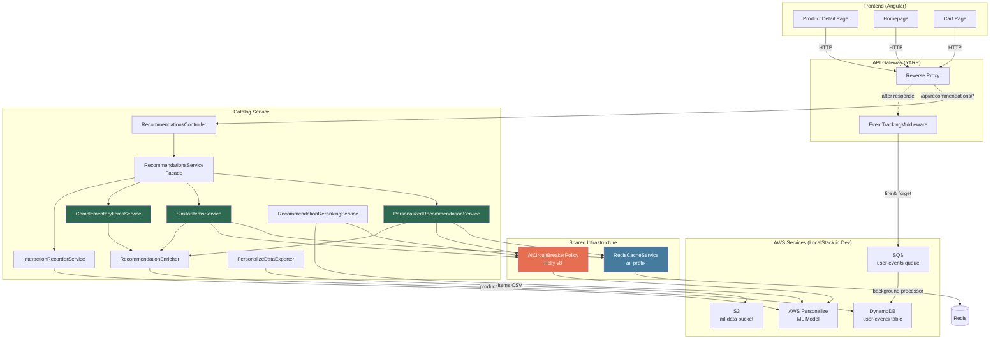

---

## Data Collection — How the System Learns

The recommendation engine relies on two categories of data: **user behavior** (interactions) and **product catalog** (item metadata). Three pipelines feed this data.

### Data Flow Overview

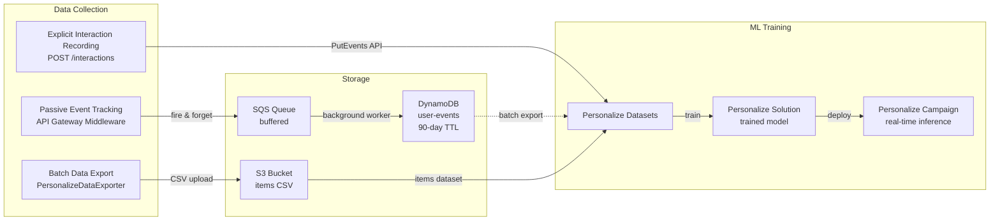

### Pipeline A — Passive Event Tracking (Automatic)

The `EventTrackingMiddleware` in the API Gateway silently detects user interactions by pattern-matching HTTP requests. The user is unaware this is happening.

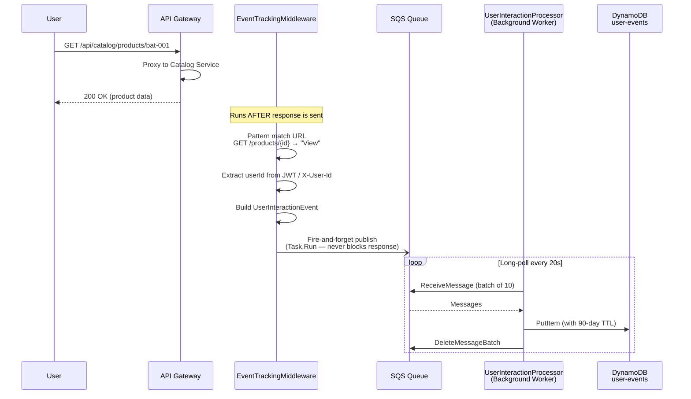

**URL Pattern Detection Rules:**

| HTTP Method | URL Pattern | Event Type | Extracted Data |
|---|---|---|---|
| `GET` | `/api/catalog/products/{id}` | `View` | productId from URL |
| `GET` | `/api/search/*` | `Search` | search query from `?q=` |
| `POST` | `/api/cart/items` | `AddToCart` | — |
| `POST` | `/api/orders` | `Purchase` | — |

**Event Payload:**

```json
{
  "userId": "user-123",
  "productId": "bat-ss-ton-001",
  "tenantId": "demo-tenant",
  "eventType": "View",
  "sessionId": "sess-abc-456",
  "timestamp": "2026-03-24T10:30:00Z",
  "metadata": {
    "referrer": "https://gearify.com/bats",
    "userAgent": "Mozilla/5.0...",
    "searchQuery": "english willow bat"
  }
}
```

**DynamoDB Storage Schema:**

| Attribute | Type | Description |
|---|---|---|
| `UserId` (PK) | String | User identifier |
| `Timestamp` (SK) | Number | Unix timestamp in milliseconds |
| `TenantId` | String | Multi-tenant isolation |
| `EventType` | String | View, AddToCart, Purchase, Search |
| `ProductId` | String | Product interacted with |
| `SessionId` | String | Browser session |
| `EventValue` | Number | Optional (price, time spent) |
| `Metadata` | Map | Referrer, user agent, search query |
| `TTL` | Number | Auto-delete after 90 days |

### Pipeline B — Explicit Interaction Recording

The frontend can directly report interactions with richer context (e.g., time spent on page, scroll depth).

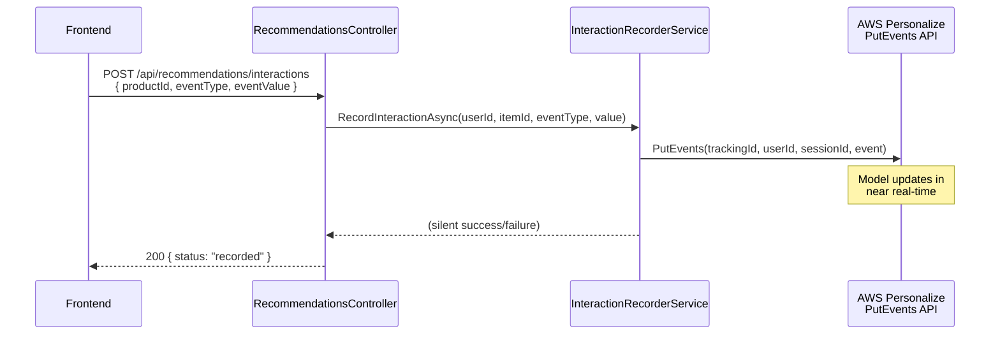

This feeds the Personalize model **directly** via PutEvents, enabling the model to update its recommendations in near real-time as users browse.

### Pipeline C — Batch Data Export (Product Catalog)

`PersonalizeDataExporter` exports the product catalog to S3 as CSV — this is the "Items Dataset" that tells Personalize what products exist and their attributes.

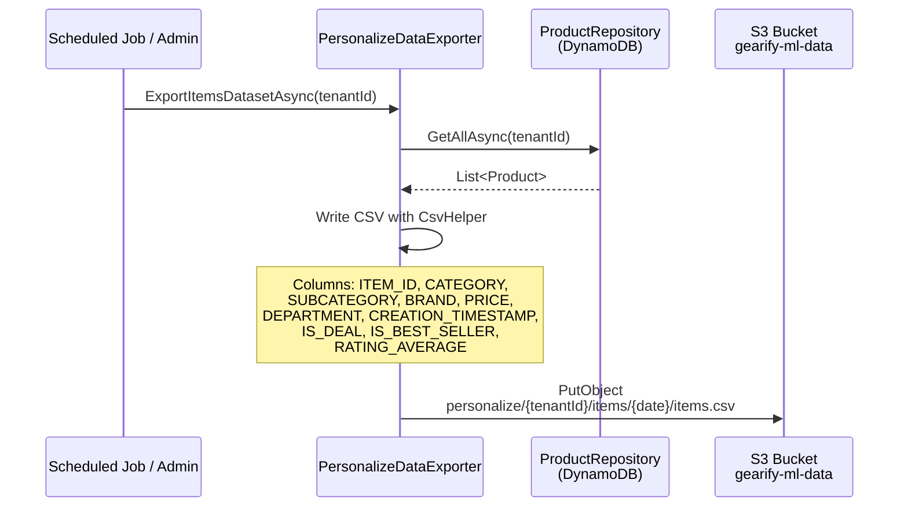

### How AWS Personalize Uses This Data

AWS Personalize trains its ML model using **three datasets**:

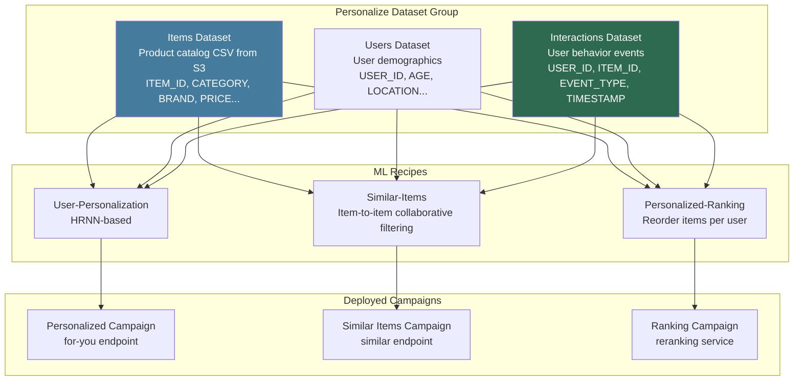

---

## Recommendation Algorithms

### Algorithm 1 — Personalized Recommendations ("For You")

**Endpoint:** `GET /api/recommendations/for-you?limit=10`

**Question answered:** "Based on everything we know about THIS USER, what products will they likely want?"

#### How AWS Personalize User-Personalization Works

The User-Personalization recipe is based on **HRNN (Hierarchical Recurrent Neural Network)**:

1. **Learns user sequences** — It treats each user's interaction history as a time-ordered sequence (viewed bat → viewed gloves → bought helmet)
2. **Finds patterns across users** — Users with similar sequences get similar recommendations (collaborative filtering)
3. **Uses item metadata** — Category, brand, price range help recommend items the user hasn't seen yet (content-based filtering)
4. **Handles cold-start** — New users with no history get popular/trending items; as they interact, recommendations become personalized
5. **Real-time updates** — PutEvents API feeds new interactions, and the model adjusts within minutes

**Example:**
```
User-123's history:
  Viewed: SS Ton Bat, MRF Genius Bat, SG Bat
  Added to cart: SS Ton Bat
  Searched: "batting gloves size L"

Personalize infers:
  → User is shopping for a cricket bat (leaning SS brand)
  → Now looking for gloves (cross-category intent)
  → Recommends: SS batting gloves, matching pads, helmet
```

#### Execution Flow

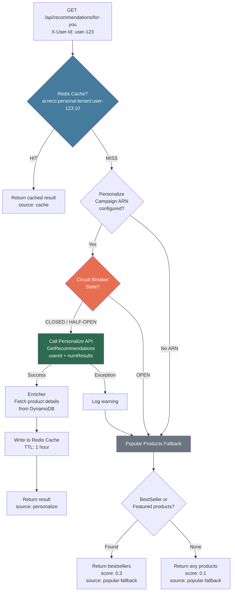

#### Cache Strategy

| Key Pattern | TTL | Rationale |
|---|---|---|
| `ai:reco:personal:{tenantId}:{userId}:{count}` | 1 hour | User preferences shift during a session, but not between page refreshes |

---

### Algorithm 2 — Similar Items

**Endpoint:** `GET /api/recommendations/products/{productId}/similar?limit=10`

**Question answered:** "What products are similar to THIS product, based on what other users also browsed?"

#### How AWS Personalize Similar-Items Works

The Similar-Items recipe uses **item-to-item collaborative filtering**:

1. **Builds a co-occurrence graph** — If users who viewed Product A also viewed Product B, they are "similar"
2. **Weighted by interaction strength** — Purchases weigh more than views; recent interactions weigh more than old ones
3. **Uses item metadata** — Products in the same category/brand/price range get a similarity boost
4. **Beyond attribute matching** — Two items might be in different categories but frequently co-browsed (e.g., a bat and a coaching book)

**Difference from Personalized:**
- **Personalized** = user-centric ("what should THIS USER see?")
- **Similar** = item-centric ("what products are like THIS PRODUCT?")

#### Execution Flow

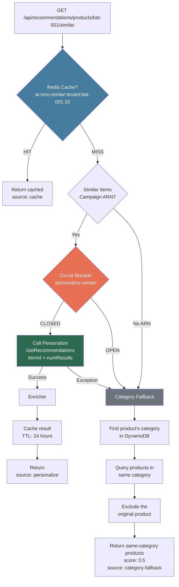

#### Cache Strategy

| Key Pattern | TTL | Rationale |
|---|---|---|
| `ai:reco:similar:{tenantId}:{itemId}:{count}` | 24 hours | Product similarity is stable — "items similar to this bat" rarely changes within a day |

---

### Algorithm 3 — Complementary Items ("Frequently Bought Together")

**Endpoint:** `GET /api/recommendations/products/{productId}/complementary?limit=10`

**Question answered:** "If you're buying THIS product, what else will you need?"

#### How It Works — Domain Rules (No ML)

This algorithm does **NOT** use AWS Personalize. It uses a hardcoded **cricket equipment knowledge graph** because:

- Cricket equipment pairing is well-defined domain knowledge (a bat always needs pads and gloves)
- ML would need thousands of co-purchase records to learn what domain experts already know
- Rules are deterministic, explainable, and free (no API cost)
- The "Frequently bought with" label is trustworthy because it's grounded in real knowledge

#### Knowledge Graph

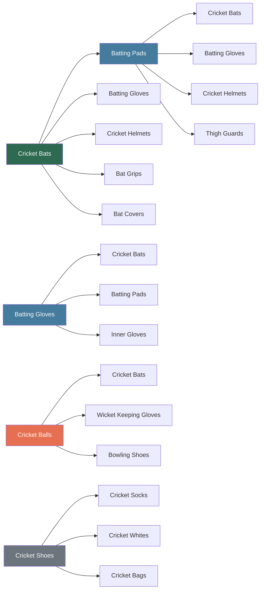

#### Execution Flow

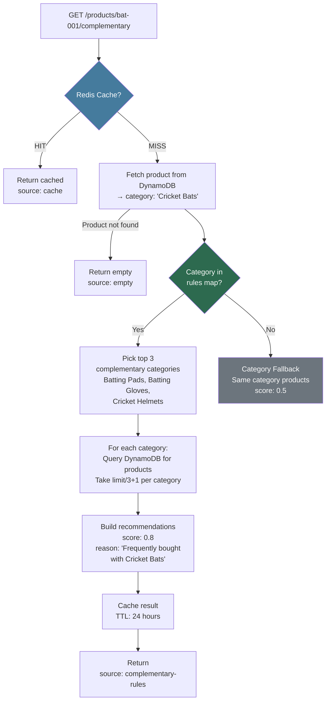

#### Product Distribution

When `limit=10` and the product is a Cricket Bat (5 complementary categories), the algorithm:
- Takes top 3 categories: Batting Pads, Batting Gloves, Cricket Helmets
- Fetches `10/3 + 1 = 4` products per category
- Returns up to 10 total, ensuring variety across categories

---

### Algorithm 4 — Reranking (Internal Use)

**Not exposed as an API endpoint** — used internally to reorder product lists for a specific user.

#### Use Case

A category page shows 20 cricket bats in default order. The reranking service reorders them based on what THIS user is most likely to click.

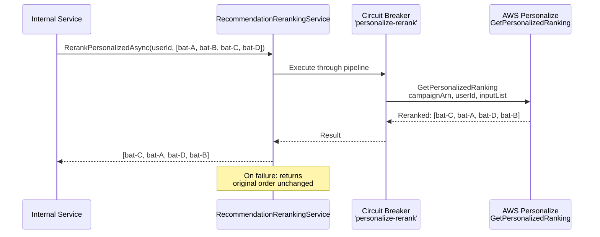

---

## Resilience Architecture

### Three-Layer Protection

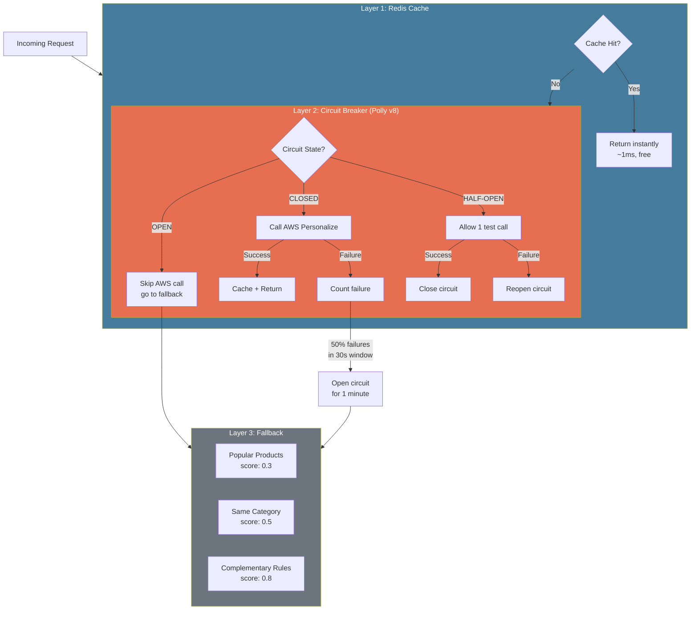

### Circuit Breaker Configuration

| Setting | Value | Meaning |
|---|---|---|
| Failure Ratio | 50% | If half the calls fail in the sampling window, trip |
| Min Throughput | 5 | Need at least 5 calls before evaluating |
| Sampling Duration | 30 seconds | Rolling window for failure counting |
| Break Duration | 1 minute | How long circuit stays open |

**Three independent circuit breaker pipelines** prevent one failure type from affecting others:

| Pipeline Name | Used By | Protects |
|---|---|---|
| `personalize` | PersonalizedRecommendationService | /for-you endpoint |
| `personalize-similar` | SimilarItemsService | /similar endpoint |
| `personalize-rerank` | RecommendationRerankingService | Internal reranking |

---

## API Reference

### `GET /api/recommendations/for-you`

Personalized recommendations for the authenticated user.

| Parameter | Location | Required | Default | Description |
|---|---|---|---|---|
| `X-User-Id` | Header | Yes | — | User identifier |
| `X-Tenant-Id` | Header | Yes | — | Tenant context |
| `limit` | Query | No | 10 | Number of results |

**Response:**
```json
{
  "items": [
    {
      "productId": "bat-ss-ton-001",
      "name": "SS Ton English Willow Bat",
      "price": 14999.00,
      "thumbnailUrl": "https://cdn.gearify.com/images/bat-ss-ton.jpg",
      "category": "Cricket Bats",
      "brand": "SS",
      "score": 0.95,
      "recommendationReason": "Recommended for you"
    }
  ],
  "source": "personalize",
  "totalCount": 10
}
```

**Possible `source` values:** `personalize`, `cache`, `popular-fallback`

---

### `GET /api/recommendations/products/{productId}/similar`

Products similar to the given product based on co-browsing patterns.

| Parameter | Location | Required | Default | Description |
|---|---|---|---|---|
| `productId` | Path | Yes | — | Product to find similar items for |
| `limit` | Query | No | 10 | Number of results |

**Possible `source` values:** `personalize`, `cache`, `category-fallback`

---

### `GET /api/recommendations/products/{productId}/complementary`

Products that complement the given product using cricket equipment domain rules.

| Parameter | Location | Required | Default | Description |
|---|---|---|---|---|
| `productId` | Path | Yes | — | Product to find complements for |
| `limit` | Query | No | 10 | Number of results |

**Possible `source` values:** `complementary-rules`, `cache`, `category-fallback`, `empty`

---

### `POST /api/recommendations/interactions`

Record a user interaction for ML model training.

| Parameter | Location | Required | Description |
|---|---|---|---|
| `X-User-Id` | Header | Yes | User identifier |
| `productId` | Body | Yes | Product interacted with |
| `eventType` | Body | Yes | View, AddToCart, Purchase, Search |
| `eventValue` | Body | No | Numeric value (price, time spent) |

**Request:**
```json
{
  "productId": "bat-ss-ton-001",
  "eventType": "View",
  "eventValue": 14999.00
}
```

**Response:**
```json
{ "status": "recorded" }
```

---

## Caching Strategy

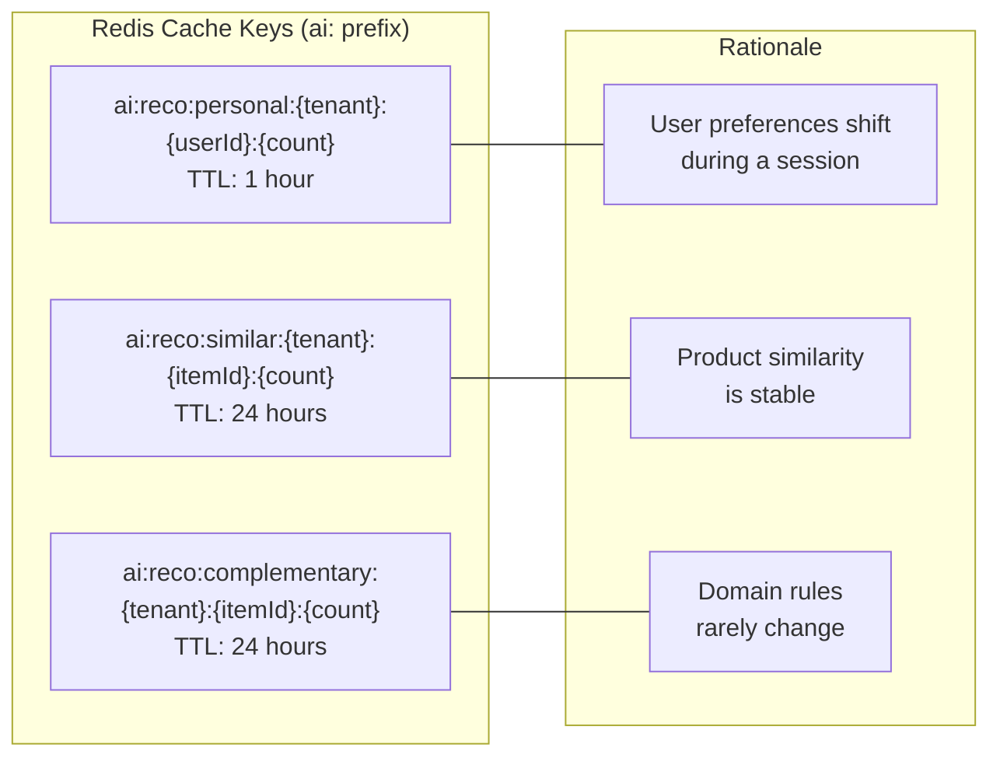

| Data | Cache Key | TTL | Reason |
|---|---|---|---|
| Personalized | `ai:reco:personal:{tenant}:{userId}:{count}` | 1 hour | Preferences shift during session but not between refreshes |
| Similar | `ai:reco:similar:{tenant}:{itemId}:{count}` | 24 hours | Item similarity is stable day-to-day |
| Complementary | `ai:reco:complementary:{tenant}:{itemId}:{count}` | 24 hours | Rule-based, changes only with code deploys |

Cache failures are **swallowed** (logged as warning) — cache is never a hard dependency.

---

## Score Interpretation

The `score` field in each recommendation indicates confidence level:

| Score | Source | Meaning |
|---|---|---|
| 0.0 – 1.0 | AWS Personalize | ML confidence score — higher means more likely to engage |
| 0.8 | Complementary Rules | High confidence — domain knowledge is reliable |
| 0.5 | Category Fallback | Moderate — same category but not ML-personalized |
| 0.3 | Popular Fallback (bestsellers) | Low — not personalized, just popular products |
| 0.1 | Popular Fallback (any) | Minimal — generic products, last resort |

---

## File Map

### Shared Kernel (`gearify-shared-kernel/AI/`)

| File | Purpose |
|---|---|
| `AIServiceConfiguration.cs` | All AI config: ARNs, cache TTLs, circuit breaker settings |
| `AIServiceExtensions.cs` | `AddAIInfrastructure()` and `AddUserInteractionTracking()` DI extensions |
| `IAIService.cs` | Base interface with health check contract |
| `Caching/IAICacheService.cs` | Cache abstraction: Get, Set, Remove, GetOrSet |
| `Caching/RedisCacheService.cs` | Redis implementation with `ai:` key prefix |
| `Resilience/AICircuitBreakerPolicy.cs` | Polly circuit breaker with per-service pipelines |
| `Monitoring/BedrockCostTracker.cs` | Token usage + cost tracking (for future Bedrock features) |
| `Events/UserInteractionEvent.cs` | Event model + `InteractionEventTypes` constants |
| `Events/IUserInteractionPublisher.cs` | Publisher interface |
| `Events/SqsUserInteractionPublisher.cs` | SQS implementation (fire-and-forget) |
| `Events/UserInteractionProcessor.cs` | Background worker: SQS → DynamoDB persistence |

### Catalog Service (`gearify-catalog-svc/`)

| File | Purpose |
|---|---|
| `API/Controllers/RecommendationsController.cs` | 4 REST endpoints |
| `Application/DTOs/ProductRecommendation.cs` | DTOs + RecommendationSources constants |
| `Application/Services/Recommendations/IRecommendationsService.cs` | Facade interface |
| `Application/Services/Recommendations/RecommendationsService.cs` | Facade — routes to specialized services |
| `Application/Services/Recommendations/PersonalizedRecommendationService.cs` | For-you: Personalize → popular fallback |
| `Application/Services/Recommendations/SimilarItemsService.cs` | Similar: Personalize → category fallback |
| `Application/Services/Recommendations/ComplementaryItemsService.cs` | Complementary: domain rules → category fallback |
| `Application/Services/Recommendations/RecommendationEnricher.cs` | Enriches raw IDs with product details + fallback queries |
| `Application/Services/Recommendations/RecommendationRerankingService.cs` | Reorders item lists per user via Personalize |
| `Application/Services/Recommendations/InteractionRecorderService.cs` | Records interactions to Personalize PutEvents |
| `Infrastructure/ML/PersonalizeDataExporter.cs` | CSV export to S3 for model training |

### API Gateway (`gearify-api-gateway/`)

| File | Purpose |
|---|---|
| `Middleware/EventTrackingMiddleware.cs` | Auto-detects user interactions from HTTP patterns |

---

## Dependencies

| Package | Version | Service | Purpose |
|---|---|---|---|
| `AWSSDK.PersonalizeRuntime` | 3.7.0 | Catalog | Real-time recommendations API |
| `AWSSDK.PersonalizeEvents` | 3.7.0 | Catalog | Record user interactions |
| `AWSSDK.Personalize` | 3.7.0 | Catalog | Management API |
| `CsvHelper` | 31.0.0 | Catalog | Data export for model training |
| `AWSSDK.SQS` | 3.7.400 | SharedKernel, Gateway | Event queue |
| `AWSSDK.DynamoDBv2` | 3.7.300 | SharedKernel, Gateway | Event storage |
| `Polly` | 8.4.2 | SharedKernel | Circuit breaker resilience |
| `StackExchange.Redis` | 2.7.33 | SharedKernel | Caching layer |

---

## Development Notes

### Running Without AWS Personalize (Local Dev)

The system works fully without Personalize configured:

- Leave `PersonalizeCampaignArn` empty in `appsettings.json`
- **For-you** → returns popular/featured products (source: `popular-fallback`)
- **Similar** → returns same-category products (source: `category-fallback`)
- **Complementary** → uses cricket rules (source: `complementary-rules`)
- **Interactions** → silently no-ops when `PersonalizeEventTrackerArn` is empty
- **Event tracking** → still publishes to SQS (if configured), building training data for later

### Activating Personalize (Production)

1. Run `PersonalizeDataExporter` to export items CSV to S3
2. Create Personalize Dataset Group with Items + Interactions datasets
3. Create Solutions using `User-Personalization` and `Similar-Items` recipes
4. Deploy Campaigns and set the ARNs in config:
   ```json
   {
     "AI": {
       "PersonalizeCampaignArn": "arn:aws:personalize:us-east-1:123:campaign/gearify-reco",
       "PersonalizeSimilarItemsCampaignArn": "arn:aws:personalize:us-east-1:123:campaign/gearify-similar",
       "PersonalizeEventTrackerArn": "arn:aws:personalize:us-east-1:123:event-tracker/gearify-tracker"
     }
   }
   ```
5. The service automatically switches from fallback to ML-powered recommendations
