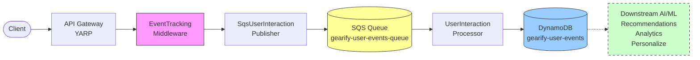
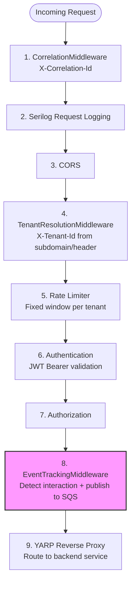
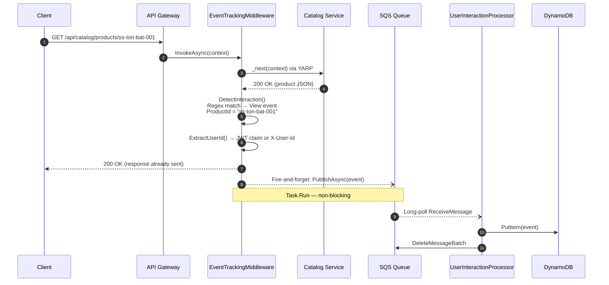
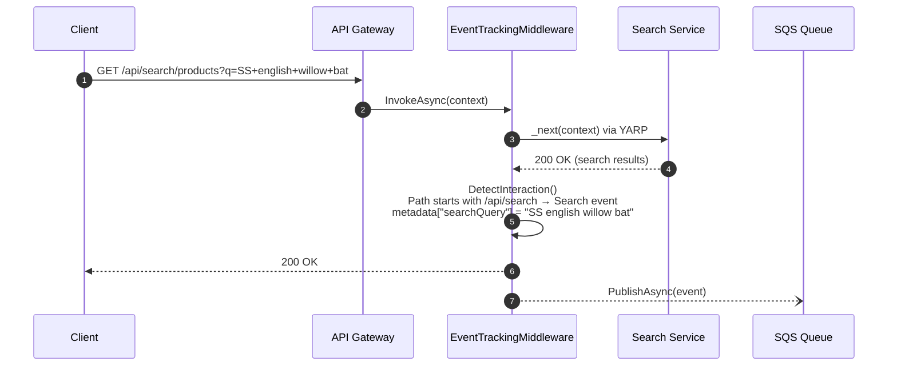
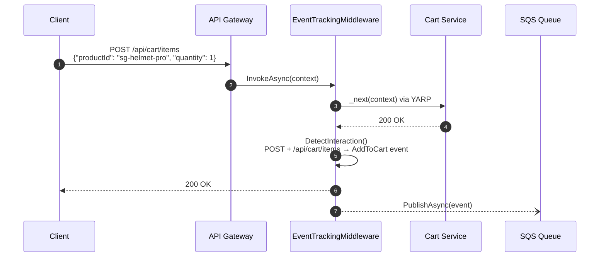
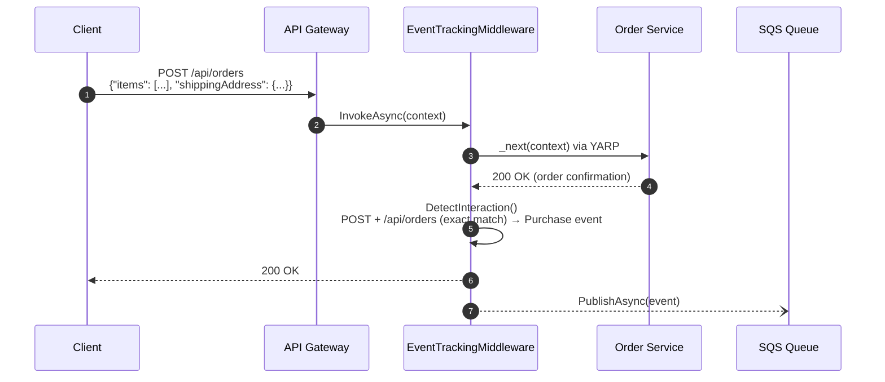

# User Interaction Event Tracking — Implementation Guide

## Feature Summary

| Property | Value |
|---|---|
| **Feature** | User Interaction Event Tracking (SQS + DynamoDB) |
| **Priority** | P0 |
| **Phase** | Phase 0 — Foundation |
| **Service** | `gearify-api-gateway` + `gearify-shared-kernel` |
| **Status** | Implemented |

Captures user interactions (product views, searches, cart additions, purchases) at the API Gateway level and persists them to DynamoDB via SQS. Events feed downstream AI/ML features including product recommendations, cart abandonment prevention, and customer analytics. The pipeline is fully decoupled and uses fire-and-forget semantics — event tracking never blocks or delays user responses.

---

## Architecture



### Design Principles

- **Fire-and-forget** — The middleware publishes events asynchronously via `Task.Run` after the response has already been sent to the client. Event tracking never adds latency to user requests.
- **Silent failure** — Both the publisher and processor catch all exceptions and log warnings. A failed event publish or persist does not propagate errors to the user.
- **Decoupled via SQS** — The middleware (producer) and processor (consumer) are completely independent. The processor runs as a `BackgroundService` that long-polls the queue.
- **Multi-tenant** — Every event is tagged with a `TenantId` extracted from the `X-Tenant-Id` header, enabling per-tenant analytics.

---

## Middleware Pipeline Order

The `EventTrackingMiddleware` is positioned after authentication and authorization in the ASP.NET pipeline so that the user's JWT identity is available when constructing events.



**Why after auth?** The middleware extracts the user's identity from `ClaimTypes.NameIdentifier` in the JWT token. If placed before auth, the user would always be `"anonymous"`.

**Why before YARP?** The middleware wraps the call to `_next(context)` — it lets the request flow through YARP to the backend service, then inspects the response status code on the way back. Only `2xx` responses trigger event detection.

---

## Sequence Diagrams

### Product View

A user browses to a product detail page, triggering a `View` event.



### Search

A user searches for products, triggering a `Search` event with the query captured as metadata.



### Add to Cart

A user adds an item to their cart, triggering an `AddToCart` event.



### Purchase

A user places an order, triggering a `Purchase` event.



### Detection Rules Summary

| HTTP Method | URL Pattern | Detection Logic | EventType | ProductId Source | Extra Metadata |
|---|---|---|---|---|---|
| `GET` | `/api/catalog/products/{id}` | Regex: `^/api/catalog/products/([a-zA-Z0-9\-]+)$` | `View` | Captured from URL regex group 1 | — |
| `GET` | `/api/search/*` | `path.StartsWith("/api/search")` | `Search` | — | `searchQuery` from `?q=` or `?query=` |
| `POST` | `/api/cart/items` | `path.StartsWith("/api/cart/items")` | `AddToCart` | — (future: from request body) | — |
| `POST` | `/api/orders` | `path.Equals("/api/orders")` | `Purchase` | — (future: from request body) | — |

All detection only runs on `2xx` response status codes.

---

## Data Model

### UserInteractionEvent Record

```csharp
// gearify-shared-kernel/AI/Events/UserInteractionEvent.cs
namespace Gearify.SharedKernel.AI.Events;

public record UserInteractionEvent
{
    public string UserId { get; init; } = "anonymous";
    public string? ProductId { get; init; }
    public string TenantId { get; init; } = "default";
    public string EventType { get; init; } = string.Empty;
    public decimal? EventValue { get; init; }
    public string SessionId { get; init; } = string.Empty;
    public DateTime Timestamp { get; init; } = DateTime.UtcNow;
    public Dictionary<string, string> Metadata { get; init; } = new();
}

public static class InteractionEventTypes
{
    public const string View = "View";
    public const string AddToCart = "AddToCart";
    public const string Purchase = "Purchase";
    public const string Search = "Search";
}
```

| Property | Type | Default | Description |
|---|---|---|---|
| `UserId` | `string` | `"anonymous"` | From JWT `NameIdentifier` claim, or `X-User-Id` header, or `"anonymous"` |
| `ProductId` | `string?` | `null` | Captured from URL for View events; null for Search/AddToCart/Purchase |
| `TenantId` | `string` | `"default"` | From `X-Tenant-Id` header |
| `EventType` | `string` | `""` | One of `View`, `AddToCart`, `Purchase`, `Search` |
| `EventValue` | `decimal?` | `null` | Monetary value (e.g., order total for Purchase events) — reserved for future use |
| `SessionId` | `string` | `""` | From `X-Session-Id` header, or `HttpContext.TraceIdentifier` as fallback |
| `Timestamp` | `DateTime` | `DateTime.UtcNow` | When the event was created |
| `Metadata` | `Dictionary<string, string>` | `{}` | Additional context: `referrer`, `userAgent`, `searchQuery` |

### SQS Message Format

The publisher serializes events to JSON with `camelCase` naming policy.

**Example message body:**
```json
{
  "userId": "user-12345",
  "productId": "ss-ton-bat-001",
  "tenantId": "gearify-india",
  "eventType": "View",
  "eventValue": null,
  "sessionId": "sess-abc-789",
  "timestamp": "2026-02-27T14:30:00Z",
  "metadata": {
    "referrer": "https://gearify.com/cricket-bats",
    "userAgent": "Mozilla/5.0 ..."
  }
}
```

**Message attributes:**

| Attribute | Type | Value | Purpose |
|---|---|---|---|
| `EventType` | `String` | e.g. `"View"` | Enables SQS message filtering for selective consumers |
| `TenantId` | `String` | e.g. `"gearify-india"` | Per-tenant routing or filtering |

### DynamoDB Schema

| Property | Value |
|---|---|
| **Table Name** | `gearify-user-events` |
| **Partition Key (PK)** | `UserId` (String) |
| **Sort Key (SK)** | `Timestamp` (Number — Unix milliseconds) |
| **Billing Mode** | PAY_PER_REQUEST |
| **TTL Attribute** | `TTL` (Unix seconds, 90 days from event timestamp) |

**Full item attributes:**

| Attribute | DynamoDB Type | Source |
|---|---|---|
| `UserId` | `S` | `evt.UserId` |
| `Timestamp` | `N` | `DateTimeOffset.ToUnixTimeMilliseconds()` |
| `TenantId` | `S` | `evt.TenantId` |
| `EventType` | `S` | `evt.EventType` |
| `SessionId` | `S` | `evt.SessionId` |
| `ProductId` | `S` | `evt.ProductId` (omitted if null) |
| `EventValue` | `N` | `evt.EventValue` (omitted if null) |
| `Metadata` | `M` | Map of String→String (omitted if empty) |
| `TTL` | `N` | `Timestamp + 90 days` (epoch seconds) |

**Sample DynamoDB item:**
```json
{
  "UserId": { "S": "user-12345" },
  "Timestamp": { "N": "1740666600000" },
  "TenantId": { "S": "gearify-india" },
  "EventType": { "S": "View" },
  "SessionId": { "S": "sess-abc-789" },
  "ProductId": { "S": "ss-ton-bat-001" },
  "Metadata": {
    "M": {
      "referrer": { "S": "https://gearify.com/cricket-bats" },
      "userAgent": { "S": "Mozilla/5.0 ..." }
    }
  },
  "TTL": { "N": "1748442600" }
}
```

---

## Files Created

| File | Purpose |
|---|---|
| `gearify-shared-kernel/AI/Events/UserInteractionEvent.cs` | Event model record + `InteractionEventTypes` constants |
| `gearify-shared-kernel/AI/Events/IUserInteractionPublisher.cs` | Publisher interface abstraction |
| `gearify-shared-kernel/AI/Events/SqsUserInteractionPublisher.cs` | SQS publisher with camelCase JSON, message attributes, silent failure |
| `gearify-shared-kernel/AI/Events/UserInteractionProcessor.cs` | `BackgroundService` — long-polls SQS, persists to DynamoDB with 90-day TTL |
| `gearify-api-gateway/Middleware/EventTrackingMiddleware.cs` | HTTP middleware — detects interactions from URL patterns, extracts user identity |

## Files Modified

| File | Change |
|---|---|
| `gearify-api-gateway/Gearify.ApiGateway.csproj` | Added `AWSSDK.SQS 3.7.0`, `AWSSDK.DynamoDBv2 3.7.0` |
| `gearify-shared-kernel/Gearify.SharedKernel.csproj` | Added `AWSSDK.SQS 3.7.0`, `AWSSDK.DynamoDBv2 3.7.0` |
| `gearify-api-gateway/Program.cs` | Registered `IAmazonSQS`, `IAmazonDynamoDB`, `AddUserInteractionTracking()`, `UseMiddleware<EventTrackingMiddleware>()` |
| `gearify-api-gateway/appsettings.json` | Added `AI` section with `UserEventsQueueUrl`, `UserEventsTableName` |
| `gearify-shared-kernel/AI/AIServiceExtensions.cs` | Added `AddUserInteractionTracking()` extension method |

---

## DI Registration

### Extension Method

The `AddUserInteractionTracking()` extension method in `AIServiceExtensions` registers the full event tracking pipeline:

```csharp
// gearify-shared-kernel/AI/AIServiceExtensions.cs
public static IServiceCollection AddUserInteractionTracking(
    this IServiceCollection services,
    IConfiguration configuration)
{
    services.Configure<AIServiceConfiguration>(configuration.GetSection("AI"));
    services.AddSingleton<IUserInteractionPublisher, SqsUserInteractionPublisher>();
    services.AddHostedService<UserInteractionProcessor>();

    return services;
}
```

- **`IUserInteractionPublisher`** — Registered as singleton. Injected per-request into `EventTrackingMiddleware.InvokeAsync` via method injection.
- **`UserInteractionProcessor`** — Registered as a hosted service. Starts automatically on application boot and runs until shutdown.

### Gateway Program.cs Registration

```csharp
// gearify-api-gateway/Program.cs

// AWS SQS + DynamoDB clients (with LocalStack detection)
var awsEndpoint = Environment.GetEnvironmentVariable("AWS_ENDPOINT")
                  ?? builder.Configuration["AI:LocalStackEndpoint"];
var useLocalStack = !string.IsNullOrEmpty(awsEndpoint);

builder.Services.AddSingleton<IAmazonSQS>(_ =>
{
    var config = new AmazonSQSConfig
    {
        RegionEndpoint = Amazon.RegionEndpoint.GetBySystemName(
            builder.Configuration["AI:Region"] ?? "us-east-1")
    };
    if (useLocalStack)
    {
        config.ServiceURL = awsEndpoint;
        config.AuthenticationRegion = "us-east-1";
    }
    return new AmazonSQSClient(config);
});

builder.Services.AddSingleton<IAmazonDynamoDB>(_ =>
{
    var config = new AmazonDynamoDBConfig
    {
        RegionEndpoint = Amazon.RegionEndpoint.GetBySystemName(
            builder.Configuration["AI:Region"] ?? "us-east-1")
    };
    if (useLocalStack)
    {
        config.ServiceURL = awsEndpoint;
        config.AuthenticationRegion = "us-east-1";
    }
    return new AmazonDynamoDBClient(config);
});

// User interaction event tracking (SQS publisher + background processor)
builder.Services.AddUserInteractionTracking(builder.Configuration);
```

### Middleware Placement

```csharp
// gearify-api-gateway/Program.cs — middleware pipeline

app.UseMiddleware<CorrelationMiddleware>();     // 1. Correlation IDs
app.UseSerilogRequestLogging();                 // 2. Request logging
app.UseCors();                                  // 3. CORS
app.UseMiddleware<TenantResolutionMiddleware>(); // 4. Tenant resolution
app.UseRateLimiter();                           // 5. Rate limiting
app.UseAuthentication();                        // 6. JWT auth
app.UseAuthorization();                         // 7. Authorization
app.UseMiddleware<EventTrackingMiddleware>();    // 8. Event tracking ← HERE
app.MapReverseProxy();                          // 9. YARP proxy
```

---

## Configuration Reference

### `appsettings.json` — AI Section

```json
{
  "AI": {
    "Region": "us-east-1",
    "UseLocalStack": true,
    "LocalStackEndpoint": "http://localhost:4566",
    "UserEventsQueueUrl": "http://localhost:4566/000000000000/gearify-user-events-queue",
    "UserEventsTableName": "gearify-user-events"
  }
}
```

| Key | Type | Default | Description |
|---|---|---|---|
| `AI:Region` | `string` | `"us-east-1"` | AWS region for SQS and DynamoDB clients |
| `AI:UseLocalStack` | `bool` | `true` | Flag for LocalStack detection (not read by code — `LocalStackEndpoint` presence is used instead) |
| `AI:LocalStackEndpoint` | `string` | `"http://localhost:4566"` | LocalStack endpoint URL. When set, AWS clients use this as `ServiceURL` |
| `AI:UserEventsQueueUrl` | `string` | — | Full SQS queue URL. If empty/null, both publisher and processor are disabled gracefully |
| `AI:UserEventsTableName` | `string` | `"gearify-user-events"` | DynamoDB table name for event persistence |

### Environment Variables

| Variable | Purpose | Example |
|---|---|---|
| `AWS_ENDPOINT` | Overrides `AI:LocalStackEndpoint` for containerized LocalStack | `http://localstack:4566` |
| `AWS_ACCESS_KEY_ID` | AWS credentials (any value for LocalStack) | `test` |
| `AWS_SECRET_ACCESS_KEY` | AWS credentials (any value for LocalStack) | `test` |

### Graceful Degradation

When `UserEventsQueueUrl` is not configured (empty or null):

| Component | Behavior |
|---|---|
| `SqsUserInteractionPublisher` | Logs `"UserEventsQueueUrl not configured, skipping event publish"` at Debug level and returns immediately |
| `UserInteractionProcessor` | Logs `"UserEventsQueueUrl not configured, UserInteractionProcessor is disabled"` at Warning level and exits `ExecuteAsync` |
| `EventTrackingMiddleware` | Still calls `PublishAsync` but the publisher no-ops — no exceptions, no performance impact |

This means the gateway starts and serves traffic normally even if the AI configuration is missing entirely.

---

## Error Handling & Resilience

### Per-Component Strategy

| Component | Strategy | Rationale |
|---|---|---|
| `EventTrackingMiddleware` | Fire-and-forget via `Task.Run`, `catch` logs warning | Response is already sent; event loss is acceptable |
| `SqsUserInteractionPublisher` | `try/catch` around `SendMessageAsync`, logs warning, never throws | Publishing must never block the HTTP pipeline |
| `UserInteractionProcessor` | Per-message `try/catch` with batch delete of successes only; outer loop catches all with backoff | Failed messages stay in queue for SQS visibility timeout retry |

### Processor Polling Parameters

| Parameter | Value | Description |
|---|---|---|
| `MaxBatchSize` | `10` | Maximum messages per `ReceiveMessage` call (SQS max) |
| `LongPollWaitSeconds` | `20` | SQS long-polling duration — reduces empty responses and API costs |
| `ErrorBackoffSeconds` | `5` | Delay after an unhandled exception in the polling loop |

### Failure Modes

```
Middleware → PublishAsync fails
  └─ Logged as Warning, event lost
  └─ User response: unaffected

SQS → ReceiveMessage fails
  └─ Logged as Error, 5s backoff, loop retries
  └─ Events: remain in queue until next successful poll

Processor → PersistEventAsync fails (single message)
  └─ Logged as Warning, message NOT deleted from SQS
  └─ SQS visibility timeout expires → message redelivered

DynamoDB → PutItem fails
  └─ Same as above — retry via SQS redelivery
```

### Data Loss Analysis

Event tracking data is used for analytics and ML model training. Occasional data loss is **acceptable** because:

- **Recommendations** are trained on aggregate patterns, not individual events
- **Analytics** dashboards tolerate incomplete data (trends remain accurate)
- **No transactional guarantees** are needed — events are informational, not operational

This is why the pipeline prioritizes availability and non-interference over strict delivery guarantees.

---

## LocalStack Setup

### Create SQS Queue

```bash
awslocal sqs create-queue \
  --queue-name gearify-user-events-queue \
  --region us-east-1
```

### Create DynamoDB Table

```bash
awslocal dynamodb create-table \
  --table-name gearify-user-events \
  --attribute-definitions \
    AttributeName=UserId,AttributeType=S \
    AttributeName=Timestamp,AttributeType=N \
  --key-schema \
    AttributeName=UserId,KeyType=HASH \
    AttributeName=Timestamp,KeyType=RANGE \
  --billing-mode PAY_PER_REQUEST \
  --region us-east-1
```

### Enable TTL

```bash
awslocal dynamodb update-time-to-live \
  --table-name gearify-user-events \
  --time-to-live-specification "Enabled=true,AttributeName=TTL" \
  --region us-east-1
```

### Verification Commands

```bash
# List queues
awslocal sqs list-queues --region us-east-1

# Describe table
awslocal dynamodb describe-table \
  --table-name gearify-user-events \
  --region us-east-1

# Send a test message
awslocal sqs send-message \
  --queue-url http://localhost:4566/000000000000/gearify-user-events-queue \
  --message-body '{"userId":"test-user","eventType":"View","productId":"ss-ton-bat-001","tenantId":"default","sessionId":"test-session","timestamp":"2026-02-27T14:30:00Z","metadata":{}}' \
  --region us-east-1

# Scan DynamoDB table (after processor picks up the message)
awslocal dynamodb scan \
  --table-name gearify-user-events \
  --region us-east-1
```

---

## Testing

### Manual Testing with curl

**Product View — SS Ton English Willow Bat:**
```bash
curl -v http://localhost:5000/api/catalog/products/ss-ton-bat-001 \
  -H "X-User-Id: test-user-001" \
  -H "X-Tenant-Id: gearify-india" \
  -H "X-Session-Id: manual-test-session"
```

**Search — Cricket Helmets:**
```bash
curl -v "http://localhost:5000/api/search/products?q=SG+cricket+helmet+under+5000" \
  -H "X-User-Id: test-user-001" \
  -H "X-Tenant-Id: gearify-india"
```

**Add to Cart — Batting Pads:**
```bash
curl -v -X POST http://localhost:5000/api/cart/items \
  -H "Content-Type: application/json" \
  -H "X-User-Id: test-user-001" \
  -H "X-Tenant-Id: gearify-india" \
  -d '{"productId": "ss-batting-pads-001", "quantity": 1}'
```

**Purchase — Place Order:**
```bash
curl -v -X POST http://localhost:5000/api/orders \
  -H "Content-Type: application/json" \
  -H "X-User-Id: test-user-001" \
  -H "X-Tenant-Id: gearify-india" \
  -d '{"items": [{"productId": "ss-ton-bat-001", "quantity": 1}], "shippingAddress": {"city": "Mumbai"}}'
```

**Verify events were persisted:**
```bash
awslocal dynamodb query \
  --table-name gearify-user-events \
  --key-condition-expression "UserId = :uid" \
  --expression-attribute-values '{":uid": {"S": "test-user-001"}}' \
  --region us-east-1
```

### Unit Test Outlines

#### Middleware Detection Tests

```csharp
// Tests for EventTrackingMiddleware.DetectInteraction

[Fact]
public async Task ProductView_DetectsViewEvent_WithProductId()
{
    // Arrange: GET /api/catalog/products/ss-ton-bat-001, 200 OK
    // Assert: publisher.PublishAsync called with EventType="View", ProductId="ss-ton-bat-001"
}

[Fact]
public async Task Search_DetectsSearchEvent_CapturesQuery()
{
    // Arrange: GET /api/search/products?q=cricket+helmet, 200 OK
    // Assert: EventType="Search", Metadata["searchQuery"]="cricket helmet"
}

[Fact]
public async Task AddToCart_DetectsAddToCartEvent()
{
    // Arrange: POST /api/cart/items, 200 OK
    // Assert: EventType="AddToCart"
}

[Fact]
public async Task Purchase_DetectsPurchaseEvent()
{
    // Arrange: POST /api/orders, 200 OK
    // Assert: EventType="Purchase"
}

[Fact]
public async Task NonMatchingPath_DoesNotPublish()
{
    // Arrange: GET /api/auth/login, 200 OK
    // Assert: publisher.PublishAsync never called
}

[Fact]
public async Task FailedResponse_DoesNotPublish()
{
    // Arrange: GET /api/catalog/products/missing, 404 Not Found
    // Assert: publisher.PublishAsync never called
}

[Fact]
public async Task AnonymousUser_UsesAnonymousId()
{
    // Arrange: No JWT, no X-User-Id header
    // Assert: UserId = "anonymous"
}

[Fact]
public async Task JwtUser_ExtractsFromClaims()
{
    // Arrange: JWT with NameIdentifier = "jwt-user-123"
    // Assert: UserId = "jwt-user-123"
}

[Fact]
public async Task HeaderUser_FallsBackToXUserId()
{
    // Arrange: No JWT, X-User-Id = "header-user-456"
    // Assert: UserId = "header-user-456"
}
```

#### Publisher Serialization Tests

```csharp
// Tests for SqsUserInteractionPublisher

[Fact]
public async Task PublishAsync_SerializesAsCamelCase()
{
    // Assert: message body contains "eventType", not "EventType"
}

[Fact]
public async Task PublishAsync_SetsMessageAttributes()
{
    // Assert: EventType and TenantId message attributes are set
}

[Fact]
public async Task PublishAsync_NoQueueUrl_SkipsPublish()
{
    // Arrange: UserEventsQueueUrl is empty
    // Assert: SendMessageAsync never called, no exception
}

[Fact]
public async Task PublishAsync_SqsFailure_LogsWarning_DoesNotThrow()
{
    // Arrange: SQS client throws AmazonSQSException
    // Assert: no exception propagated, warning logged
}
```

#### Processor Persistence Tests

```csharp
// Tests for UserInteractionProcessor

[Fact]
public async Task PersistEvent_WritesAllFieldsToDynamoDB()
{
    // Assert: PutItem contains UserId, Timestamp, TenantId, EventType, SessionId, TTL
}

[Fact]
public async Task PersistEvent_OmitsNullProductId()
{
    // Arrange: event with ProductId = null (e.g., Search event)
    // Assert: item does not contain ProductId key
}

[Fact]
public async Task PersistEvent_Sets90DayTTL()
{
    // Assert: TTL = Timestamp + 90 days in epoch seconds
}

[Fact]
public async Task FailedMessage_NotDeletedFromQueue()
{
    // Arrange: PutItem throws for one message in a batch
    // Assert: that message is NOT in DeleteMessageBatch entries
}
```

### Integration Test Approach

Integration tests use LocalStack via Docker to verify the full event pipeline:

1. **Publish event** — Call `IUserInteractionPublisher.PublishAsync` with a test event
2. **Verify SQS** — Use `ReceiveMessageAsync` to confirm the message is in the queue
3. **Run processor** — Start `UserInteractionProcessor`, let it consume the message
4. **Verify DynamoDB** — Use `GetItemAsync` to confirm the event was persisted with correct attributes
5. **Verify deletion** — Confirm the SQS message was deleted after successful processing

---

## Downstream Consumers

The DynamoDB `gearify-user-events` table serves as the central event store for multiple AI/ML features:

| Consumer Feature | Phase | How Events Are Used |
|---|---|---|
| **Product Recommendations** | Phase 1 | View and Purchase events train AWS Personalize models; real-time events sent via PutEvents API |
| **Cart Abandonment Prevention** | Phase 1 | AddToCart events without a subsequent Purchase within a time window trigger recovery emails |
| **Customer Behavior Analytics** | Phase 4 | All events feed shopping journey analysis and session replay |
| **Churn Prediction** | Phase 4 | Declining event frequency signals disengagement; ML.NET classification model |
| **Customer Lifetime Value** | Phase 4 | Purchase events with EventValue drive RFM (Recency, Frequency, Monetary) analysis |

### DynamoDB Query Patterns

| Query | Key Condition | Use Case |
|---|---|---|
| User's recent events | `UserId = :uid` + `Timestamp > :since` | User activity feed, session analysis |
| All events for user | `UserId = :uid` | Full user history export for Personalize training |
| Events in time range | `UserId = :uid` + `Timestamp BETWEEN :start AND :end` | Analytics dashboards, reporting |
| Filter by event type | Key condition + `FilterExpression: EventType = :type` | Count views vs purchases (conversion rate) |

**Note:** For queries by `EventType` + time range across all users (e.g., "all Search events today"), a Global Secondary Index (GSI) on `EventType` (PK) + `Timestamp` (SK) is recommended — see What's Next.

---

## What's Next

The following improvements are planned for the event tracking pipeline:

### 1. LocalStack Init Script Entries

Add the SQS queue and DynamoDB table creation commands to the project's LocalStack initialization script so infrastructure is provisioned automatically on `docker compose up`.

### 2. Dead Letter Queue (DLQ)

Configure a DLQ (`gearify-user-events-dlq`) on the SQS queue for messages that fail processing after a configurable number of retries (e.g., `maxReceiveCount: 3`). This prevents poison messages from blocking the queue indefinitely.

```bash
awslocal sqs create-queue --queue-name gearify-user-events-dlq --region us-east-1

awslocal sqs set-queue-attributes \
  --queue-url http://localhost:4566/000000000000/gearify-user-events-queue \
  --attributes '{"RedrivePolicy": "{\"deadLetterTargetArn\":\"arn:aws:sqs:us-east-1:000000000000:gearify-user-events-dlq\",\"maxReceiveCount\":\"3\"}"}'
```

### 3. Global Secondary Index (GSI) on EventType + Timestamp

Enable efficient queries like "all View events in the last 24 hours" without scanning the entire table:

```bash
awslocal dynamodb update-table \
  --table-name gearify-user-events \
  --attribute-definitions \
    AttributeName=EventType,AttributeType=S \
    AttributeName=Timestamp,AttributeType=N \
  --global-secondary-index-updates '[{
    "Create": {
      "IndexName": "EventType-Timestamp-index",
      "KeySchema": [
        {"AttributeName": "EventType", "KeyType": "HASH"},
        {"AttributeName": "Timestamp", "KeyType": "RANGE"}
      ],
      "Projection": {"ProjectionType": "ALL"}
    }
  }]' \
  --region us-east-1
```

### 4. Request Body Parsing for ProductId

Currently, `AddToCart` and `Purchase` events do not capture `ProductId` because the middleware does not read the request body (it would require buffering and re-reading). Options:

- **Enable request buffering** (`context.Request.EnableBuffering()`) and parse the JSON body for these POST routes
- **Use response body** instead — parse the response JSON to extract product IDs from the backend service's reply
- **Downstream enrichment** — let the processor or a Lambda function join events with order/cart data in DynamoDB

### 5. AWS Personalize PutEvents Integration

Once Personalize campaigns are active, add a second consumer that reads from the DynamoDB stream (or directly from SQS via fan-out) and calls `PutEventsAsync` to feed real-time user interactions into the recommendation model.

---

**Last Updated**: February 2026
**Maintained By**: Gearify Development Team
