# Security Features - Architecture Overview

## System Architecture Diagram

```mermaid
graph TB
    subgraph "Client Layer"
        WebApp[Web Application]
        MobileApp[Mobile App]
        AuthApp[Authenticator App]
    end

    subgraph "API Gateway"
        Gateway[API Gateway]
        TenantMiddleware[Tenant Resolution]
        AuthMiddleware[JWT Auth]
    end

    subgraph "Auth Service Controllers"
        AuthController[AuthController]
        PasswordController[PasswordController]
        MfaController[MfaController]
        SessionController[SessionController]
    end

    subgraph "Application Layer - Commands & Queries"
        LoginCmd[LoginCommand]
        RegisterCmd[RegisterCommand]
        ForgotPwdCmd[ForgotPasswordCommand]
        ResetPwdCmd[ResetPasswordCommand]
        ChangePwdCmd[ChangePasswordCommand]
        SetupMfaCmd[SetupTotpMfaCommand]
        VerifyMfaCmd[VerifyMfaSetupCommand]
        DisableMfaCmd[DisableMfaCommand]
        RevokeSessionCmd[RevokeSessionCommand]
        GetSessionsQuery[GetActiveSessionsQuery]
    end

    subgraph "Application Services"
        PasswordPolicy[PasswordPolicyService]
        AccountLockout[AccountLockoutService]
        TotpService[TotpService]
        OtpService[OtpService]
        SmsService[SmsService]
        SessionService[SessionService]
        EmailService[EmailService]
        EmailTemplate[EmailTemplateService]
        JwtService[JwtService]
    end

    subgraph "Infrastructure - Repositories"
        UserRepo[UserRepository]
        SessionRepo[UserSessionRepository]
        MfaCodeRepo[MfaCodeRepository]
    end

    subgraph "Data Layer"
        DynamoDB[(DynamoDB)]
        UsersTable[(Users Table)]
        SessionsTable[(UserSessions Table)]
        MfaCodesTable[(MfaCodes Table)]
    end

    subgraph "External Services"
        SES[AWS SES - Email]
        SNS[AWS SNS - SMS]
        LocalStack[LocalStack - Dev]
    end

    WebApp --> Gateway
    MobileApp --> Gateway
    AuthApp -.->|Scan QR Code| MobileApp

    Gateway --> TenantMiddleware
    TenantMiddleware --> AuthMiddleware
    AuthMiddleware --> AuthController
    AuthMiddleware --> PasswordController
    AuthMiddleware --> MfaController
    AuthMiddleware --> SessionController

    AuthController --> LoginCmd
    AuthController --> RegisterCmd
    PasswordController --> ForgotPwdCmd
    PasswordController --> ResetPwdCmd
    PasswordController --> ChangePwdCmd
    MfaController --> SetupMfaCmd
    MfaController --> VerifyMfaCmd
    MfaController --> DisableMfaCmd
    SessionController --> RevokeSessionCmd
    SessionController --> GetSessionsQuery

    LoginCmd --> AccountLockout
    LoginCmd --> PasswordPolicy
    LoginCmd --> JwtService
    LoginCmd --> SessionService
    RegisterCmd --> PasswordPolicy
    ForgotPwdCmd --> EmailService
    ResetPwdCmd --> PasswordPolicy
    ResetPwdCmd --> EmailService
    ChangePwdCmd --> PasswordPolicy
    ChangePwdCmd --> EmailService
    SetupMfaCmd --> TotpService
    SetupMfaCmd --> EmailService
    VerifyMfaCmd --> TotpService
    VerifyMfaCmd --> EmailService
    DisableMfaCmd --> EmailService
    LoginCmd --> OtpService
    OtpService --> SmsService
    RevokeSessionCmd --> SessionService
    GetSessionsQuery --> SessionService

    PasswordPolicy --> UserRepo
    AccountLockout --> UserRepo
    AccountLockout --> EmailService
    SessionService --> SessionRepo
    OtpService --> MfaCodeRepo
    EmailService --> EmailTemplate
    EmailService --> SES

    SmsService --> SNS

    UserRepo --> DynamoDB
    SessionRepo --> DynamoDB
    MfaCodeRepo --> DynamoDB

    DynamoDB --> UsersTable
    DynamoDB --> SessionsTable
    DynamoDB --> MfaCodesTable

    SES -.-> LocalStack
    SNS -.-> LocalStack

    style WebApp fill:#e1f5ff
    style MobileApp fill:#e1f5ff
    style AuthApp fill:#e1f5ff
    style Gateway fill:#fff4e6
    style TenantMiddleware fill:#fff4e6
    style AuthMiddleware fill:#fff4e6
    style PasswordPolicy fill:#f3e5f5
    style AccountLockout fill:#f3e5f5
    style TotpService fill:#f3e5f5
    style SessionService fill:#f3e5f5
    style DynamoDB fill:#e8f5e9
    style SES fill:#ffebee
    style SNS fill:#ffebee
```

---

## Component Responsibility Matrix

| Component | Responsibility | Key Methods |
|-----------|----------------|-------------|
| **PasswordPolicyService** | Password validation, hashing, history | ValidatePassword(), HashPassword(), IsPasswordInHistory() |
| **AccountLockoutService** | Lockout tracking and enforcement | IsLockedOut(), RecordFailedLoginAttempt(), ResetFailedLoginAttempts() |
| **TotpService** | TOTP generation and verification | GenerateSecret(), GenerateQrCode(), VerifyCode() |
| **OtpService** | Email/SMS OTP management | GenerateCode(), StoreCodeAsync(), VerifyCodeAsync() |
| **SmsService** | SMS delivery via AWS SNS | SendSmsAsync(), SendOtpAsync() |
| **SessionService** | Session lifecycle management | CreateSessionAsync(), RevokeSessionAsync(), GetActiveSessionsAsync() |
| **EmailService** | Email delivery via AWS SES | SendEmailAsync() |
| **EmailTemplateService** | Template rendering | RenderTemplateAsync() |
| **JwtService** | JWT token generation | GenerateAccessToken(), GenerateRefreshToken() |

---

## Data Flow Diagrams

### 1. Password Policy Enforcement Flow

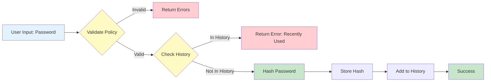

### 2. Account Lockout Flow

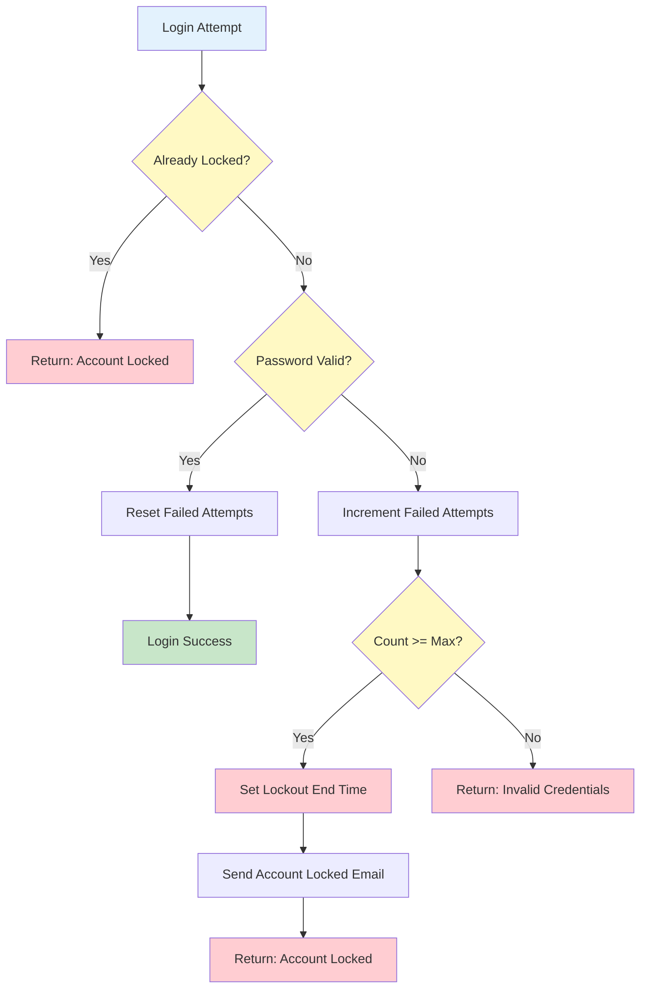

### 3. MFA Setup and Verification Flow

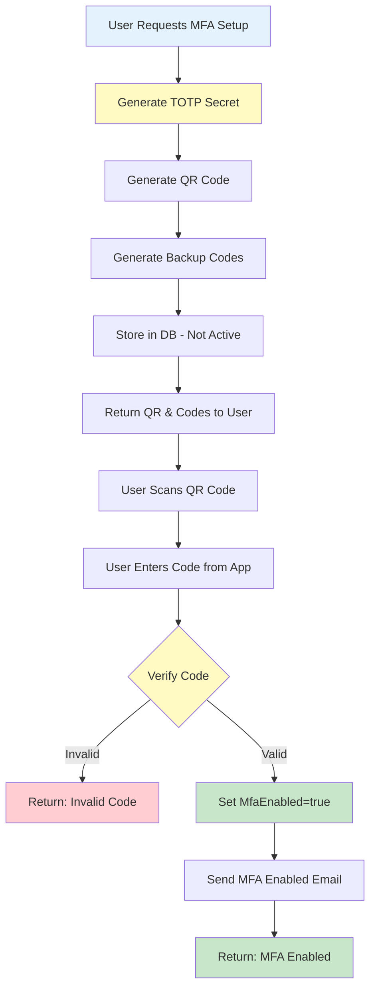

### 4. Session Management Flow

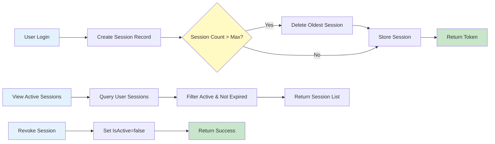

---

## Security Layers

### Layer 1: Transport Security
- **HTTPS Only** in production
- **TLS 1.2+** encryption
- **CORS** configured for allowed origins

### Layer 2: Authentication
- **JWT Bearer Tokens** with expiry
- **Refresh Tokens** for session management
- **Multi-Factor Authentication** (TOTP/Email/SMS)

### Layer 3: Authorization
- **Role-Based Access Control** (RBAC)
- **Tenant Isolation** via middleware
- **Endpoint-level authorization** via [Authorize] attribute

### Layer 4: Password Security
- **BCrypt Hashing** (adaptive, salted)
- **Password Policy** enforcement
- **Password History** tracking (5 passwords)
- **Secure Token Generation** (cryptographic RNG)

### Layer 5: Account Protection
- **Account Lockout** after failed attempts
- **Progressive Lockout** (exponential backoff possible)
- **Email Notifications** for security events
- **Session Management** and revocation

### Layer 6: Audit & Monitoring
- **Failed Login Tracking**
- **Password Change Timestamps**
- **MFA Setup Tracking**
- **Session Activity Logging**

---

## Integration Points

### AWS Services

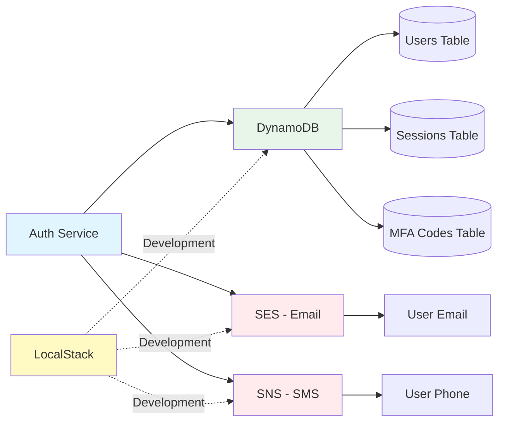

### External Integrations

| Service | Purpose | Fallback |
|---------|---------|----------|
| **AWS SES** | Email delivery | SMTP server |
| **AWS SNS** | SMS delivery | Twilio, custom provider |
| **LocalStack** | Local AWS emulation | Direct AWS in production |
| **Authenticator Apps** | TOTP generation | Backup codes |

---

## Technology Stack

### Backend
- **.NET 8** - Runtime framework
- **ASP.NET Core** - Web framework
- **MediatR** - CQRS pattern
- **FluentValidation** - Input validation
- **Serilog** - Structured logging
- **OpenTelemetry** - Observability

### Security Libraries
- **BCrypt.Net** - Password hashing
- **OtpNet** (v1.9.2) - TOTP implementation
- **QRCoder** (v1.4.3) - QR code generation
- **System.Security.Cryptography** - Token generation

### AWS SDK
- **AWSSDK.DynamoDBv2** - DynamoDB client
- **AWSSDK.SimpleEmailService** - SES client
- **AWSSDK.SimpleNotificationService** - SNS client

### Development Tools
- **LocalStack** - Local AWS emulation
- **Docker** - Containerization
- **Swagger/OpenAPI** - API documentation

---

## Deployment Architecture

### Development Environment

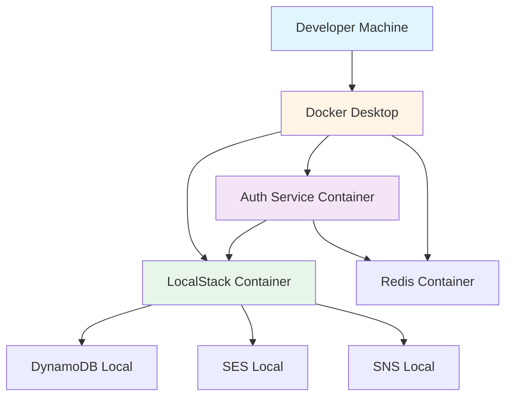

### Production Environment

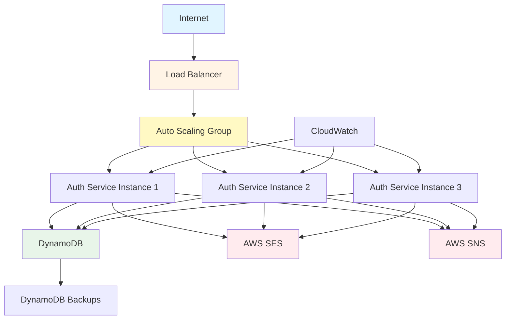

---

## Performance Considerations

### Database Optimization

| Table | Access Pattern | Index/Key | Notes |
|-------|----------------|-----------|-------|
| Users | GetByEmail | GSI1: Email | Most common lookup |
| Users | GetById | PK: USER#{id} | Primary access |
| UserSessions | GetByUser | PK: USER#{userId} | List user sessions |
| UserSessions | GetByToken | Linear scan | Could add GSI |
| MfaCodes | GetByUser | PK: USER#{userId} | Cleanup old codes |

### Caching Strategy

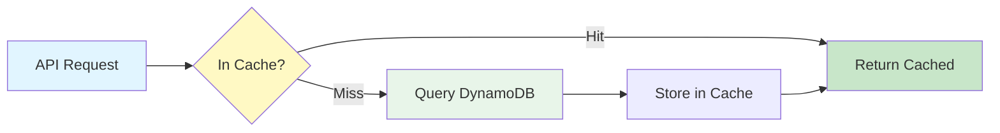

**Cacheable Data**:
- ✅ User profile (after login)
- ✅ MFA settings
- ❌ Session tokens (security)
- ❌ OTP codes (security)

### Rate Limiting (Recommended)

| Endpoint | Rate Limit | Window | Notes |
|----------|-----------|--------|-------|
| /login | 5 attempts | 15 min | Per IP address |
| /password/forgot | 3 requests | 1 hour | Per email |
| /password/reset | 5 attempts | 1 hour | Per token |
| /mfa/verify | 3 attempts | 5 min | Per code |

---

## Monitoring & Alerts

### Key Metrics to Monitor

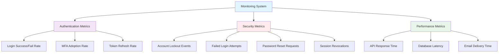

### Alert Thresholds

| Alert | Condition | Action |
|-------|-----------|--------|
| High Failed Logins | > 100 fails/min | Investigate potential attack |
| Mass Lockouts | > 50 lockouts/hour | Check for credential stuffing |
| High Password Resets | > 500 resets/hour | Possible phishing campaign |
| DB Throttling | > 10 throttles/min | Scale DynamoDB capacity |
| SES Bounce Rate | > 5% | Review email list |

---

## Scalability Considerations

### Horizontal Scaling
- **Stateless Services** - All state in DynamoDB
- **No In-Memory Sessions** - Database-backed sessions
- **Load Balancer Ready** - Round-robin distribution

### Database Scaling
- **DynamoDB Auto-Scaling** - On-demand or provisioned
- **Global Tables** - Multi-region replication (future)
- **Point-in-Time Recovery** - Continuous backups

### Service Limits

| AWS Service | Limit | Scalability |
|-------------|-------|-------------|
| SES Emails | 14 emails/sec (sandbox) | Request limit increase |
| SNS SMS | 20 TPS (default) | Request limit increase |
| DynamoDB | 40,000 RCU/WCU per table | On-demand auto-scales |
| Lambda (future) | 1000 concurrent | Request limit increase |

---

## Disaster Recovery

### Backup Strategy

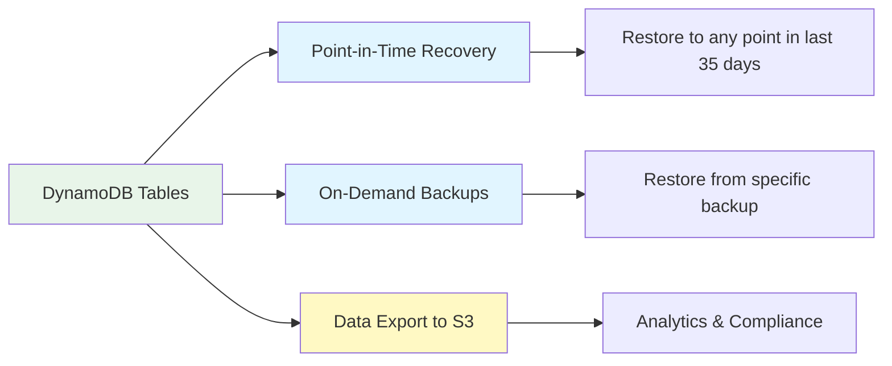

### RTO/RPO Targets

| Scenario | RTO | RPO | Strategy |
|----------|-----|-----|----------|
| Service Failure | < 5 min | 0 | Auto-scaling, health checks |
| Database Failure | < 1 hour | < 5 min | DynamoDB auto-failover |
| Region Failure | < 4 hours | < 1 hour | Multi-region (future) |
| Data Corruption | < 24 hours | < 1 hour | Point-in-time recovery |

---

## Summary

This architecture provides:
- ✅ **Scalable** - Horizontal scaling with stateless services
- ✅ **Secure** - Multiple security layers (transport, auth, password, account)
- ✅ **Resilient** - Database backups, auto-scaling, monitoring
- ✅ **Maintainable** - Clean architecture, CQRS pattern, dependency injection
- ✅ **Observable** - Structured logging, metrics, distributed tracing
- ✅ **Testable** - Service interfaces, dependency injection, isolated components

**Architecture Pattern**: Clean Architecture + CQRS + Event-Driven
**Cloud Provider**: AWS (DynamoDB, SES, SNS)
**Development**: LocalStack for local AWS emulation
**Monitoring**: Serilog + OpenTelemetry + CloudWatch

---

**Document Version**: 1.0
**Last Updated**: October 26, 2025
**Architecture Owner**: Gearify Platform Team
