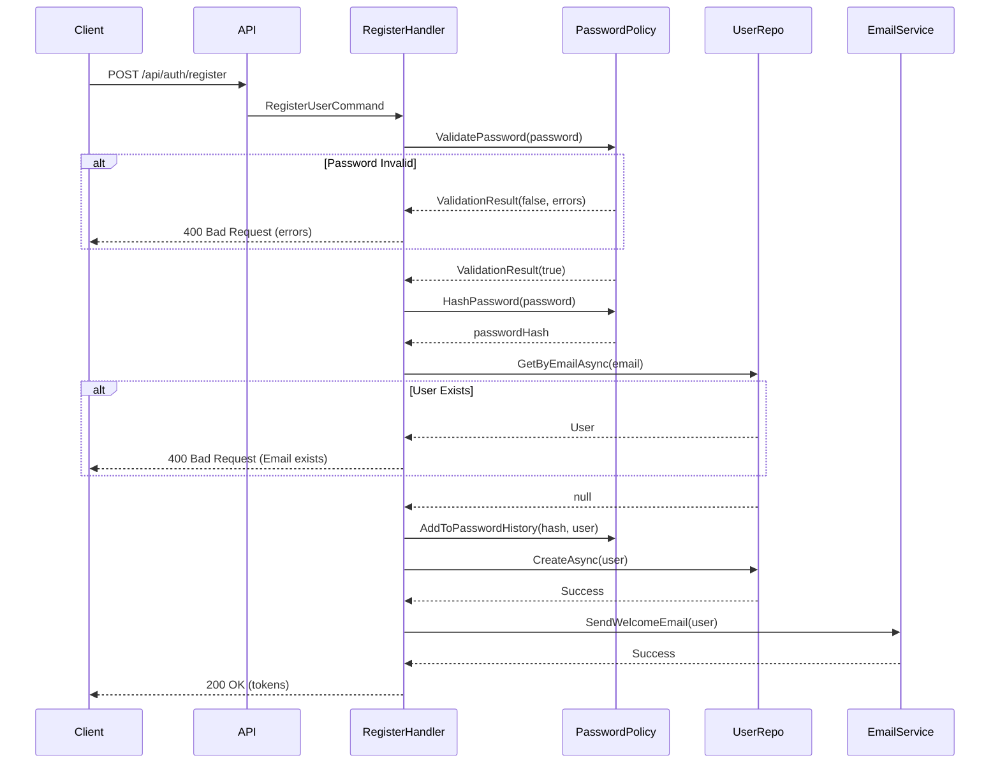
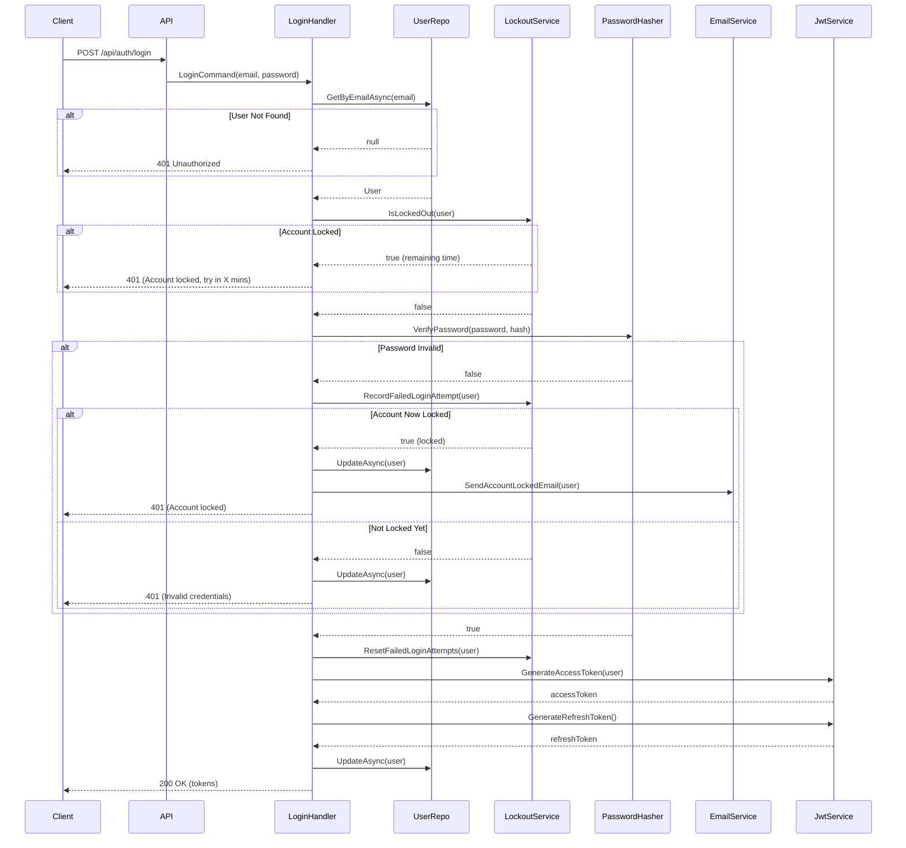
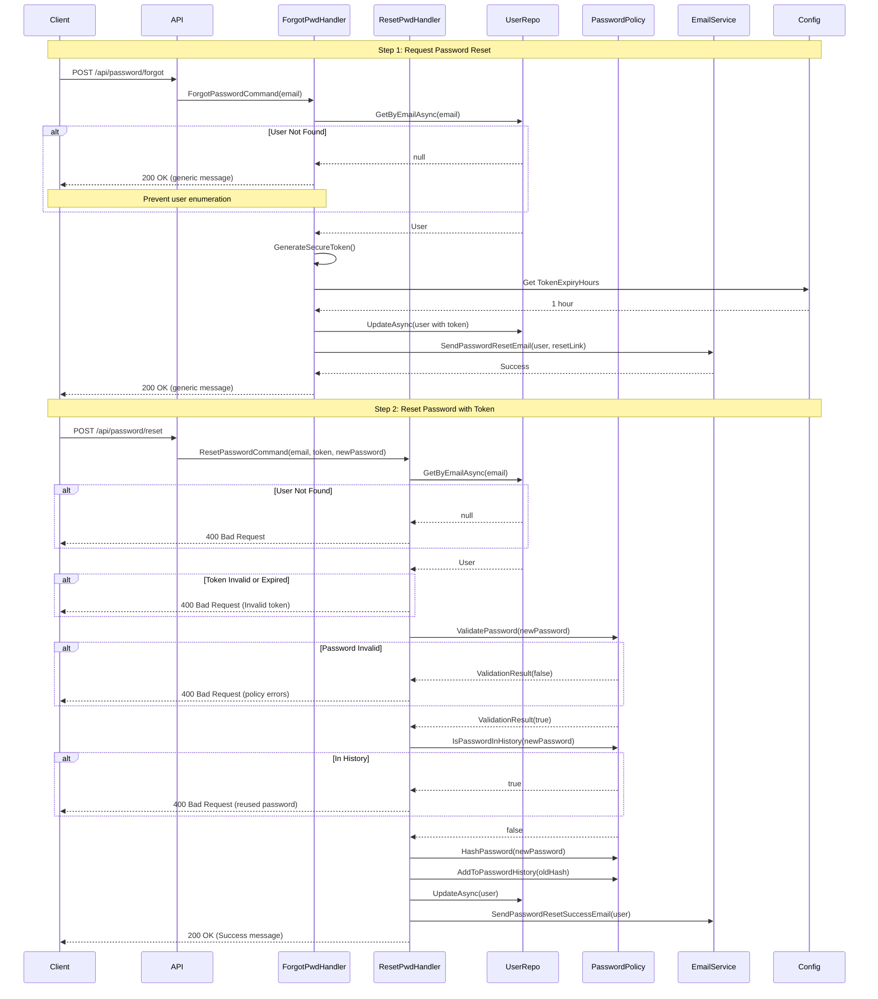
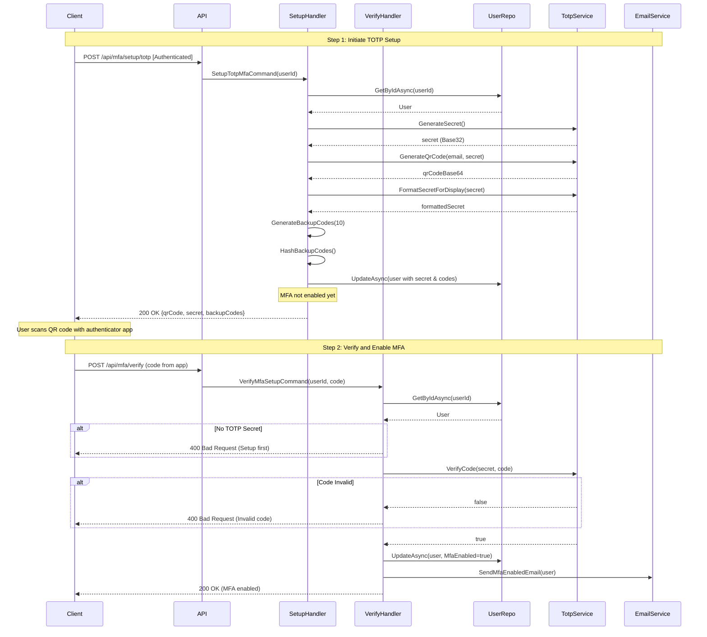
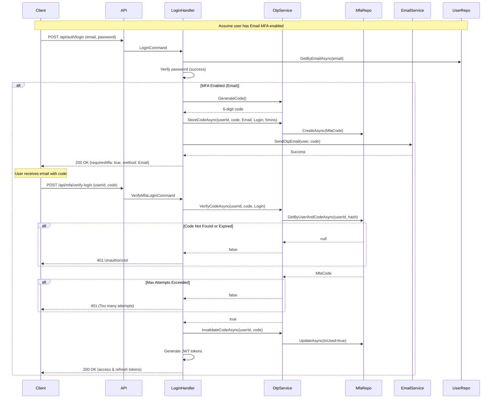
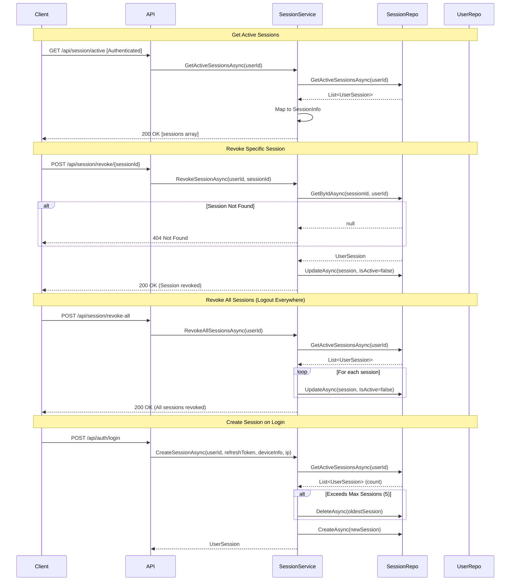
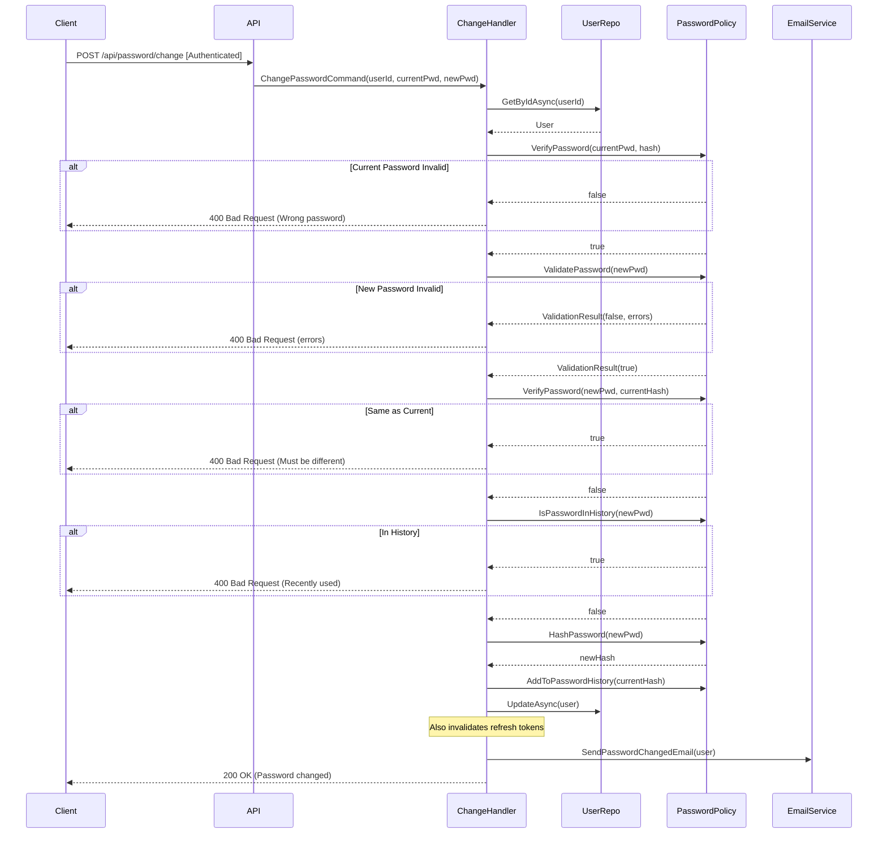

# Enterprise Security Features - Detailed Documentation

## Table of Contents
1. [Model Classes & Properties](#model-classes--properties)
2. [Sequence Diagrams by Feature](#sequence-diagrams-by-feature)
3. [API Request/Response Models](#api-requestresponse-models)
4. [Configuration Models](#configuration-models)

---

## Model Classes & Properties

### 1. User Entity (Extended)
**Location**: `Domain/Entities/User.cs`

**Purpose**: Stores all user information including authentication, security, and MFA settings

| Property | Type | Description | Used By |
|----------|------|-------------|---------|
| `Id` | string | Unique user identifier (GUID) | All features |
| `TenantId` | string | Multi-tenant identifier | All features |
| `Email` | string | User's email address (lowercase) | Login, Password Reset |
| `PasswordHash` | string | BCrypt hashed password | Login, Password Policy |
| `FirstName` | string | User's first name | Email templates |
| `LastName` | string | User's last name | Email templates |
| `Phone` | string | User's phone number (E.164 format) | SMS MFA |
| `Role` | string | User role (Admin, Customer, Manager) | Authorization |
| `CreatedAt` | DateTime | Account creation timestamp | Audit |
| `UpdatedAt` | DateTime | Last update timestamp | Audit |
| `LastLoginAt` | DateTime? | Last successful login | Audit, Sessions |
| `IsActive` | bool | Account active status | Login |
| `EmailVerified` | bool | Email verification status | Registration |
| `RefreshToken` | string? | Current refresh token | Login, Sessions |
| `RefreshTokenExpiry` | DateTime? | Refresh token expiration | Login, Sessions |
| `EmailVerificationToken` | string? | Email verification token | Registration |
| `EmailVerificationTokenExpiry` | DateTime? | Token expiration | Registration |
| **MFA Fields** | | | |
| `MfaEnabled` | bool | Whether MFA is enabled | Login, MFA |
| `PreferredMfaMethod` | string | Preferred MFA method (None/Totp/Email/Sms) | MFA |
| `TotpSecret` | string? | TOTP secret for authenticator apps | TOTP MFA |
| `BackupCodes` | string? | Comma-separated hashed backup codes | MFA Recovery |
| `LastMfaSetupAt` | DateTime? | When MFA was last configured | Audit |
| **Password Reset Fields** | | | |
| `PasswordResetToken` | string? | Password reset token | Password Reset |
| `PasswordResetTokenExpiry` | DateTime? | Token expiration | Password Reset |
| `LastPasswordChangeAt` | DateTime? | Last password change timestamp | Password Policy |
| **Account Lockout Fields** | | | |
| `FailedLoginAttempts` | int | Count of failed login attempts | Account Lockout |
| `LockoutEnd` | DateTime? | When lockout ends | Account Lockout |
| `LockoutEnabled` | bool | Whether lockout is enabled | Account Lockout |
| **Password History** | | | |
| `PasswordHistory` | string? | Comma-separated hashed passwords | Password Policy |
| **Session Tracking** | | | |
| `ActiveSessionCount` | int | Count of active sessions | Session Management |

---

### 2. UserSession Entity
**Location**: `Domain/Entities/UserSession.cs`

**Purpose**: Tracks individual user sessions for security and management

| Property | Type | Description |
|----------|------|-------------|
| `Id` | string | Unique session identifier (GUID) |
| `UserId` | string | Associated user ID |
| `TenantId` | string | Tenant identifier |
| `RefreshToken` | string | Session refresh token |
| `DeviceInfo` | string | User agent / device information |
| `IpAddress` | string | IP address of the session |
| `Location` | string? | Geographic location (optional) |
| `CreatedAt` | DateTime | Session creation time |
| `LastAccessedAt` | DateTime | Last activity timestamp |
| `ExpiresAt` | DateTime | Session expiration time |
| `IsActive` | bool | Whether session is active |

**DynamoDB Schema**:
- **PK**: `USER#{userId}`
- **SK**: `SESSION#{sessionId}`

---

### 3. MfaCode Entity
**Location**: `Domain/Entities/MfaCode.cs`

**Purpose**: Stores temporary OTP codes for Email/SMS MFA

| Property | Type | Description |
|----------|------|-------------|
| `Id` | string | Unique code identifier (GUID) |
| `UserId` | string | Associated user ID |
| `TenantId` | string | Tenant identifier |
| `CodeHash` | string | BCrypt hashed OTP code |
| `Method` | MfaMethod | Email or Sms |
| `CreatedAt` | DateTime | Code generation time |
| `ExpiresAt` | DateTime | Code expiration (typically 5 mins) |
| `IsUsed` | bool | Whether code has been used |
| `AttemptCount` | int | Number of verification attempts |
| `Purpose` | string | Login, Setup, etc. |

**DynamoDB Schema**:
- **PK**: `USER#{userId}`
- **SK**: `MFACODE#{codeId}`

---

### 4. MfaMethod Enum
**Location**: `Domain/Enums/MfaMethod.cs`

```csharp
public enum MfaMethod
{
    None = 0,   // No MFA enabled
    Totp = 1,   // Authenticator app (Google Authenticator, Authy, etc.)
    Email = 2,  // Email OTP codes
    Sms = 3     // SMS OTP codes
}
```

---

### 5. Result Models

#### PasswordValidationResult
**Location**: `Application/Models/PasswordValidationResult.cs`

| Property | Type | Description |
|----------|------|-------------|
| `IsValid` | bool | Whether password meets policy |
| `Errors` | List\<string\> | List of validation errors |

#### MfaSetupResult
**Location**: `Application/Models/MfaSetupResult.cs`

| Property | Type | Description |
|----------|------|-------------|
| `Success` | bool | Whether setup was successful |
| `Message` | string | Success/error message |
| `QrCodeBase64` | string? | Base64-encoded QR code image (TOTP only) |
| `ManualEntryKey` | string? | Formatted TOTP secret for manual entry |
| `BackupCodes` | string[]? | Array of backup recovery codes |

#### MfaVerificationResult
**Location**: `Application/Models/MfaSetupResult.cs`

| Property | Type | Description |
|----------|------|-------------|
| `Success` | bool | Whether verification was successful |
| `Message` | string | Success/error message |
| `Token` | string? | Access token (if MFA verification during login) |
| `RefreshToken` | string? | Refresh token (if MFA verification during login) |

#### SessionInfo
**Location**: `Application/Models/SessionInfo.cs`

| Property | Type | Description |
|----------|------|-------------|
| `SessionId` | string | Session identifier |
| `DeviceInfo` | string | Device/browser information |
| `IpAddress` | string | IP address |
| `Location` | string? | Geographic location |
| `CreatedAt` | DateTime | When session was created |
| `LastAccessedAt` | DateTime | Last activity time |
| `ExpiresAt` | DateTime | When session expires |
| `IsCurrent` | bool | Whether this is the current session |

---

### 6. Configuration Models
**Location**: `Application/Models/SecurityConfiguration.cs`

#### SecurityConfiguration
```csharp
public class SecurityConfiguration
{
    public PasswordPolicySettings PasswordPolicy { get; set; }
    public AccountLockoutSettings AccountLockout { get; set; }
    public MfaSettings Mfa { get; set; }
    public PasswordResetSettings PasswordReset { get; set; }
    public SessionSettings Session { get; set; }
}
```

#### PasswordPolicySettings
| Property | Type | Default | Description |
|----------|------|---------|-------------|
| `MinimumLength` | int | 8 | Minimum password length |
| `RequireUppercase` | bool | true | Require uppercase letters |
| `RequireLowercase` | bool | true | Require lowercase letters |
| `RequireDigit` | bool | true | Require numbers |
| `RequireSpecialChar` | bool | true | Require special characters |
| `PasswordHistoryCount` | int | 5 | Number of previous passwords to remember |

#### AccountLockoutSettings
| Property | Type | Default | Description |
|----------|------|---------|-------------|
| `MaxFailedAttempts` | int | 5 | Failed attempts before lockout |
| `LockoutDurationMinutes` | int | 30 | Duration of lockout |
| `EnableLockout` | bool | true | Whether lockout is enabled |

#### MfaSettings
| Property | Type | Default | Description |
|----------|------|---------|-------------|
| `CodeExpiryMinutes` | int | 5 | OTP code expiration time |
| `MaxVerificationAttempts` | int | 3 | Max attempts per code |
| `BackupCodesCount` | int | 10 | Number of backup codes |
| `TotpIssuer` | string | "Gearify" | Issuer name in authenticator apps |
| `TotpDigits` | int | 6 | Number of digits in TOTP code |
| `TotpPeriod` | int | 30 | TOTP time step in seconds |

#### PasswordResetSettings
| Property | Type | Default | Description |
|----------|------|---------|-------------|
| `TokenExpiryHours` | int | 1 | Reset token expiration |
| `MaxResetAttemptsPerDay` | int | 3 | Max reset requests per day |

#### SessionSettings
| Property | Type | Default | Description |
|----------|------|---------|-------------|
| `MaxConcurrentSessions` | int | 5 | Maximum simultaneous sessions |
| `SessionTimeoutMinutes` | int | 60 | Session inactivity timeout |
| `RefreshTokenExpiryDays` | int | 7 | Refresh token expiration |

---

## Sequence Diagrams by Feature

### Feature 1: User Registration with Password Policy



---

### Feature 2: Login with Account Lockout



---

### Feature 3: Password Reset Flow



---

### Feature 4: TOTP MFA Setup



---

### Feature 5: Email OTP MFA (Login)



---

### Feature 6: Session Management



---

### Feature 7: Change Password (Authenticated User)



---

## API Request/Response Models

### 1. Password Management

#### Forgot Password Request
```json
POST /api/password/forgot
{
  "email": "user@example.com"
}

Response: 200 OK
{
  "success": true,
  "message": "If an account exists with this email, you will receive a password reset link."
}
```

#### Reset Password Request
```json
POST /api/password/reset
{
  "email": "user@example.com",
  "resetToken": "base64-encoded-token",
  "newPassword": "NewSecure@Pass123"
}

Response: 200 OK
{
  "success": true,
  "message": "Your password has been reset successfully."
}

Error: 400 Bad Request
{
  "success": false,
  "message": "Password must contain at least one uppercase letter. Password must contain at least one special character."
}
```

#### Change Password Request
```json
POST /api/password/change
Authorization: Bearer {token}
{
  "currentPassword": "OldPassword123!",
  "newPassword": "NewSecure@Pass456"
}

Response: 200 OK
{
  "success": true,
  "message": "Your password has been changed successfully."
}
```

---

### 2. MFA Management

#### Setup TOTP MFA
```json
POST /api/mfa/setup/totp
Authorization: Bearer {token}

Response: 200 OK
{
  "success": true,
  "message": "TOTP MFA setup successful.",
  "qrCodeBase64": "iVBORw0KGgoAAAANSUhEUgAA...",
  "manualEntryKey": "JBSW Y3DP EHPK 3PXP",
  "backupCodes": [
    "ABCD-1234",
    "EFGH-5678",
    "IJKL-9012",
    ...
  ]
}
```

#### Verify MFA Setup
```json
POST /api/mfa/verify
Authorization: Bearer {token}
{
  "code": "123456"
}

Response: 200 OK
{
  "success": true,
  "message": "MFA has been enabled successfully."
}
```

#### Disable MFA
```json
POST /api/mfa/disable
Authorization: Bearer {token}
{
  "password": "CurrentPassword123!"
}

Response: 200 OK
{
  "success": true,
  "message": "MFA has been disabled successfully."
}
```

---

### 3. Session Management

#### Get Active Sessions
```json
GET /api/session/active
Authorization: Bearer {token}

Response: 200 OK
{
  "success": true,
  "sessions": [
    {
      "sessionId": "sess-123",
      "deviceInfo": "Chrome 120.0 on Windows 10",
      "ipAddress": "192.168.1.100",
      "location": "New York, USA",
      "createdAt": "2025-10-26T10:00:00Z",
      "lastAccessedAt": "2025-10-26T14:30:00Z",
      "expiresAt": "2025-11-02T10:00:00Z",
      "isCurrent": true
    },
    {
      "sessionId": "sess-456",
      "deviceInfo": "Safari 17.0 on iPhone",
      "ipAddress": "192.168.1.101",
      "location": "New York, USA",
      "createdAt": "2025-10-25T08:00:00Z",
      "lastAccessedAt": "2025-10-26T12:00:00Z",
      "expiresAt": "2025-11-01T08:00:00Z",
      "isCurrent": false
    }
  ]
}
```

#### Revoke Session
```json
POST /api/session/revoke/sess-456
Authorization: Bearer {token}

Response: 200 OK
{
  "success": true,
  "message": "Session revoked successfully."
}
```

#### Revoke All Sessions
```json
POST /api/session/revoke-all
Authorization: Bearer {token}

Response: 200 OK
{
  "success": true,
  "message": "All sessions revoked successfully."
}
```

---

## Error Response Format

All endpoints follow consistent error response format:

```json
400 Bad Request / 401 Unauthorized
{
  "success": false,
  "message": "Detailed error message explaining what went wrong"
}
```

**Common Error Scenarios**:

| HTTP Code | Scenario | Message Example |
|-----------|----------|----------------|
| 400 | Password policy violation | "Password must be at least 8 characters long." |
| 400 | Password in history | "You cannot reuse a recent password." |
| 401 | Account locked | "Account is locked. Please try again in 28 minutes." |
| 401 | Invalid credentials | "Invalid email or password" |
| 401 | MFA code invalid | "Invalid verification code. Please try again." |
| 401 | Token expired | "Reset token has expired. Please request a new one." |
| 404 | Session not found | "Session not found." |

---

## Summary

This documentation provides:
- ✅ Complete model class definitions with all properties
- ✅ Property associations showing which features use each field
- ✅ Detailed sequence diagrams for all 7 major features
- ✅ API request/response examples
- ✅ Error handling patterns
- ✅ Configuration model details

All diagrams use Mermaid syntax and can be rendered in:
- GitHub (native support)
- GitLab (native support)
- VS Code (with Mermaid extension)
- Documentation tools (MkDocs, Docusaurus, etc.)

---

**Document Version**: 1.0
**Last Updated**: October 26, 2025
**Status**: ✅ Complete
