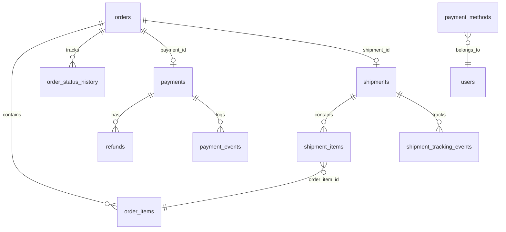
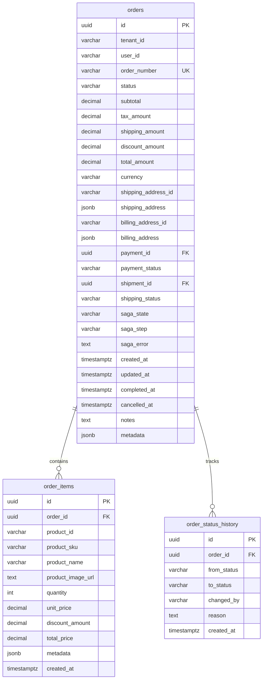
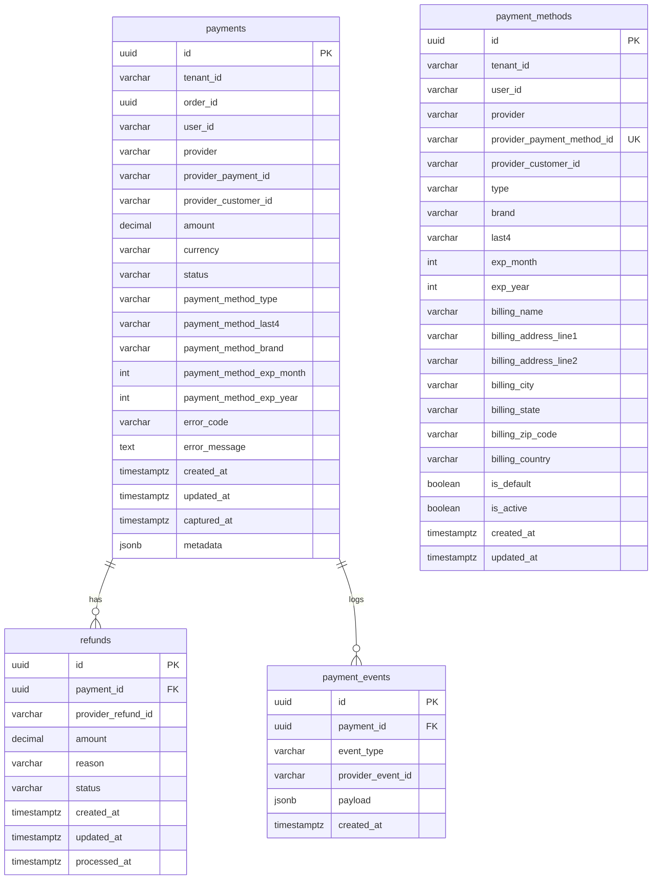
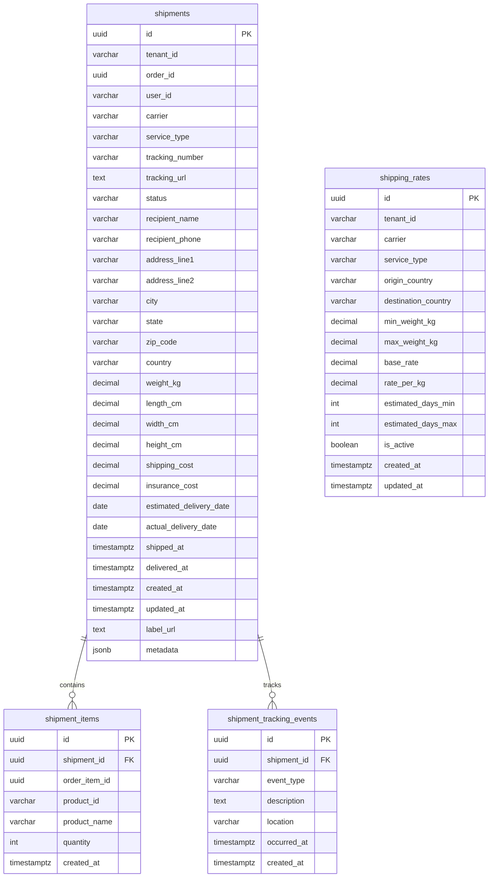
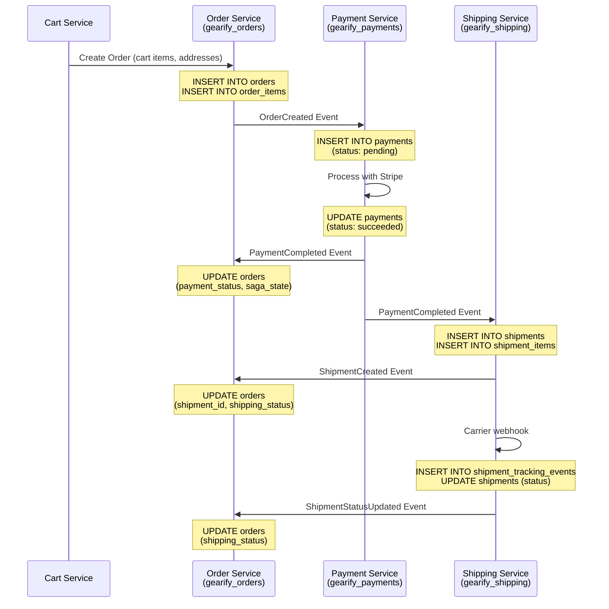

# Gearify Checkout - PostgreSQL Database Schema

This document describes the PostgreSQL database schema for the checkout and order management system. The system uses three separate databases for microservice isolation.

## Database Overview

| Database | Service | Purpose |
|----------|---------|---------|
| `gearify_orders` | order-svc | Order management, saga orchestration |
| `gearify_payments` | payment-svc | Payment processing, payment methods |
| `gearify_shipping` | shipping-svc | Shipment tracking, carrier management |

---

## Entity Relationship Diagram

### Complete System Overview



---

## Database: `gearify_orders`

### ER Diagram



### Table: `orders`

Main order table storing order header information.

| Column | Type | Constraints | Description |
|--------|------|-------------|-------------|
| `id` | UUID | PK, DEFAULT gen_random_uuid() | Unique order identifier |
| `tenant_id` | VARCHAR(50) | NOT NULL | Multi-tenant identifier |
| `user_id` | VARCHAR(100) | NOT NULL | User who placed the order |
| `order_number` | VARCHAR(20) | UNIQUE, NOT NULL | Human-readable order number |
| `status` | VARCHAR(30) | NOT NULL, DEFAULT 'pending' | Order status |
| `subtotal` | DECIMAL(12,2) | NOT NULL | Sum of item prices before tax/shipping |
| `tax_amount` | DECIMAL(12,2) | DEFAULT 0 | Tax amount |
| `shipping_amount` | DECIMAL(12,2) | DEFAULT 0 | Shipping cost |
| `discount_amount` | DECIMAL(12,2) | DEFAULT 0 | Total discounts applied |
| `total_amount` | DECIMAL(12,2) | NOT NULL | Final order total |
| `currency` | VARCHAR(3) | DEFAULT 'USD' | Currency code |
| `shipping_address_id` | VARCHAR(100) | - | Reference to address in DynamoDB (auth-svc) |
| `shipping_address` | JSONB | - | Snapshot of shipping address at order time |
| `billing_address_id` | VARCHAR(100) | - | Reference to address in DynamoDB (auth-svc) |
| `billing_address` | JSONB | - | Snapshot of billing address at order time |
| `payment_id` | UUID | FK (logical) | Reference to payment in payment-svc |
| `payment_status` | VARCHAR(30) | - | Cached payment status |
| `shipment_id` | UUID | FK (logical) | Reference to shipment in shipping-svc |
| `shipping_status` | VARCHAR(30) | - | Cached shipping status |
| `saga_state` | VARCHAR(50) | DEFAULT 'created' | Current saga state |
| `saga_step` | VARCHAR(50) | - | Current saga step |
| `saga_error` | TEXT | - | Error message if saga failed |
| `created_at` | TIMESTAMPTZ | DEFAULT NOW() | Order creation time |
| `updated_at` | TIMESTAMPTZ | DEFAULT NOW() | Last update time |
| `completed_at` | TIMESTAMPTZ | - | Order completion time |
| `cancelled_at` | TIMESTAMPTZ | - | Order cancellation time |
| `notes` | TEXT | - | Order notes |
| `metadata` | JSONB | DEFAULT '{}' | Additional metadata |

**Order Status Values:**
- `pending` - Order created, awaiting payment
- `payment_processing` - Payment is being processed
- `payment_failed` - Payment failed
- `paid` - Payment successful
- `processing` - Order being prepared
- `shipped` - Order shipped
- `delivered` - Order delivered
- `cancelled` - Order cancelled
- `refunded` - Order refunded

**Saga State Values:**
- `created` - Order created
- `payment_pending` - Waiting for payment
- `payment_completed` - Payment successful
- `shipping_pending` - Waiting for shipment creation
- `shipping_created` - Shipment created
- `completed` - Saga completed successfully
- `compensating` - Running compensation
- `failed` - Saga failed

**Address JSONB Structure:**

The `shipping_address` and `billing_address` columns store a snapshot of the address from DynamoDB at order time:

```json
{
  "id": "addr-123",
  "label": "Home",
  "firstName": "John",
  "lastName": "Doe",
  "phone": "+1234567890",
  "addressLine1": "123 Main St",
  "addressLine2": "Apt 4B",
  "city": "New York",
  "state": "NY",
  "zipCode": "10001",
  "country": "USA"
}
```

This approach provides:
- **Reference**: `shipping_address_id` links to the original address in auth-svc (DynamoDB)
- **Immutability**: JSONB snapshot preserves the exact address used at order time
- **Independence**: No cross-service calls needed to display order details

### Table: `order_items`

Line items within an order.

| Column | Type | Constraints | Description |
|--------|------|-------------|-------------|
| `id` | UUID | PK | Unique item identifier |
| `order_id` | UUID | FK, NOT NULL | Parent order reference |
| `product_id` | VARCHAR(100) | NOT NULL | Product identifier |
| `product_sku` | VARCHAR(50) | NOT NULL | Product SKU |
| `product_name` | VARCHAR(255) | NOT NULL | Product name at time of order |
| `product_image_url` | TEXT | - | Product image URL |
| `quantity` | INT | NOT NULL, CHECK > 0 | Quantity ordered |
| `unit_price` | DECIMAL(12,2) | NOT NULL | Price per unit |
| `discount_amount` | DECIMAL(12,2) | DEFAULT 0 | Discount on this item |
| `total_price` | DECIMAL(12,2) | NOT NULL | Total price for line item |
| `metadata` | JSONB | DEFAULT '{}' | Additional metadata (variants, etc.) |
| `created_at` | TIMESTAMPTZ | DEFAULT NOW() | Creation time |

### Table: `order_status_history`

Audit trail of order status changes.

| Column | Type | Constraints | Description |
|--------|------|-------------|-------------|
| `id` | UUID | PK | Unique record identifier |
| `order_id` | UUID | FK, NOT NULL | Parent order reference |
| `from_status` | VARCHAR(30) | - | Previous status |
| `to_status` | VARCHAR(30) | NOT NULL | New status |
| `changed_by` | VARCHAR(100) | - | User/system that made change |
| `reason` | TEXT | - | Reason for status change |
| `created_at` | TIMESTAMPTZ | DEFAULT NOW() | When change occurred |

### Indexes

```sql
CREATE INDEX idx_orders_tenant_id ON orders(tenant_id);
CREATE INDEX idx_orders_user_id ON orders(user_id);
CREATE INDEX idx_orders_status ON orders(status);
CREATE INDEX idx_orders_order_number ON orders(order_number);
CREATE INDEX idx_orders_created_at ON orders(created_at DESC);
CREATE INDEX idx_orders_saga_state ON orders(saga_state);
CREATE INDEX idx_order_items_order_id ON order_items(order_id);
CREATE INDEX idx_order_items_product_id ON order_items(product_id);
CREATE INDEX idx_order_status_history_order_id ON order_status_history(order_id);
```

---

## Database: `gearify_payments`

### ER Diagram



### Table: `payments`

Payment transactions.

| Column | Type | Constraints | Description |
|--------|------|-------------|-------------|
| `id` | UUID | PK | Unique payment identifier |
| `tenant_id` | VARCHAR(50) | NOT NULL | Multi-tenant identifier |
| `order_id` | UUID | NOT NULL | Associated order ID |
| `user_id` | VARCHAR(100) | NOT NULL | User who made payment |
| `provider` | VARCHAR(30) | NOT NULL | Payment provider (stripe, paypal) |
| `provider_payment_id` | VARCHAR(255) | - | Provider's payment ID |
| `provider_customer_id` | VARCHAR(255) | - | Provider's customer ID |
| `amount` | DECIMAL(12,2) | NOT NULL | Payment amount |
| `currency` | VARCHAR(3) | DEFAULT 'USD' | Currency code |
| `status` | VARCHAR(30) | NOT NULL, DEFAULT 'pending' | Payment status |
| `payment_method_type` | VARCHAR(30) | - | Type (card, paypal, etc.) |
| `payment_method_last4` | VARCHAR(4) | - | Last 4 digits |
| `payment_method_brand` | VARCHAR(30) | - | Card brand |
| `payment_method_exp_month` | INT | - | Expiration month |
| `payment_method_exp_year` | INT | - | Expiration year |
| `error_code` | VARCHAR(50) | - | Error code if failed |
| `error_message` | TEXT | - | Error message if failed |
| `created_at` | TIMESTAMPTZ | DEFAULT NOW() | Creation time |
| `updated_at` | TIMESTAMPTZ | DEFAULT NOW() | Last update time |
| `captured_at` | TIMESTAMPTZ | - | When payment was captured |
| `metadata` | JSONB | DEFAULT '{}' | Additional metadata |

**Payment Status Values:**
- `pending` - Payment initiated
- `processing` - Payment processing with provider
- `succeeded` - Payment successful
- `failed` - Payment failed
- `refunded` - Fully refunded
- `partially_refunded` - Partially refunded
- `cancelled` - Payment cancelled

### Table: `payment_methods`

Stored payment methods (tokenized, never raw card data).

| Column | Type | Constraints | Description |
|--------|------|-------------|-------------|
| `id` | UUID | PK | Unique identifier |
| `tenant_id` | VARCHAR(50) | NOT NULL | Multi-tenant identifier |
| `user_id` | VARCHAR(100) | NOT NULL | Owner of payment method |
| `provider` | VARCHAR(30) | NOT NULL | Payment provider |
| `provider_payment_method_id` | VARCHAR(255) | UNIQUE, NOT NULL | Provider's token ID |
| `provider_customer_id` | VARCHAR(255) | - | Provider's customer ID |
| `type` | VARCHAR(30) | NOT NULL | Type (card, bank_account) |
| `brand` | VARCHAR(30) | - | Card brand |
| `last4` | VARCHAR(4) | - | Last 4 digits |
| `exp_month` | INT | - | Expiration month |
| `exp_year` | INT | - | Expiration year |
| `billing_*` | VARCHAR | - | Billing address fields |
| `is_default` | BOOLEAN | DEFAULT false | Default payment method |
| `is_active` | BOOLEAN | DEFAULT true | Active/inactive status |
| `created_at` | TIMESTAMPTZ | DEFAULT NOW() | Creation time |
| `updated_at` | TIMESTAMPTZ | DEFAULT NOW() | Last update time |

### Table: `refunds`

Refund records.

| Column | Type | Constraints | Description |
|--------|------|-------------|-------------|
| `id` | UUID | PK | Unique identifier |
| `payment_id` | UUID | FK, NOT NULL | Parent payment |
| `provider_refund_id` | VARCHAR(255) | - | Provider's refund ID |
| `amount` | DECIMAL(12,2) | NOT NULL | Refund amount |
| `reason` | VARCHAR(255) | - | Refund reason |
| `status` | VARCHAR(30) | DEFAULT 'pending' | Refund status |
| `created_at` | TIMESTAMPTZ | DEFAULT NOW() | Creation time |
| `updated_at` | TIMESTAMPTZ | DEFAULT NOW() | Last update time |
| `processed_at` | TIMESTAMPTZ | - | When refund processed |

### Table: `payment_events`

Webhook and event log from payment providers.

| Column | Type | Constraints | Description |
|--------|------|-------------|-------------|
| `id` | UUID | PK | Unique identifier |
| `payment_id` | UUID | FK, NOT NULL | Related payment |
| `event_type` | VARCHAR(50) | NOT NULL | Event type |
| `provider_event_id` | VARCHAR(255) | - | Provider's event ID |
| `payload` | JSONB | DEFAULT '{}' | Full event payload |
| `created_at` | TIMESTAMPTZ | DEFAULT NOW() | When event received |

### Indexes

```sql
CREATE INDEX idx_payments_tenant_id ON payments(tenant_id);
CREATE INDEX idx_payments_order_id ON payments(order_id);
CREATE INDEX idx_payments_user_id ON payments(user_id);
CREATE INDEX idx_payments_status ON payments(status);
CREATE INDEX idx_payments_provider_payment_id ON payments(provider_payment_id);
CREATE INDEX idx_payment_methods_tenant_user ON payment_methods(tenant_id, user_id);
CREATE INDEX idx_payment_methods_provider_customer ON payment_methods(provider_customer_id);
CREATE INDEX idx_refunds_payment_id ON refunds(payment_id);
CREATE INDEX idx_payment_events_payment_id ON payment_events(payment_id);
```

---

## Database: `gearify_shipping`

### ER Diagram



### Table: `shipments`

Shipment records.

| Column | Type | Constraints | Description |
|--------|------|-------------|-------------|
| `id` | UUID | PK | Unique identifier |
| `tenant_id` | VARCHAR(50) | NOT NULL | Multi-tenant identifier |
| `order_id` | UUID | NOT NULL | Associated order ID |
| `user_id` | VARCHAR(100) | NOT NULL | Recipient user ID |
| `carrier` | VARCHAR(50) | - | Carrier (fedex, ups, usps, dhl) |
| `service_type` | VARCHAR(50) | - | Service type (standard, express) |
| `tracking_number` | VARCHAR(100) | - | Carrier tracking number |
| `tracking_url` | TEXT | - | Tracking URL |
| `status` | VARCHAR(30) | DEFAULT 'pending' | Shipment status |
| `recipient_name` | VARCHAR(200) | - | Recipient full name |
| `recipient_phone` | VARCHAR(20) | - | Recipient phone |
| `address_line1` | VARCHAR(255) | NOT NULL | Address line 1 |
| `address_line2` | VARCHAR(255) | - | Address line 2 |
| `city` | VARCHAR(100) | NOT NULL | City |
| `state` | VARCHAR(100) | - | State/Province |
| `zip_code` | VARCHAR(20) | NOT NULL | ZIP/Postal code |
| `country` | VARCHAR(100) | NOT NULL | Country |
| `weight_kg` | DECIMAL(10,3) | - | Package weight |
| `length_cm` | DECIMAL(10,2) | - | Package length |
| `width_cm` | DECIMAL(10,2) | - | Package width |
| `height_cm` | DECIMAL(10,2) | - | Package height |
| `shipping_cost` | DECIMAL(12,2) | - | Shipping cost |
| `insurance_cost` | DECIMAL(12,2) | DEFAULT 0 | Insurance cost |
| `estimated_delivery_date` | DATE | - | Estimated delivery |
| `actual_delivery_date` | DATE | - | Actual delivery |
| `shipped_at` | TIMESTAMPTZ | - | When shipped |
| `delivered_at` | TIMESTAMPTZ | - | When delivered |
| `created_at` | TIMESTAMPTZ | DEFAULT NOW() | Creation time |
| `updated_at` | TIMESTAMPTZ | DEFAULT NOW() | Last update time |
| `label_url` | TEXT | - | Shipping label URL |
| `metadata` | JSONB | DEFAULT '{}' | Additional metadata |

**Shipment Status Values:**
- `pending` - Shipment created, awaiting processing
- `label_created` - Shipping label generated
- `picked_up` - Package picked up by carrier
- `in_transit` - Package in transit
- `out_for_delivery` - Out for delivery
- `delivered` - Package delivered
- `failed` - Delivery failed
- `returned` - Package returned

### Table: `shipment_items`

Items included in a shipment.

| Column | Type | Constraints | Description |
|--------|------|-------------|-------------|
| `id` | UUID | PK | Unique identifier |
| `shipment_id` | UUID | FK, NOT NULL | Parent shipment |
| `order_item_id` | UUID | NOT NULL | Reference to order item |
| `product_id` | VARCHAR(100) | NOT NULL | Product ID |
| `product_name` | VARCHAR(255) | NOT NULL | Product name |
| `quantity` | INT | NOT NULL, CHECK > 0 | Quantity in shipment |
| `created_at` | TIMESTAMPTZ | DEFAULT NOW() | Creation time |

### Table: `shipment_tracking_events`

Tracking history from carriers.

| Column | Type | Constraints | Description |
|--------|------|-------------|-------------|
| `id` | UUID | PK | Unique identifier |
| `shipment_id` | UUID | FK, NOT NULL | Parent shipment |
| `event_type` | VARCHAR(50) | NOT NULL | Event type |
| `description` | TEXT | - | Event description |
| `location` | VARCHAR(255) | - | Event location |
| `occurred_at` | TIMESTAMPTZ | NOT NULL | When event occurred |
| `created_at` | TIMESTAMPTZ | DEFAULT NOW() | When recorded |

### Table: `shipping_rates`

Configurable shipping rates per carrier/service.

| Column | Type | Constraints | Description |
|--------|------|-------------|-------------|
| `id` | UUID | PK | Unique identifier |
| `tenant_id` | VARCHAR(50) | NOT NULL | Multi-tenant identifier |
| `carrier` | VARCHAR(50) | NOT NULL | Carrier name |
| `service_type` | VARCHAR(50) | NOT NULL | Service type |
| `origin_country` | VARCHAR(100) | - | Origin country filter |
| `destination_country` | VARCHAR(100) | - | Destination country filter |
| `min_weight_kg` | DECIMAL(10,3) | DEFAULT 0 | Minimum weight |
| `max_weight_kg` | DECIMAL(10,3) | - | Maximum weight |
| `base_rate` | DECIMAL(12,2) | NOT NULL | Base shipping rate |
| `rate_per_kg` | DECIMAL(12,2) | DEFAULT 0 | Rate per kg |
| `estimated_days_min` | INT | - | Min delivery days |
| `estimated_days_max` | INT | - | Max delivery days |
| `is_active` | BOOLEAN | DEFAULT true | Active status |
| `created_at` | TIMESTAMPTZ | DEFAULT NOW() | Creation time |
| `updated_at` | TIMESTAMPTZ | DEFAULT NOW() | Last update time |

### Indexes

```sql
CREATE INDEX idx_shipments_tenant_id ON shipments(tenant_id);
CREATE INDEX idx_shipments_order_id ON shipments(order_id);
CREATE INDEX idx_shipments_user_id ON shipments(user_id);
CREATE INDEX idx_shipments_status ON shipments(status);
CREATE INDEX idx_shipments_tracking_number ON shipments(tracking_number);
CREATE INDEX idx_shipment_items_shipment_id ON shipment_items(shipment_id);
CREATE INDEX idx_shipment_tracking_events_shipment_id ON shipment_tracking_events(shipment_id);
CREATE INDEX idx_shipping_rates_tenant ON shipping_rates(tenant_id);
CREATE INDEX idx_shipping_rates_lookup ON shipping_rates(carrier, service_type, destination_country);
```

---

## Cross-Service Data Flow



---

## Connection Strings

### Development (Docker)

```
# Order Service
Host=postgres;Port=5432;Database=gearify_orders;Username=postgres;Password=postgres

# Payment Service
Host=postgres;Port=5432;Database=gearify_payments;Username=postgres;Password=postgres

# Shipping Service
Host=postgres;Port=5432;Database=gearify_shipping;Username=postgres;Password=postgres
```

### Local Development

```
# Order Service
Host=localhost;Port=5432;Database=gearify_orders;Username=postgres;Password=postgres

# Payment Service
Host=localhost;Port=5432;Database=gearify_payments;Username=postgres;Password=postgres

# Shipping Service
Host=localhost;Port=5432;Database=gearify_shipping;Username=postgres;Password=postgres
```

---

## Migration Strategy

Each service manages its own database migrations using Entity Framework Core:

```bash
# Order Service
cd gearify-order-svc
dotnet ef migrations add InitialCreate
dotnet ef database update

# Payment Service
cd gearify-payment-svc
dotnet ef migrations add InitialCreate
dotnet ef database update

# Shipping Service
cd gearify-shipping-svc
dotnet ef migrations add InitialCreate
dotnet ef database update
```

For Docker development, the init script (`postgres/init-databases.sql`) creates all databases and tables automatically on first run.
