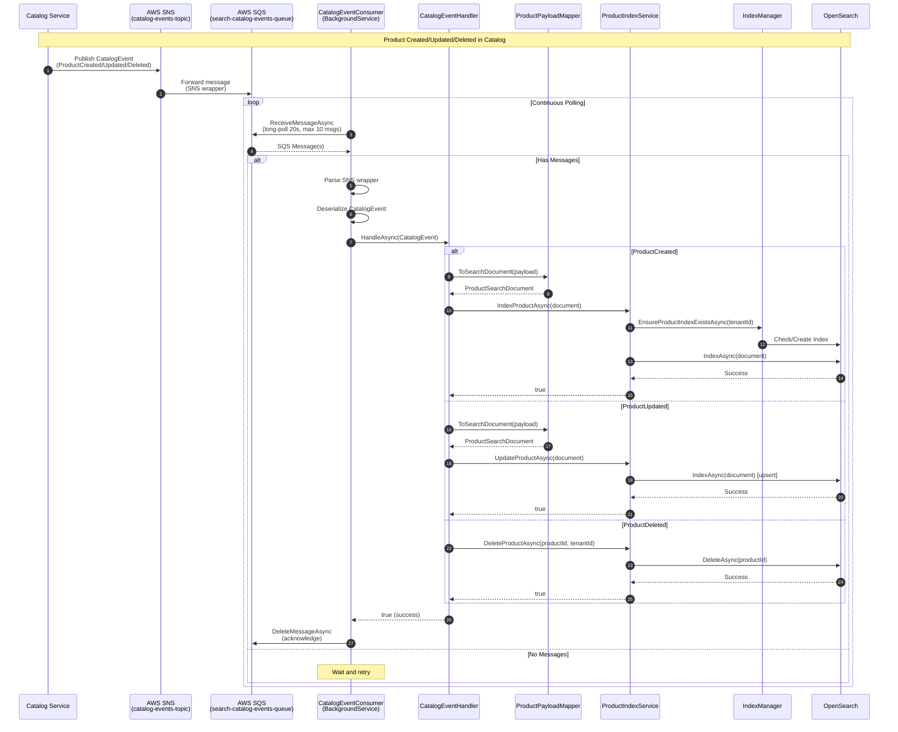
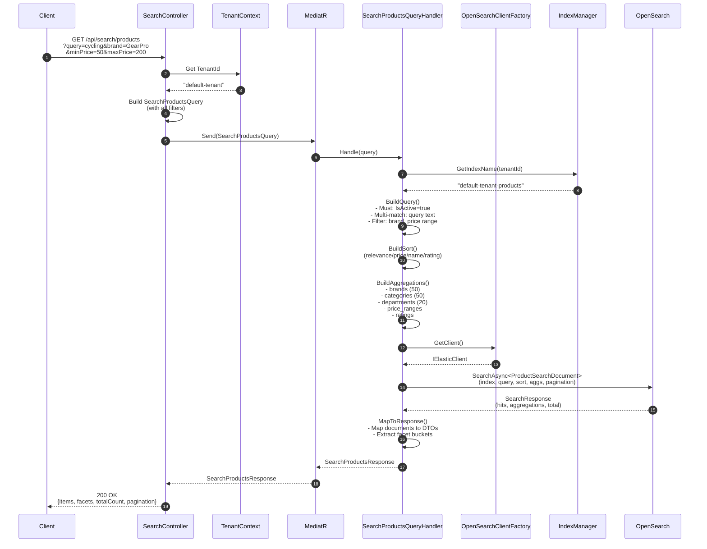
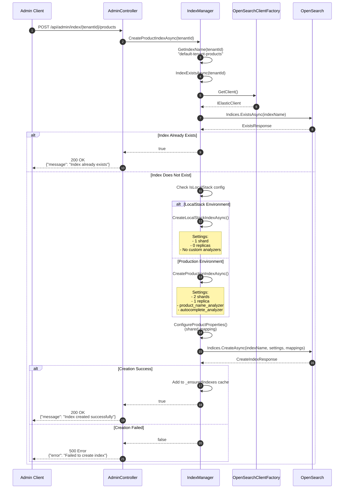
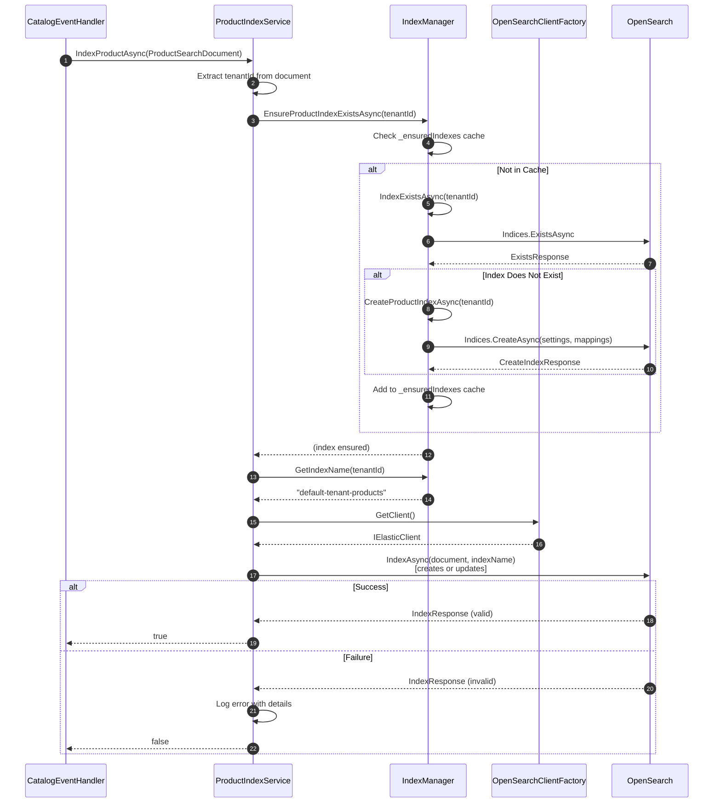
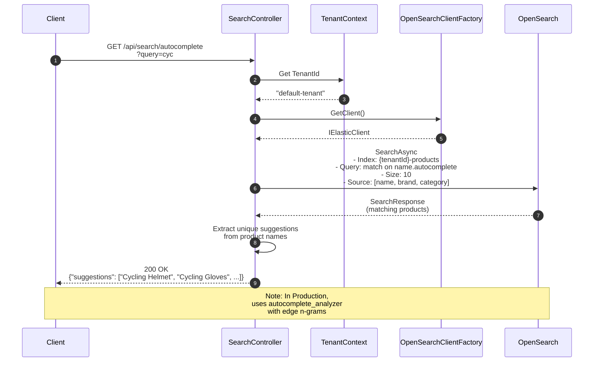
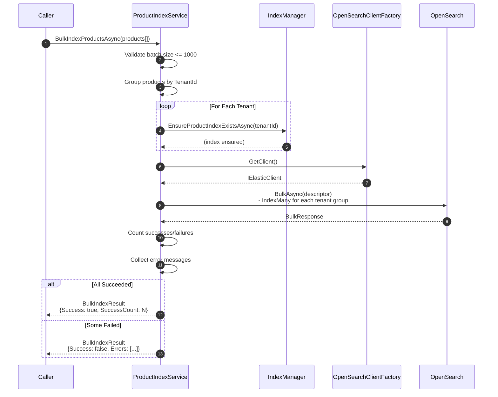
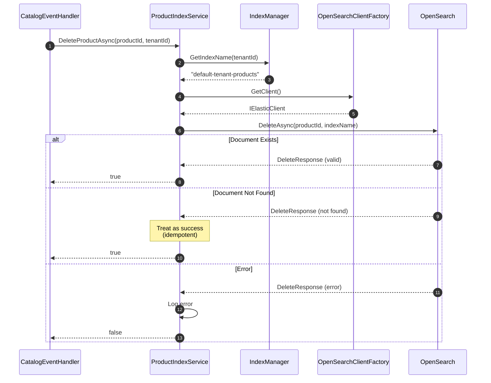

# Search Service - Sequence Diagrams

This document contains Mermaid sequence diagrams illustrating the key flows in the Search Service.

## Table of Contents

1. [Event-Driven Synchronization Flow](#1-event-driven-synchronization-flow)
2. [Product Search Flow](#2-product-search-flow)
3. [Index Creation Flow](#3-index-creation-flow)
4. [Product Indexing Flow](#4-product-indexing-flow)
5. [Autocomplete Flow](#5-autocomplete-flow)

---

## 1. Event-Driven Synchronization Flow

This diagram shows how product changes in the Catalog Service are synchronized to the Search Service.

---

## 2. Product Search Flow

This diagram shows how a search request is processed from the API to OpenSearch.

---

## 3. Index Creation Flow

This diagram shows how a product index is created via the Admin API.

---

## 4. Product Indexing Flow

This diagram shows the detailed flow when indexing a single product.

---

## 5. Autocomplete Flow

This diagram shows the autocomplete suggestion flow (planned for Module 4.1).

---

## 6. Bulk Indexing Flow

This diagram shows the bulk indexing operation for multiple products.

---

## 7. Delete Product Flow

This diagram shows the product deletion flow.

---

## Message Flow Legend

| Symbol | Meaning |
|--------|---------|
| `->>`  | Synchronous request |
| `-->>` | Response |
| `alt`  | Alternative paths |
| `loop` | Repeated operation |
| `Note` | Additional context |

---

## Related Documentation

- [Class Responsibilities](./CLASS-RESPONSIBILITIES.md) - Detailed class documentation
- [Architecture](./ARCHITECTURE.md) - System architecture overview
- [Implementation Plan](./IMPLEMENTATION-PLAN.md) - Development guide
