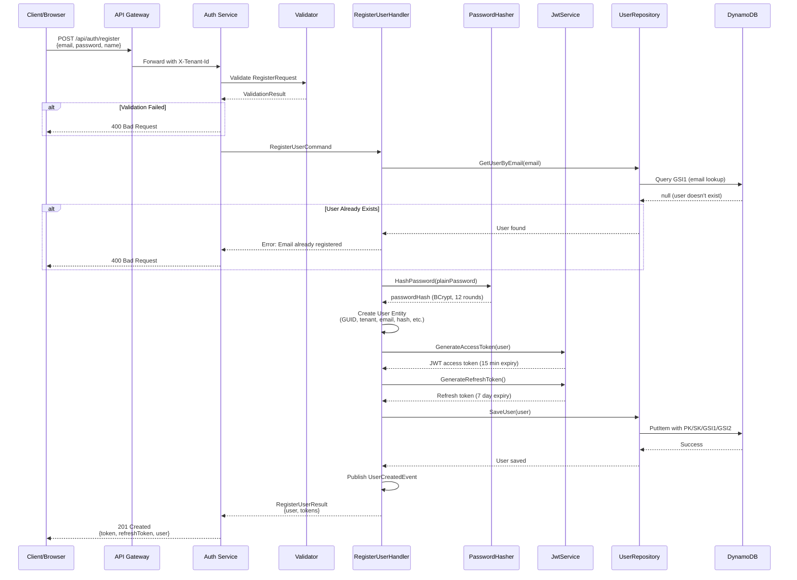
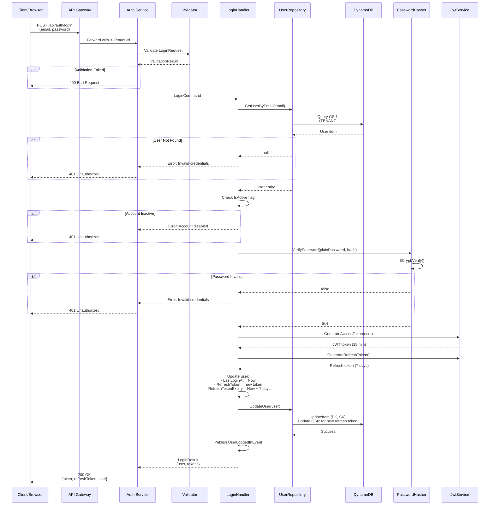
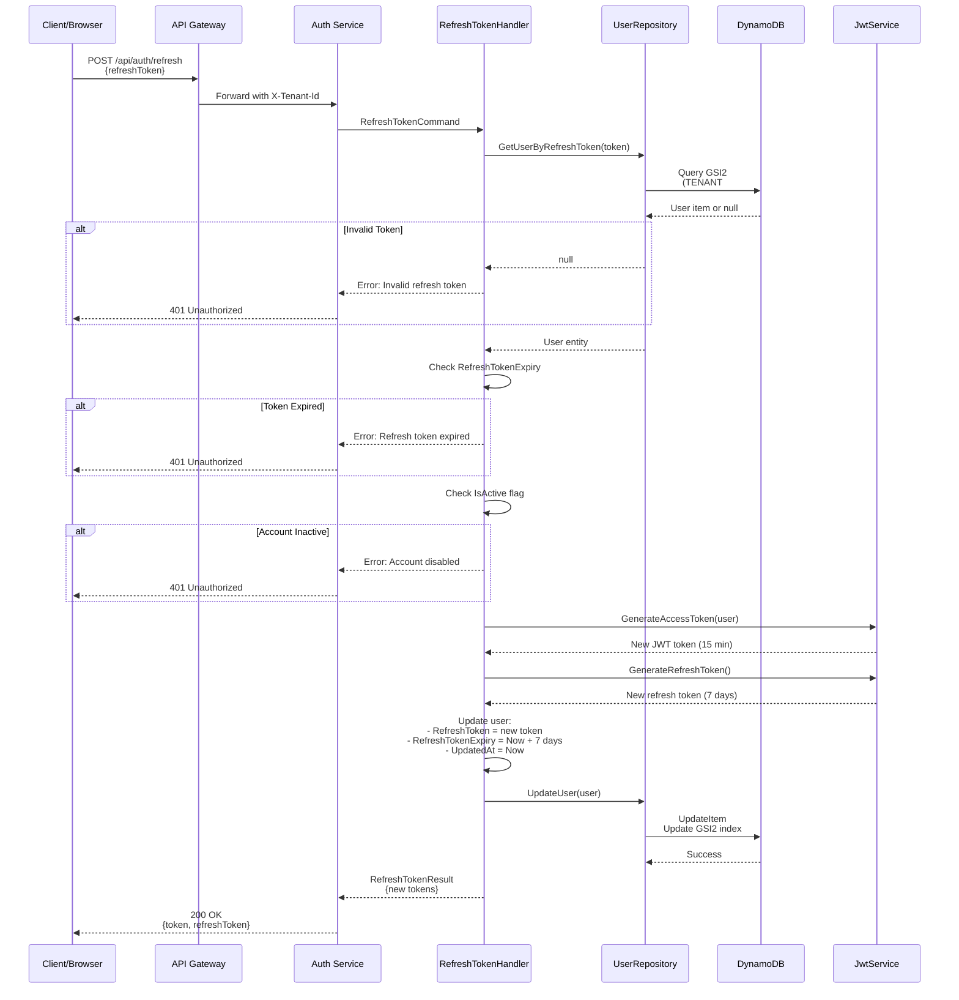
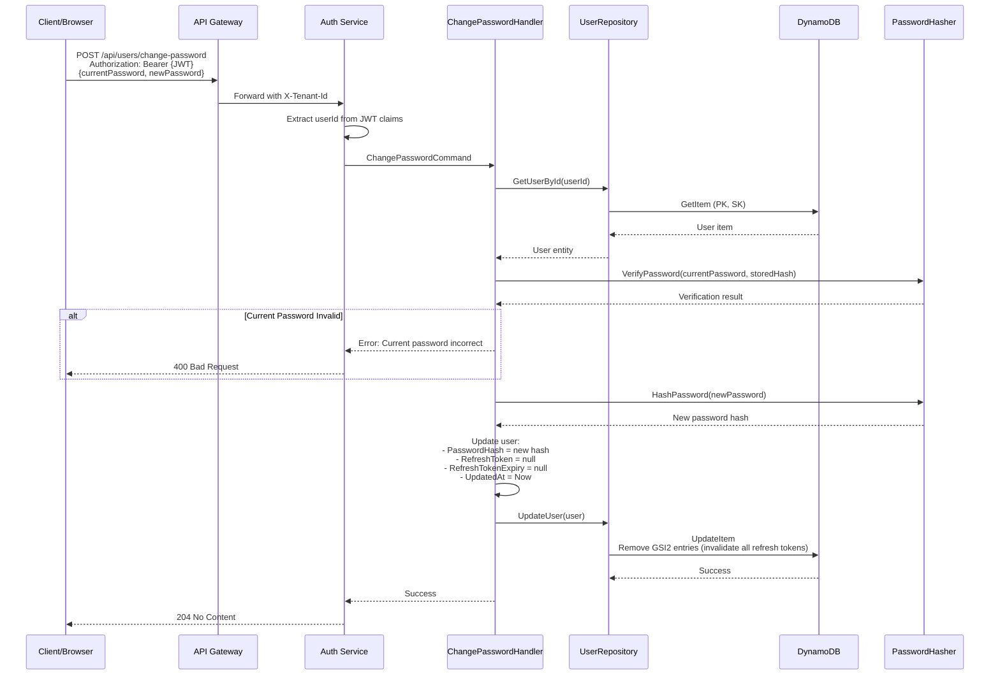
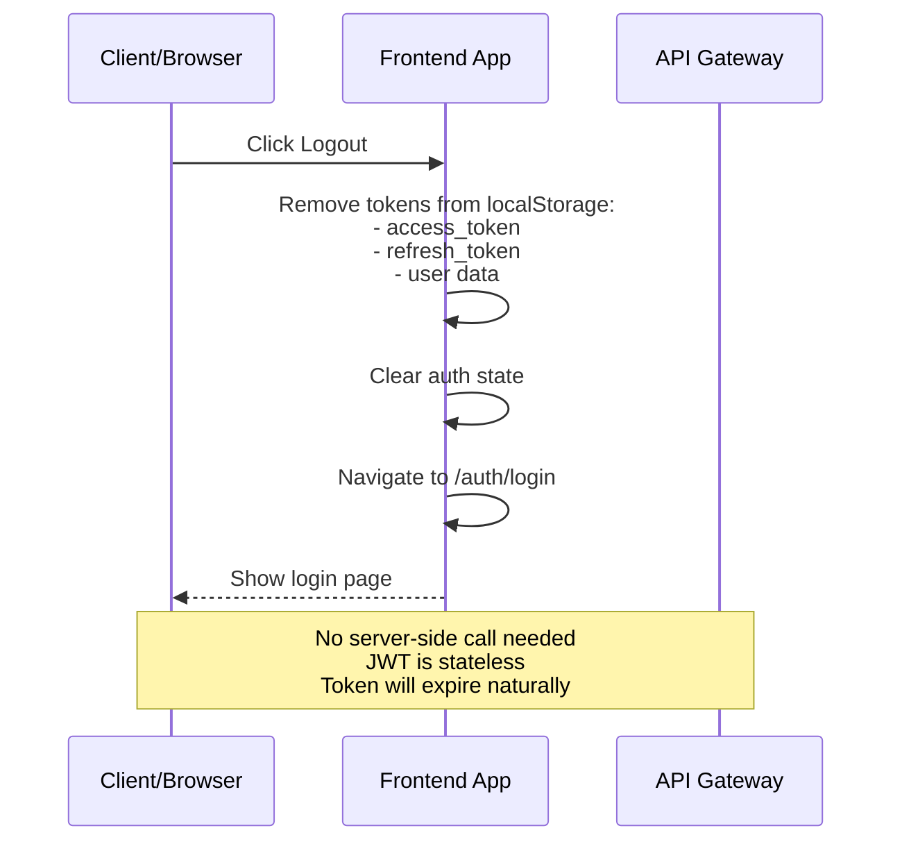

# Gearify Authentication Service - Architecture Documentation

## Table of Contents
1. [Overview](#overview)
2. [Architecture Design](#architecture-design)
3. [Technology Stack](#technology-stack)
4. [Database Design](#database-design)
5. [Authentication Flow](#authentication-flow)
6. [API Endpoints](#api-endpoints)
7. [Security Implementation](#security-implementation)
8. [Deployment Architecture](#deployment-architecture)

---

## Overview

### Purpose
The Gearify Authentication Service is a microservice responsible for:
- User registration and account management
- User authentication (login/logout)
- JWT token generation and validation
- Refresh token management
- Password management and security
- Multi-tenant user isolation

### Key Features
- **JWT-based Authentication**: Secure token-based authentication using HMAC-SHA256
- **Refresh Token Strategy**: Long-lived refresh tokens for seamless user experience
- **BCrypt Password Hashing**: Industry-standard password encryption with 12 salt rounds
- **Multi-tenancy Support**: Complete tenant isolation at the data layer
- **CQRS Pattern**: Separation of read and write operations
- **Event-Driven**: Domain events for integration with other services
- **DynamoDB Backend**: NoSQL database optimized for high-scale access patterns

---

## Architecture Design

### High-Level Architecture

```
┌─────────────────────────────────────────────────────────────────┐
│                         API GATEWAY                              │
│                    (Port 8080 - YARP)                           │
└────────────────────────┬────────────────────────────────────────┘
                         │
                         │ HTTP/REST
                         │ X-Tenant-Id Header
                         │
┌────────────────────────▼────────────────────────────────────────┐
│                   AUTH SERVICE (Port 80)                        │
│                                                                  │
│  ┌────────────────────────────────────────────────────────┐   │
│  │                  API Layer                              │   │
│  │  • AuthController (/api/auth)                          │   │
│  │  • UserController (/api/users)                         │   │
│  │  • DTOs & Request/Response Models                      │   │
│  └──────────────────────┬──────────────────────────────────┘   │
│                         │                                        │
│  ┌──────────────────────▼──────────────────────────────────┐   │
│  │              Application Layer (CQRS)                    │   │
│  │                                                           │   │
│  │  Commands:                    Queries:                   │   │
│  │  • RegisterUserCommand        • GetUserByIdQuery         │   │
│  │  • LoginCommand               • GetUserByEmailQuery      │   │
│  │  • RefreshTokenCommand                                   │   │
│  │  • UpdateProfileCommand                                  │   │
│  │  • ChangePasswordCommand                                 │   │
│  │                                                           │   │
│  │  Validators (FluentValidation)                           │   │
│  │  • RegisterUserValidator                                 │   │
│  │  • LoginValidator                                        │   │
│  └──────────────────────┬──────────────────────────────────┘   │
│                         │                                        │
│  ┌──────────────────────▼──────────────────────────────────┐   │
│  │                 Domain Layer                             │   │
│  │  • User Entity                                           │   │
│  │  • Domain Events (UserCreatedEvent, UserLoggedInEvent)   │   │
│  │  • Business Rules                                        │   │
│  └──────────────────────┬──────────────────────────────────┘   │
│                         │                                        │
│  ┌──────────────────────▼──────────────────────────────────┐   │
│  │            Infrastructure Layer                          │   │
│  │                                                           │   │
│  │  Services:                Repositories:                  │   │
│  │  • JwtService            • DynamoDbUserRepository        │   │
│  │  • PasswordHasher        • IUserRepository               │   │
│  │                                                           │   │
│  └──────────────────────┬──────────────────────────────────┘   │
│                         │                                        │
└─────────────────────────┼────────────────────────────────────────┘
                          │
                          │ AWS SDK
                          │
┌─────────────────────────▼────────────────────────────────────────┐
│                    AWS DynamoDB                                  │
│                 (LocalStack in Dev)                              │
│                                                                  │
│  Table: gearify-users                                           │
│  • Primary Key: TENANT#{tenantId}, USER#{userId}               │
│  • GSI1: Email lookup                                           │
│  • GSI2: Refresh token lookup                                   │
└──────────────────────────────────────────────────────────────────┘
```

### Clean Architecture Layers

```
┌──────────────────────────────────────────────────────────┐
│                    API Layer                              │
│  Controllers, DTOs, Middleware, Filters                  │
│  Dependencies: Application Layer                          │
└──────────────────────┬───────────────────────────────────┘
                       │
┌──────────────────────▼───────────────────────────────────┐
│               Application Layer                           │
│  Commands, Queries, Handlers, Validators                 │
│  Dependencies: Domain Layer                               │
└──────────────────────┬───────────────────────────────────┘
                       │
┌──────────────────────▼───────────────────────────────────┐
│                 Domain Layer                              │
│  Entities, Value Objects, Domain Events                  │
│  Dependencies: None (Pure business logic)                │
└──────────────────────▲───────────────────────────────────┘
                       │
┌──────────────────────┴───────────────────────────────────┐
│            Infrastructure Layer                           │
│  Repositories, External Services, Database Access        │
│  Dependencies: Domain Layer                               │
└──────────────────────────────────────────────────────────┘
```

---

## Technology Stack

### Backend Framework
- **.NET 8.0**: Latest LTS version of .NET
- **ASP.NET Core Web API**: RESTful API framework
- **C# 12**: Latest language features

### Key Libraries

| Library | Version | Purpose |
|---------|---------|---------|
| MediatR | 12.2.0 | CQRS pattern implementation |
| FluentValidation | 11.9.0 | Input validation |
| BCrypt.Net-Next | 4.0.3 | Password hashing |
| System.IdentityModel.Tokens.Jwt | 7.0.3 | JWT token handling |
| AWSSDK.DynamoDBv2 | 3.7.0 | DynamoDB client |
| LocalStack.Client.Extensions | 1.4.0 | Local AWS emulation |
| Serilog | 8.0.1 | Structured logging |
| OpenTelemetry | Latest | Distributed tracing |

### Development Tools
- **LocalStack**: Local AWS service emulation
- **Docker**: Containerization
- **Swagger/OpenAPI**: API documentation

---

## Database Design

### DynamoDB Table Schema

**Table Name**: `gearify-users`

#### Primary Key Design
```
Partition Key (PK): TENANT#{tenantId}
Sort Key (SK):      USER#{userId}

Example:
PK: TENANT#acme-corp
SK: USER#a1b2c3d4-e5f6-7890-abcd-ef1234567890
```

#### Global Secondary Index 1 (GSI1) - Email Lookup
```
GSI1PK: TENANT#{tenantId}#EMAIL#{email.toLowerCase()}
GSI1SK: USER#{userId}

Purpose: Find user by email for login/registration
Example:
GSI1PK: TENANT#acme-corp#EMAIL#john.doe@example.com
GSI1SK: USER#a1b2c3d4-e5f6-7890-abcd-ef1234567890
```

#### Global Secondary Index 2 (GSI2) - Refresh Token Lookup
```
GSI2PK: TENANT#{tenantId}
GSI2SK: REFRESH#{refreshToken}

Purpose: Find user by refresh token for token refresh
Example:
GSI2PK: TENANT#acme-corp
GSI2SK: REFRESH#iXmg615NGVjPchs1X/jQDIeg3eEUbEukvf4MMm9NzJqPGv5a...
```

#### Attributes

| Attribute | Type | Required | Description |
|-----------|------|----------|-------------|
| PK | String | Yes | Partition key |
| SK | String | Yes | Sort key |
| GSI1PK | String | Yes | GSI1 partition key |
| GSI1SK | String | Yes | GSI1 sort key |
| GSI2PK | String | No | GSI2 partition key (only when refresh token exists) |
| GSI2SK | String | No | GSI2 sort key (only when refresh token exists) |
| Id | String | Yes | User GUID |
| TenantId | String | Yes | Tenant identifier |
| Email | String | Yes | User email (lowercase) |
| PasswordHash | String | Yes | BCrypt hashed password |
| FirstName | String | Yes | User's first name |
| LastName | String | Yes | User's last name |
| Phone | String | No | Phone number |
| Role | String | Yes | User role (Customer/Admin/Manager) |
| IsActive | Boolean | Yes | Account active status |
| EmailVerified | Boolean | Yes | Email verification status |
| CreatedAt | String | Yes | ISO 8601 timestamp |
| UpdatedAt | String | Yes | ISO 8601 timestamp |
| LastLoginAt | String | No | Last login timestamp |
| RefreshToken | String | No | Current refresh token |
| RefreshTokenExpiry | String | No | Refresh token expiry time |

#### Access Patterns

| Pattern | Keys Used | Index |
|---------|-----------|-------|
| Get user by ID | PK, SK | Primary |
| Get user by email | GSI1PK, GSI1SK | GSI1 |
| Get user by refresh token | GSI2PK, GSI2SK | GSI2 |
| Update user profile | PK, SK | Primary |
| Delete user | PK, SK | Primary |

#### Sample Item
```json
{
  "PK": "TENANT#default",
  "SK": "USER#02678a8e-fe44-4d81-8d2a-906a858a8287",
  "GSI1PK": "TENANT#default#EMAIL#test@example.com",
  "GSI1SK": "USER#02678a8e-fe44-4d81-8d2a-906a858a8287",
  "GSI2PK": "TENANT#default",
  "GSI2SK": "REFRESH#iXmg615NGVjPchs1X/jQDIeg3eEUbEukvf4MMm9NzJqPGv5aJM+Y...",
  "Id": "02678a8e-fe44-4d81-8d2a-906a858a8287",
  "TenantId": "default",
  "Email": "test@example.com",
  "PasswordHash": "$2a$12$abcdefghijklmnopqrstuvwxyzABCDEFGHIJKLMNOPQRSTUVWXYZ",
  "FirstName": "Test",
  "LastName": "User",
  "Phone": "",
  "Role": "Customer",
  "IsActive": true,
  "EmailVerified": false,
  "CreatedAt": "2025-10-24T01:36:54.0000000Z",
  "UpdatedAt": "2025-10-24T01:36:54.0000000Z",
  "LastLoginAt": "2025-10-24T01:41:27.3525057Z",
  "RefreshToken": "iXmg615NGVjPchs1X/jQDIeg3eEUbEukvf4MMm9NzJqPGv5aJM+Y...",
  "RefreshTokenExpiry": "2025-10-31T01:41:27.3525057Z"
}
```

---

## Authentication Flow

### 1. User Registration Flow



**Steps Explained:**

1. **Request Validation**
   - Email format validation
   - Password strength check (8+ chars, uppercase, lowercase, number)
   - Required fields validation

2. **Uniqueness Check**
   - Query DynamoDB GSI1 by email
   - Return error if email already exists for tenant

3. **Password Hashing**
   - BCrypt with 12 salt rounds
   - Each hash is unique even for same password
   - Computation time: ~200ms (intentionally slow for security)

4. **User Creation**
   - Generate GUID for user ID
   - Set default values (IsActive=true, Role=Customer)
   - Set timestamps (CreatedAt, UpdatedAt)

5. **Token Generation**
   - JWT access token with user claims
   - Cryptographically secure refresh token (64 bytes)

6. **Database Storage**
   - Store with primary key (TENANT#x, USER#y)
   - Create GSI1 entry for email lookup
   - Create GSI2 entry for refresh token

7. **Event Publishing**
   - UserCreatedEvent for downstream services
   - Could trigger welcome email, analytics, etc.

---

### 2. User Login Flow



**Steps Explained:**

1. **Credential Validation**
   - Email format check
   - Password presence check

2. **User Lookup**
   - Query by email using GSI1
   - Single-digit millisecond latency

3. **Account Status Check**
   - Verify IsActive = true
   - Prevents disabled accounts from logging in

4. **Password Verification**
   - BCrypt compare operation
   - Constant-time comparison (prevents timing attacks)

5. **Token Generation**
   - New JWT with fresh claims
   - New refresh token replaces old one

6. **Login Tracking**
   - Update LastLoginAt timestamp
   - Store new refresh token in database
   - Update GSI2 for refresh token lookup

7. **Event Publishing**
   - UserLoggedInEvent for analytics
   - Could trigger security notifications

---

### 3. Token Refresh Flow



**Steps Explained:**

1. **Token Lookup**
   - Query GSI2 by refresh token
   - Find associated user

2. **Validation Checks**
   - Token exists in database
   - Token not expired
   - User account is active

3. **Token Rotation**
   - Generate new access token
   - Generate new refresh token
   - Invalidate old refresh token

4. **Database Update**
   - Store new refresh token
   - Update expiry time
   - Update GSI2 index

---

### 4. Change Password Flow



**Steps Explained:**

1. **Authentication**
   - Verify JWT token validity
   - Extract user ID from claims

2. **Current Password Verification**
   - Retrieve user from database
   - Verify current password matches

3. **New Password Hash**
   - Generate new BCrypt hash
   - Different salt ensures unique hash

4. **Invalidate Sessions**
   - Clear refresh token
   - Remove GSI2 entries
   - Forces re-login on all devices

---

### 5. Logout Flow



**Logout Implementation:**

The current implementation uses **client-side logout**:

1. **Token Removal**
   - Clear access token from localStorage
   - Clear refresh token from localStorage
   - Clear user data from localStorage

2. **State Reset**
   - Reset application auth state
   - Clear any cached user data

3. **Navigation**
   - Redirect to login page
   - JWT token expires after 15 minutes
   - Refresh token becomes useless without storage

**Alternative: Server-Side Logout (Not Implemented)**

For server-side logout, you could:
```typescript
// Future enhancement
POST /api/auth/logout
Authorization: Bearer {JWT}

// Server would:
1. Extract user ID from JWT
2. Clear refresh token in database
3. Add JWT to a blacklist (Redis) until expiry
4. Return 204 No Content
```

---

## API Endpoints

### Authentication Endpoints (`/api/auth`)

#### 1. Register User
```http
POST /api/auth/register
Content-Type: application/json
X-Tenant-Id: {tenantId}

Request Body:
{
  "email": "user@example.com",
  "password": "SecurePass123",
  "firstName": "John",
  "lastName": "Doe",
  "phone": "1234567890",        // Optional
  "role": "Customer"             // Optional, defaults to "Customer"
}

Success Response (201 Created):
{
  "token": "eyJhbGciOiJIUzI1NiIsInR5cCI6IkpXVCJ9...",
  "refreshToken": "iXmg615NGVjPchs1X/jQDIeg3eEUbE...",
  "user": {
    "id": "02678a8e-fe44-4d81-8d2a-906a858a8287",
    "email": "user@example.com",
    "firstName": "John",
    "lastName": "Doe",
    "phone": "1234567890",
    "role": "Customer",
    "isActive": true,
    "emailVerified": false,
    "createdAt": "2025-10-24T01:36:54Z",
    "lastLoginAt": null
  }
}

Error Responses:
- 400 Bad Request: Validation errors or email already exists
- 500 Internal Server Error: Server error
```

#### 2. Login
```http
POST /api/auth/login
Content-Type: application/json
X-Tenant-Id: {tenantId}

Request Body:
{
  "email": "user@example.com",
  "password": "SecurePass123"
}

Success Response (200 OK):
{
  "token": "eyJhbGciOiJIUzI1NiIsInR5cCI6IkpXVCJ9...",
  "refreshToken": "iXmg615NGVjPchs1X/jQDIeg3eEUbE...",
  "user": {
    "id": "02678a8e-fe44-4d81-8d2a-906a858a8287",
    "email": "user@example.com",
    "firstName": "John",
    "lastName": "Doe",
    "role": "Customer",
    "isActive": true,
    "lastLoginAt": "2025-10-24T01:41:27Z"
  }
}

Error Responses:
- 400 Bad Request: Validation errors
- 401 Unauthorized: Invalid credentials or inactive account
```

#### 3. Refresh Token
```http
POST /api/auth/refresh
Content-Type: application/json
X-Tenant-Id: {tenantId}

Request Body:
{
  "refreshToken": "iXmg615NGVjPchs1X/jQDIeg3eEUbE..."
}

Success Response (200 OK):
{
  "token": "eyJhbGciOiJIUzI1NiIsInR5cCI6IkpXVCJ9...",
  "refreshToken": "newRefreshToken..."
}

Error Responses:
- 401 Unauthorized: Invalid or expired refresh token
```

#### 4. Get Current User
```http
GET /api/auth/me
Authorization: Bearer {JWT}
X-Tenant-Id: {tenantId}

Success Response (200 OK):
{
  "id": "02678a8e-fe44-4d81-8d2a-906a858a8287",
  "email": "user@example.com",
  "firstName": "John",
  "lastName": "Doe",
  "role": "Customer",
  "isActive": true,
  "emailVerified": false,
  "createdAt": "2025-10-24T01:36:54Z",
  "lastLoginAt": "2025-10-24T01:41:27Z"
}

Error Responses:
- 401 Unauthorized: Invalid or expired token
- 404 Not Found: User not found
```

### User Management Endpoints (`/api/users`)

#### 5. Update Profile
```http
PUT /api/users/profile
Authorization: Bearer {JWT}
Content-Type: application/json
X-Tenant-Id: {tenantId}

Request Body:
{
  "firstName": "Jane",      // Optional
  "lastName": "Smith",      // Optional
  "phone": "9876543210"     // Optional
}

Success Response:
204 No Content

Error Responses:
- 401 Unauthorized: Invalid token
- 400 Bad Request: Validation errors
```

#### 6. Change Password
```http
POST /api/users/change-password
Authorization: Bearer {JWT}
Content-Type: application/json
X-Tenant-Id: {tenantId}

Request Body:
{
  "currentPassword": "OldPass123",
  "newPassword": "NewSecurePass456"
}

Success Response:
204 No Content

Note: All refresh tokens are invalidated. User must login again.

Error Responses:
- 401 Unauthorized: Invalid token
- 400 Bad Request: Current password incorrect or validation errors
```

---

## Security Implementation

### 1. Password Security

#### BCrypt Configuration
```csharp
public class BCryptPasswordHasher : IPasswordHasher
{
    private const int SaltRounds = 12;  // High security

    public string HashPassword(string password)
    {
        return BCrypt.Net.BCrypt.HashPassword(password, SaltRounds);
    }

    public bool VerifyPassword(string plaintext, string hash)
    {
        return BCrypt.Net.BCrypt.Verify(plaintext, hash);
    }
}
```

**Security Features:**
- **12 Salt Rounds**: Requires ~200-300ms to hash (intentionally slow)
- **Unique Salts**: Each hash has a unique salt, prevents rainbow table attacks
- **One-Way Function**: Cannot reverse hash to get password
- **Adaptive**: Can increase rounds as hardware improves

#### Password Requirements
```csharp
public class RegisterUserValidator : AbstractValidator<RegisterRequest>
{
    public RegisterUserValidator()
    {
        RuleFor(x => x.Password)
            .NotEmpty()
            .MinimumLength(8)
            .MaximumLength(100)
            .Matches("[A-Z]").WithMessage("Password must contain uppercase letter")
            .Matches("[a-z]").WithMessage("Password must contain lowercase letter")
            .Matches("[0-9]").WithMessage("Password must contain number");
    }
}
```

---

### 2. JWT Token Security

#### Token Structure
```
Header:
{
  "alg": "HS256",
  "typ": "JWT"
}

Payload (Claims):
{
  "sub": "02678a8e-fe44-4d81-8d2a-906a858a8287",  // User ID
  "email": "test@example.com",
  "jti": "c5bb815c-73b6-4141-bb8c-baef2e8f1628",  // JWT ID
  "tenantId": "default",
  "role": "Customer",
  "firstName": "Test",
  "lastName": "User",
  "exp": 1761270987,                              // Expiry (Unix timestamp)
  "iss": "gearify-auth",                          // Issuer
  "aud": "gearify-api"                            // Audience
}

Signature:
HMACSHA256(
  base64UrlEncode(header) + "." + base64UrlEncode(payload),
  secret
)
```

#### JWT Configuration
```csharp
services.AddAuthentication(JwtBearerDefaults.AuthenticationScheme)
    .AddJwtBearer(options =>
    {
        options.TokenValidationParameters = new TokenValidationParameters
        {
            ValidateIssuerSigningKey = true,
            IssuerSigningKey = new SymmetricSecurityKey(
                Encoding.UTF8.GetBytes(jwtSecret)
            ),
            ValidateIssuer = true,
            ValidIssuer = "gearify-auth",
            ValidateAudience = true,
            ValidAudience = "gearify-api",
            ValidateLifetime = true,
            ClockSkew = TimeSpan.Zero  // Strict expiry checking
        };
    });
```

**Security Features:**
- **Short-Lived**: 15-minute expiry minimizes exposure window
- **Signed**: HMAC-SHA256 prevents tampering
- **Stateless**: No database lookup needed for validation
- **Claims-Based**: All user info embedded in token
- **Zero Clock Skew**: Strict expiry enforcement

---

### 3. Refresh Token Security

#### Generation
```csharp
public string GenerateRefreshToken()
{
    var randomBytes = new byte[64];
    using var rng = RandomNumberGenerator.Create();
    rng.GetBytes(randomBytes);
    return Convert.ToBase64String(randomBytes);
}
```

**Security Features:**
- **Cryptographically Secure**: Uses `RandomNumberGenerator`
- **High Entropy**: 64 bytes = 512 bits of randomness
- **Stored in Database**: Can be invalidated server-side
- **Long-Lived**: 7 days for user convenience
- **One-Time Use**: Rotated on each refresh

#### Refresh Token Lifecycle
1. **Generation**: Created during login/register
2. **Storage**: Stored in DynamoDB with user record
3. **Usage**: Exchanged for new access token
4. **Rotation**: New refresh token issued, old one invalidated
5. **Expiry**: 7 days from creation
6. **Invalidation**: Cleared on password change

---

### 4. Multi-Tenancy Security

#### Tenant Isolation
```csharp
// All queries scoped to tenant
public async Task<User?> GetUserByEmail(string tenantId, string email)
{
    var request = new QueryRequest
    {
        TableName = "gearify-users",
        IndexName = "GSI1",
        KeyConditionExpression = "GSI1PK = :gsi1pk",
        ExpressionAttributeValues = new Dictionary<string, AttributeValue>
        {
            { ":gsi1pk", new AttributeValue
                {
                    S = $"TENANT#{tenantId}#EMAIL#{email.ToLower()}"
                }
            }
        }
    };

    var response = await _dynamoDb.QueryAsync(request);
    // ...
}
```

**Isolation Guarantees:**
- **Partition Key Prefix**: `TENANT#{tenantId}` ensures physical separation
- **Index Scoping**: All GSIs include tenant ID
- **Query Level**: Every query filtered by tenant
- **Header Validation**: X-Tenant-Id required on all requests
- **No Cross-Tenant Access**: Impossible to query other tenant's data

---

### 5. Security Best Practices Implemented

| Practice | Implementation |
|----------|---------------|
| **Password Hashing** | BCrypt with 12 rounds |
| **Token Signing** | HMAC-SHA256 |
| **Token Expiry** | 15 min access, 7 day refresh |
| **HTTPS Only** | Enforced in production |
| **CORS** | Configured allowed origins |
| **Input Validation** | FluentValidation on all inputs |
| **SQL Injection** | N/A (using DynamoDB) |
| **XSS Prevention** | API returns JSON only |
| **CSRF Protection** | JWT in header (not cookies) |
| **Rate Limiting** | Implemented at API Gateway |
| **Audit Logging** | Serilog structured logging |
| **Secrets Management** | Environment variables/AWS Secrets Manager |

---

## Deployment Architecture

### Container Architecture

```
┌─────────────────────────────────────────────────────────────┐
│                     Docker Compose Stack                     │
├─────────────────────────────────────────────────────────────┤
│                                                              │
│  ┌────────────────┐  ┌────────────────┐  ┌──────────────┐ │
│  │   Web (Nginx)  │  │  API Gateway   │  │  Auth Service│ │
│  │   Port: 4200   │  │   Port: 8080   │  │   Port: 80   │ │
│  │                │  │                │  │              │ │
│  │  Angular SPA   │─▶│  YARP Proxy    │─▶│  .NET API    │ │
│  └────────────────┘  └────────────────┘  └──────┬───────┘ │
│                                                   │          │
│  ┌────────────────┐  ┌────────────────┐         │          │
│  │  LocalStack    │  │  PostgreSQL    │         │          │
│  │  Port: 4566    │◀─┤  Port: 5432    │         │          │
│  │                │  │                │         │          │
│  │  DynamoDB      │  │  (Other svcs)  │         │          │
│  │  S3, SQS, SNS  │  │                │         │          │
│  └────────────────┘  └────────────────┘         │          │
│                                                   │          │
│  ┌────────────────┐  ┌────────────────┐         │          │
│  │  Redis         │  │  MailHog       │         │          │
│  │  Port: 6379    │  │  Port: 1025    │         │          │
│  │                │  │                │         │          │
│  │  Caching       │  │  Email Testing │         │          │
│  └────────────────┘  └────────────────┘         │          │
│                                                   │          │
└───────────────────────────────────────────────────┼──────────┘
                                                    │
                                    ┌───────────────▼──────────┐
                                    │  Observability Stack     │
                                    │  - Seq (Logging)         │
                                    │  - Jaeger (Tracing)      │
                                    │  - Prometheus (Metrics)  │
                                    └──────────────────────────┘
```

### Environment Configuration

#### Development Environment
- **LocalStack**: Emulates AWS services locally
- **Docker Compose**: Orchestrates all services
- **Hot Reload**: Code changes reflected immediately
- **Debug Mode**: Full logging and tracing

#### Production Environment (Future)
- **AWS ECS/EKS**: Container orchestration
- **DynamoDB**: Managed NoSQL database
- **Application Load Balancer**: Traffic distribution
- **AWS Secrets Manager**: Secret management
- **CloudWatch**: Logging and monitoring
- **X-Ray**: Distributed tracing

---

## Configuration Reference

### appsettings.json
```json
{
  "JwtSettings": {
    "Secret": "your-super-secret-jwt-key-min-32-chars",
    "Issuer": "gearify-auth",
    "Audience": "gearify-api",
    "AccessTokenExpiryMinutes": 15,
    "RefreshTokenExpiryDays": 7
  },
  "LocalStack": {
    "UseLocalStack": true,
    "Config": {
      "LocalStackHost": "localstack:4566"
    }
  },
  "AWS": {
    "Region": "us-east-1",
    "ServiceURL": "http://localstack:4566"
  }
}
```

### Environment Variables
```bash
# Development
ASPNETCORE_ENVIRONMENT=Development
ASPNETCORE_URLS=http://+:80

# AWS Configuration
AWS_ACCESS_KEY_ID=test
AWS_SECRET_ACCESS_KEY=test
AWS_REGION=us-east-1

# Observability
SEQ_URL=http://seq:5341
OTLP_ENDPOINT=http://otel-collector:4318
```

---

## Testing

### Unit Tests
```bash
cd gearify-auth-svc
dotnet test
```

### Integration Tests
```bash
# Start dependencies
docker-compose up -d localstack

# Run tests
dotnet test --filter Category=Integration
```

### Manual API Testing
```bash
# Register
curl -X POST http://localhost:5011/api/auth/register \
  -H "Content-Type: application/json" \
  -H "X-Tenant-Id: default" \
  -d '{
    "email": "test@example.com",
    "password": "Test1234",
    "firstName": "Test",
    "lastName": "User"
  }'

# Login
curl -X POST http://localhost:5011/api/auth/login \
  -H "Content-Type: application/json" \
  -H "X-Tenant-Id: default" \
  -d '{
    "email": "test@example.com",
    "password": "Test1234"
  }'
```

---

## Performance Considerations

### DynamoDB Optimization
- **On-Demand Billing**: Auto-scales with traffic
- **GSI Projections**: All attributes for faster reads
- **Consistent Reads**: Used for critical operations
- **Batch Operations**: Not used (single user operations)

### Caching Strategy (Future)
```csharp
// Redis caching for user data
public async Task<User?> GetUserById(string userId)
{
    var cacheKey = $"user:{userId}";
    var cached = await _redis.GetAsync<User>(cacheKey);

    if (cached != null)
        return cached;

    var user = await _dynamoDb.GetUser(userId);

    if (user != null)
        await _redis.SetAsync(cacheKey, user, TimeSpan.FromMinutes(5));

    return user;
}
```

### Expected Performance
- **Registration**: < 500ms (BCrypt hashing is slow by design)
- **Login**: < 500ms (BCrypt verification)
- **Token Refresh**: < 100ms (database lookup only)
- **Get User**: < 50ms (primary key lookup)
- **DynamoDB Queries**: < 20ms (single-digit millisecond latency)

---

## Monitoring and Observability

### Logging
- **Serilog**: Structured JSON logging
- **Log Levels**: Information, Warning, Error
- **Correlation IDs**: Trace requests across services
- **Sensitive Data**: Passwords never logged

### Metrics
- **OpenTelemetry**: Standard metrics collection
- **Custom Metrics**:
  - Registration count
  - Login success/failure rate
  - Token refresh rate
  - Password change count

### Tracing
- **Distributed Tracing**: OTLP protocol
- **Span Context**: Propagated via headers
- **Trace Attributes**: User ID, tenant ID, operation type

### Health Checks
```http
GET /health
Response: { "status": "healthy", "service": "auth" }
```

---

## Security Checklist

- [x] Passwords hashed with BCrypt (12 rounds)
- [x] JWT tokens signed and validated
- [x] Refresh tokens stored securely
- [x] Token expiry enforced
- [x] HTTPS enforced (production)
- [x] CORS configured
- [x] Input validation on all endpoints
- [x] Multi-tenancy enforced at query level
- [x] Inactive accounts prevented from login
- [x] Password change invalidates all sessions
- [x] No sensitive data in logs
- [x] Environment variables for secrets
- [x] Rate limiting (at API Gateway)
- [x] Audit logging for security events

---

## Troubleshooting

### Common Issues

**1. "Invalid email or password" on correct credentials**
- Check tenant ID matches registration
- Verify account is active
- Check LocalStack is running

**2. JWT validation fails**
- Verify JWT secret matches in all services
- Check token expiry time
- Ensure ClockSkew configuration

**3. Refresh token not working**
- Check token hasn't expired (7 days)
- Verify user is still active
- Check GSI2 index exists

**4. DynamoDB connection issues**
- Verify LocalStack is running
- Check AWS credentials configured
- Verify service URL points to LocalStack

---

## Future Enhancements

### Planned Features
1. **Email Verification**: Send verification emails on registration
2. **Password Reset**: Forgot password flow with email tokens
3. **Social Login**: OAuth integration (Google, GitHub, etc.)
4. **Two-Factor Authentication**: TOTP-based 2FA
5. **Account Lockout**: Lock after failed login attempts
6. **Session Management**: View and revoke active sessions
7. **Audit Trail**: Complete history of security events
8. **Password Policy Configuration**: Per-tenant password rules

### Scalability Improvements
1. **Redis Caching**: Cache user data for faster reads
2. **Read Replicas**: DynamoDB global tables for multi-region
3. **Token Blacklist**: Redis-based JWT blacklist for logout
4. **Rate Limiting**: Per-user rate limits
5. **Connection Pooling**: Optimize DynamoDB connections

---

## References

- [JWT Best Practices](https://tools.ietf.org/html/rfc8725)
- [OWASP Authentication Cheat Sheet](https://cheatsheetseries.owasp.org/cheatsheets/Authentication_Cheat_Sheet.html)
- [BCrypt Algorithm](https://en.wikipedia.org/wiki/Bcrypt)
- [DynamoDB Best Practices](https://docs.aws.amazon.com/amazondynamodb/latest/developerguide/best-practices.html)
- [Clean Architecture](https://blog.cleancoder.com/uncle-bob/2012/08/13/the-clean-architecture.html)

---

## Glossary

| Term | Definition |
|------|------------|
| **JWT** | JSON Web Token - compact, URL-safe token format |
| **BCrypt** | Password hashing algorithm with adaptive complexity |
| **CQRS** | Command Query Responsibility Segregation |
| **GSI** | Global Secondary Index in DynamoDB |
| **HMAC** | Hash-based Message Authentication Code |
| **OTLP** | OpenTelemetry Protocol |
| **YARP** | Yet Another Reverse Proxy |
| **MediatR** | .NET library implementing mediator pattern |

---

**Document Version**: 1.0
**Last Updated**: October 24, 2025
**Maintained By**: Gearify Platform Team
